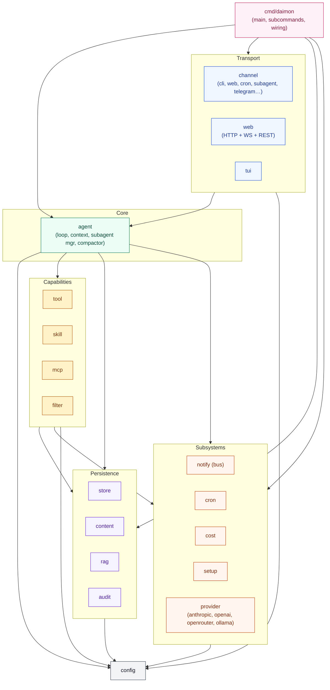
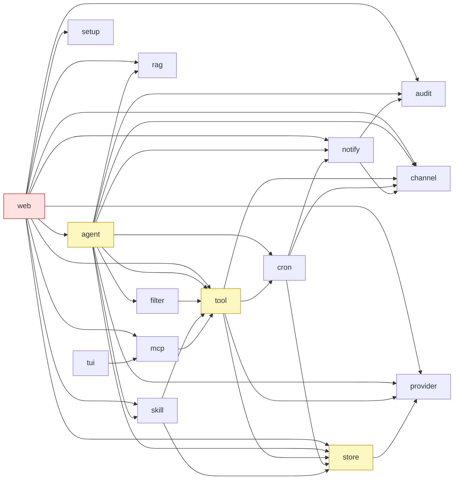
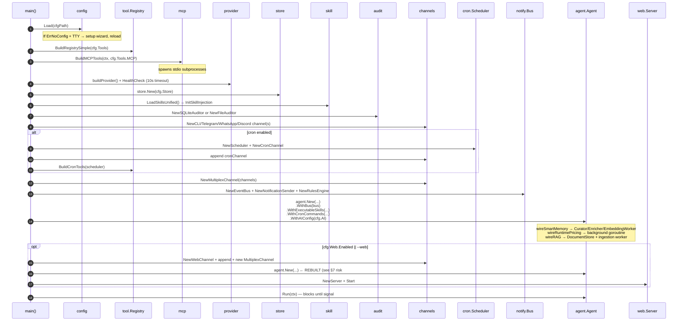
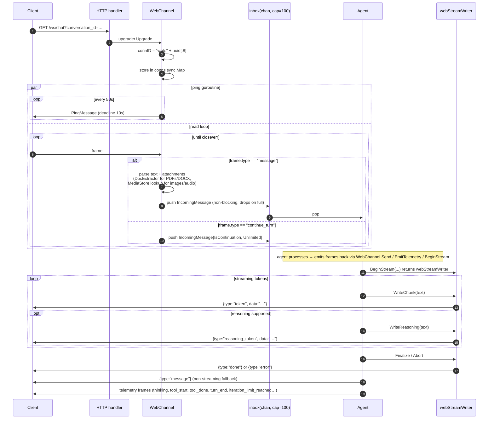
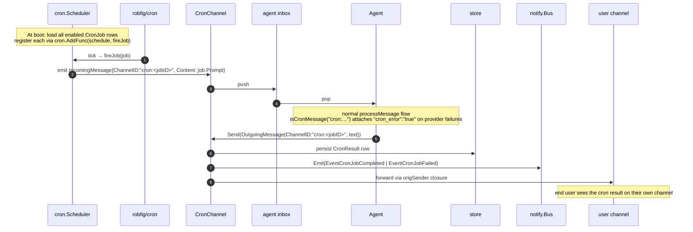
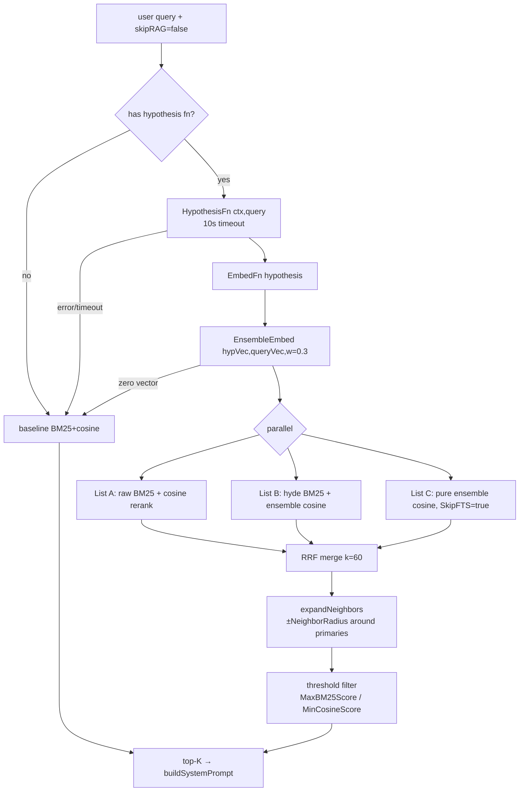
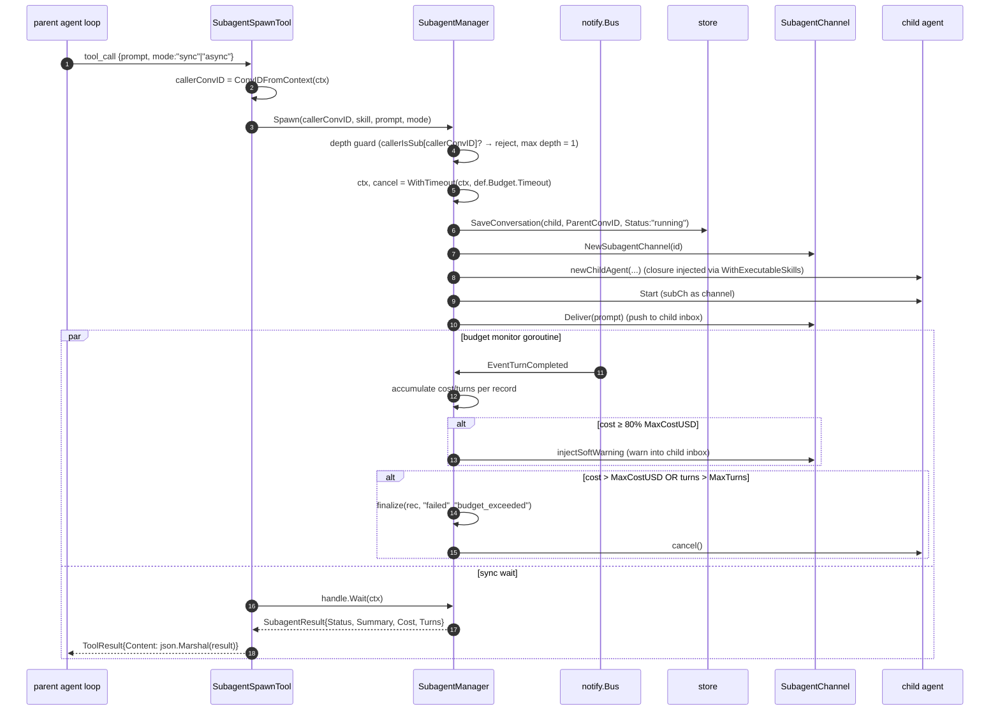

# Daimon — Architecture Map

> **Audience**: humans onboarding to the codebase + LLM agents working on it.
> **Source of truth**: `internal/` + `cmd/daimon/` (verified via codegraph index, 422 files / 8124 symbols).
> **Last reviewed**: 2026-05-23.

This document is the single shared map. Read it once, then jump to [`modules/<name>.md`](modules/) for any module you actually need to touch.

---

## 1. One-page system map

Daimon is a Go monolith that processes one logical inbox at a time: messages enter through some transport (CLI, WebSocket, cron tick, subagent), the agent loop builds a prompt, calls a provider, optionally executes tools, and emits a response back through the same transport. Persistence and retrieval are side effects, never on the hot path.



### Layering rules (target)

| Layer                                                      | Allowed to import                                                |
| ---------------------------------------------------------- | ---------------------------------------------------------------- |
| Shell (`cmd/`)                                             | every layer                                                      |
| Transport                                                  | Core, Capabilities, Persistence, Subsystems, `config`, `content` |
| Core (`agent`)                                             | Capabilities, Persistence, Subsystems, `config`, `content`       |
| Capabilities (`tool`, `skill`, `mcp`, `filter`)            | Persistence, Subsystems, `config`, `content`                     |
| Persistence (`store`, `content`, `rag`, `audit`)           | `config`, `content`. **Must not import `provider` or `tool`.**   |
| Subsystems (`notify`, `cron`, `cost`, `setup`, `provider`) | `config`, `content`, `store`.                                    |
| Cross-cutting (`config`, `content`)                        | nothing inside `internal/`                                       |

[Section 6](#6-layering-violations) lists where the current code violates this and why each violation matters.

---

## 2. Module dependency map (real edges)

Verified by grepping `import` blocks across all non-test `.go` files in `internal/`. Each row counts only edges **inside `internal/`** (stdlib and third-party omitted).

| Module     | Imports (fan-out)                                                                                          | Imported by (fan-in)                       | Notes                                                                       |
| ---------- | ---------------------------------------------------------------------------------------------------------- | ------------------------------------------ | --------------------------------------------------------------------------- |
| `agent`    | audit, channel, config, content, cron, filter, notify, provider, rag, rag/metrics, skill, store, tool (13) | web (1)                                    | Hub of the agent loop.                                                      |
| `audit`    | —                                                                                                          | agent, notify, web (3)                     | Pure leaf.                                                                  |
| `channel`  | config, content, store (3)                                                                                 | agent, cron, notify, tool, web (5)         | Re-imported by `tool` and `notify` — see violations §6.                     |
| `config`   | —                                                                                                          | 12 modules                                 | Cross-cutting; never imports anything.                                      |
| `content`  | —                                                                                                          | agent, channel, cron, provider, tool (5)   | Block primitives; pure leaf.                                                |
| `cost`     | —                                                                                                          | (only `cmd/daimon/costs_cmd.go`)           | **Ghost package**: fan-in = 0 inside `internal/`.                           |
| `cron`     | channel, config, content, notify, store (5)                                                                | agent, tool (2)                            | Mixes Scheduler (subsystem) + CronChannel (transport) in one package.       |
| `filter`   | config, tool (2)                                                                                           | agent (1)                                  | Logically belongs to `agent`.                                               |
| `mcp`      | config, tool (2)                                                                                           | tui, web (2)                               |                                                                             |
| `notify`   | audit, channel, config (3)                                                                                 | agent, cron, web (3)                       | Notify imports Transport — see §6.                                          |
| `provider` | config, content (2)                                                                                        | agent, store, tool, web (4)                | LLM clients.                                                                |
| `rag`      | rag/metrics, tool (2)                                                                                      | agent, web (2)                             |                                                                             |
| `setup`    | config (1)                                                                                                 | web (1)                                    | First-launch wizard.                                                        |
| `skill`    | config, store, tool (3)                                                                                    | agent, web (2)                             |                                                                             |
| `store`    | config, content, provider (3)                                                                              | agent, channel, cron, skill, tool, web (6) | Persistence imports `provider` — see §6.                                    |
| `tool`     | channel, config, content, cron, provider, store (6)                                                        | agent, filter, mcp, rag, skill, web (6)    | Capabilities imports Transport (`channel`) and Subsystem (`cron`) — see §6. |
| `tui`      | config, mcp (2)                                                                                            | —                                          | Terminal dashboard.                                                         |
| `web`      | 14 modules including `agent`                                                                               | —                                          | **God-module candidate**; widest fan-out.                                   |

Simplified internal graph (only edges between **non-config, non-content** modules to keep it readable):



Red = god-module, yellow = layering violation, plain = clean.

---

## 3. Boot sequence

Single happy path through `cmd/daimon/main.go`. Numbers correspond to wiring stages — the full machine is assembled top-down.



Key implementation refs:

| Step                                | Code                     |
| ----------------------------------- | ------------------------ |
| Config load                         | `cmd/daimon/main.go:212` |
| Tool registry                       | `main.go:244`            |
| MCP wiring                          | `main.go:256`            |
| Provider + health check             | `main.go:272`–`298`      |
| Store                               | `main.go:305`            |
| Skills (unified loader + injection) | `main.go:322`, `343`     |
| Auditor                             | `main.go:395`–`415`      |
| Channels                            | `main.go:418`–`490`      |
| Multiplex                           | `main.go:492`            |
| Notify bus                          | `main.go:498`–`502`      |
| Agent build                         | `main.go:524`            |
| Web path (agent rebuild)            | `main.go:582`–`637`      |
| Signal handler + Run                | `main.go:676`–`687`      |

Goroutines alive in steady state: cron internal workers, `EmbeddingWorker.run`, `Enricher.run`, `Consolidator.run`, `Agent.startPruningLoop`, `mediaCleanupLoop` (when enabled), runtime pricing refresher, one ping goroutine per WebSocket connection, the signal handler.

---

## 4. Key message flows

### 4.1 Happy path: user message → response

```mermaid
sequenceDiagram
  autonumber
  participant U as User
  participant WS as WebChannel
  participant Ag as agent.Run
  participant Loop as processMessage
  participant St as store
  participant Mem as SearchMemory
  participant Rag as ragStore
  participant Ctx as buildSystemPrompt
  participant Prv as provider.Chat
  participant Aud as audit
  participant Bus as notify.Bus

  U->>WS: ws frame {type:"message", text, attachments}
  WS->>WS: parse → content.Blocks
  WS->>Ag: inbox <- IncomingMessage
  Ag->>Loop: processMessage (semaphore guard, max=4)
  Loop->>St: LoadConversation(convID) or new
  Loop->>Loop: append user ChatMessage
  par memory recall
    Loop->>Mem: SearchMemory(scope, query)
  and RAG retrieval (if ragStore != nil)
    Loop->>Rag: ragSearchWithHyDE / SearchChunks
  end
  Loop->>Ctx: buildSystemPrompt(memories, rag, summary)
  Loop->>Loop: contextMgr.Manage(messages)
  Loop->>Prv: Chat(ChatRequest)
  Prv-->>Loop: ChatResponse{Content, ToolCalls, Usage}
  Loop->>Aud: emit llm_call event
  Loop->>St: RecordCost(input/output tokens, dollars)
  alt resp.ToolCalls == nil  (end_turn)
    Loop->>WS: channel.Send(OutgoingMessage)
    Loop->>St: AppendMemory(curator output)
    Loop->>St: SaveConversation(turn)
    Loop->>Bus: Emit(EventTurnCompleted)
  else has tool calls
    Note over Loop: → see flow 4.2
  end
```

Implementation anchors: `channel/web.go:202` (upgrade & parse), `agent/agent.go:699` (inbox loop), `agent/loop.go:121` (processMessage), `agent/loop.go:408` (provider.Chat or `processStreamingCall`), `agent/loop.go:526` (end-turn send + persist).

### 4.2 Tool-use iteration loop

Triggered when `ChatResponse.ToolCalls != nil`. The agent runs at most `MaxIterations` rounds (configurable; `0` ⇒ `math.MaxInt32`).

```mermaid
sequenceDiagram
  autonumber
  participant Loop as agent.loop (i=0..N)
  participant Reg as tool registry
  participant Filter as filter.PreApply
  participant Tool as Tool.Execute
  participant Idx as indexWorker
  participant Inj as filter.ApplyInjectionFilter
  participant Prv as provider.Chat

  Loop->>Loop: append assistant ChatMessage with ToolCalls
  loop for each tc in ToolCalls
    Loop->>Loop: loop-detection ring buffer (window=5, threshold=3)<br/>emit telemetry if (name,input) repeats 3x
    Loop->>Reg: lookup tools[tc.Name]
    Loop->>Filter: PreApply(tc.Name, tc.Input)  -- may short-circuit (sandbox mode)
    Loop->>Loop: validateToolInput(input, schema)
    Loop->>Tool: Execute(toolCtx with timeout, scope, convID)
    Tool-->>Loop: ToolResult{Content, IsError}
    Loop->>Loop: filter.Apply(result) — compression/truncation
    opt context_mode.AutoIndexOutputs
      Loop->>Idx: enqueue output for search_output tool
    end
    Loop->>Inj: ApplyInjectionFilter(result.Content)
    Loop->>Loop: append ChatMessage{Role:"tool"} with CDATA-wrapped result
  end
  alt i == maxIters-1 OR tokens >= maxTotalTokens
    Loop->>Loop: emit "iteration_limit_reached" / "token_budget_reached"
    Loop->>Loop: break (no further provider.Chat)
  else
    Loop->>Prv: Chat(ChatRequest with new messages)
    Note over Loop: next iteration
  end
```

Implementation anchors: `agent/loop.go:374` (`for i := 0; i < maxIters; i++`), `:577` (assistant append), `:599` (loop detection), `:639` (PreApply), `:658` (Execute with timeout + scope/convID), `:677` (Apply), `:759` (injection filter), `:769` (CDATA tool_result), `:782` (cap checks).

Panics inside tools are recovered by `executeWithRecover` (`agent/loop.go:900`) and surface as `ToolResult{IsError: true}` so the LLM can self-correct.

### 4.3 WebSocket `/ws/chat` lifecycle



Outbound frame types: `message`, `token`, `reasoning_token`, `done`, `error`, plus `tool_start`/`tool_done`/`thinking`/`turn_end`/`iteration_limit_reached`/`token_budget_reached` telemetry frames (see `channel/web.go:167`–`482` and `agent/loop.go:790`).

**Important caveats**:

- The inbox push is **non-blocking** — when the channel is saturated, frames are dropped with a `slog.Warn` and the client gets no error signal (see §7 risk #9).
- `conversation_id` is taken from the query string with only a length cap (200 runes), no ownership check (§7 risk #10).
- `connID` truncates the UUID to 8 hex chars / 32 bits (§7 risk #5).

### 4.4 Cron / heartbeat trigger



Tools `cron_schedule_add` / `_remove` / `_list` mutate the scheduler in place — no restart needed (`tool/cron.go` → `Scheduler.registerJob`).

### 4.5 RAG retrieval (HyDE + RRF)

The doc-store/retrieval pipeline runs three parallel searches and merges them with RRF — **not** the linear pipeline implied by older docs.



Implementation anchors: `agent/loop.go:238`–`293` (call site), `agent/loop.go:950` (`ragSearchWithHyDE` → `rag.PerformHydeSearch`), `rag/hyde_search.go:54` (function), `rag/sqlite_store.go:138` (`SearchChunks`), `rag/sqlite_store.go:283` (`pureVectorSearch`), `rag/sqlite_store.go:371` (`expandNeighbors`).

Provenance of every returned chunk (which of A/B/C produced it) is preserved at `rag/hyde_search.go:257`–`263`. Skips: any extracted attachment with `len(textContent) < 30` triggers `skipRAG = true` (`agent/loop.go:237`).

> **Correction to DAIMON.md §12c**: the doc described retrieval as "BM25 → cosine → HyDE → RRF → neighbor expand → threshold filter" but the code performs the three searches concurrently and expands neighbors _inside_ each `SearchChunks` call, before RRF — not after. Update DAIMON.md when that section is next touched.

### 4.6 Subagent spawn (executable skill)



The child's final assistant text becomes `SubagentResult.Summary` via `SubagentChannel.FinalAssistant()` (`subagent_manager.go:433`). For async mode the tool returns immediately and the parent can poll a separate tool to retrieve the result.

Implementation anchors: `agent/subagent_tool.go:62` (`Execute`), `agent/subagent_tool.go:82` (convID extraction), `agent/subagent_manager.go:214` (`Spawn`), `:222`–`226` (depth guard), `:283` (channel creation), `:310` (child factory closure), `:354`–`418` (budget enforcement).

---

## 5. Channel inventory (transport surface area)

| Channel impl       | File                              | Direction    | Notes                                                                                         |
| ------------------ | --------------------------------- | ------------ | --------------------------------------------------------------------------------------------- |
| `CLIChannel`       | `channel/cli.go`                  | stdin/stdout | Default when no `--web`/daemon/etc.                                                           |
| `WebChannel`       | `channel/web.go`                  | WebSocket    | Adds streaming, reasoning tokens, telemetry frames; supports resume via `conversation_id`.    |
| `CronChannel`      | `cron/channel.go`                 | virtual      | Scheduler emits inbound, forwards outbound to `origSender`. Lives in `cron` package — see §6. |
| `SubagentChannel`  | `channel/subagent.go` (inferred)  | in-memory    | Parent ↔ child agent comm.                                                                    |
| `TelegramChannel`  | `channel/telegram.go`             | HTTPS poll   | Whitelist of user IDs.                                                                        |
| `WhatsAppChannel`  | `channel/whatsapp.go`             | webhook      |                                                                                               |
| `DiscordChannel`   | `channel/discord.go`              | gateway      |                                                                                               |
| `MultiplexChannel` | `channel/multiplex.go` (inferred) | composite    | Fan-in across N channels into one inbox.                                                      |

All implementations satisfy the `channel.Channel` interface defined in `channel/channel.go`. See [`modules/channel.md`](modules/channel.md) for contracts and edge cases.

---

## 6. Layering violations

These are real edges that contradict the table in §1. They are not all bad — some are pragmatic trade-offs — but every one is a maintenance liability and a candidate for the [refactor backlog](VERDICT.md).

| #   | Edge                                     | Where                                                                                     | Why it exists                                                                                     | Risk                                                                                                                  |
| --- | ---------------------------------------- | ----------------------------------------------------------------------------------------- | ------------------------------------------------------------------------------------------------- | --------------------------------------------------------------------------------------------------------------------- |
| L1  | `web → agent`                            | `web/server.go`, `web/handler_subagents.go`, `web/handler_skills.go`, `web/mcp_skills.go` | REST endpoints need concrete types like `*agent.Agent`, `agent.SubagentStatus` for introspection. | Transport depends on Core implementation; Core can't evolve without dragging `web`.                                   |
| L2  | `store → provider`                       | `store/store.go:33` (`Conversation.Messages []provider.ChatMessage`)                      | Avoids a parallel message type.                                                                   | Persistence schema is tied to provider message shape — any breaking change in `provider.ChatMessage` migrates the DB. |
| L3  | `tool → cron`                            | `tool/cron.go`                                                                            | Exposes `cron_schedule_add/remove/list` as agent tools.                                           | Capabilities import a Subsystem; bidirectional knowledge between `cron` and `tool`.                                   |
| L4  | `tool → channel`                         | `tool/*.go`                                                                               | Shared types like `channel.Scope`, convID helpers.                                                | Capabilities reach into Transport; complicates testing tools in isolation.                                            |
| L5  | `notify → channel`                       | `notify/sender.go`                                                                        | `NotificationSender` delivers external messages via channels.                                     | Subsystem depends on Transport. Acceptable for senders, but indicates the abstraction lives in the wrong package.     |
| L6  | `filter → tool`                          | `filter/*.go`                                                                             | `filter` operates on `tool.ToolResult`.                                                           | If `filter` were a sub-package of `agent`, this would be honest; today it's a sibling.                                |
| L7  | `CronChannel` lives in `cron`            | `cron/channel.go`                                                                         | Single team owns scheduler + transport adapter.                                                   | Two responsibilities (Subsystem + Transport) in one package — `CronChannel` should belong to `channel/`.              |
| L8  | `web → audit / notify / store / setup …` | `web/*.go`                                                                                | The dashboard exposes everything.                                                                 | Makes `web` the de-facto god module (14 fan-out).                                                                     |

`cmd/daimon` is a Shell package and is allowed to import anything, so its breadth does not count as a violation.

---

## 7. Architectural risks worth tracking

Ten findings surfaced during the codegraph sweep. Each is one item on the future refactor list; severity is the orchestrator's first read, calibrate against §6 in [VERDICT.md](VERDICT.md).

1. **Double-build of the agent on `--web` path** — `main.go:524` then `main.go:582`–`591` builds a second `*agent.Agent` without `Shutdown()`-ing the first. Background workers (Enricher, EmbeddingWorker, Consolidator, pruning loop) started by the first instance can leak. _Severity: high._
2. **`store` imports `provider`** — `store/store.go:33`. Persistence schema is coupled to provider message shape. _Severity: medium._
3. **`cost` is a ghost package** — fan-in inside `internal/` is 0. Live cost accounting uses `audit.EstimateCostSplit` (`agent/loop.go:481`). Either consolidate into `audit` or revive `cost` as the single source. _Severity: medium (dead code → confusion)._
4. **`web` god-module** — 14 outbound deps including `agent`. Candidate for sub-packages (`web/handlers`, `web/ws`, `web/validation`, …). _Severity: high (review surface)._
5. **8-char `connID` truncation** — `channel/web.go:237` truncates UUIDv4 to 32 bits. With 50 concurrent connections (the cap) collision probability is ~0.006%. A collision means the second connection receives the first one's frames. _Severity: low but trivial to fix._
6. **`SubagentManager` subscribes to the global bus and scans linearly** — `subagent_manager.go:188`. O(N) per `EventTurnCompleted` under a lock. With `maxConcurrent=4` it doesn't bite today; if depth or concurrency ever grow, it will. _Severity: low._
7. **`filter` is logically inside the loop but lives outside `agent`** — fan-in = 1 (only `agent`), but importing `tool`. Move under `agent/filter/`. _Severity: low._
8. **`cron` package mixes scheduler + transport adapter** — see §6 L7. _Severity: low._
9. **WebSocket inbox drops silently when full** — `channel/web.go:415`. The client never learns that its message was discarded. _Severity: high (UX) — at minimum emit a `{type:"error", code:"inbox_full"}` frame back. _
10. **WebSocket `conversation_id` has no ownership check** — `channel/web.go:218`. Multi-user deployments can cross-read conversations by guessing IDs. _Severity: high if Daimon ever runs multi-tenant; low for the single-user MVP._

---

## 8. Pointers

- Module-level deep dives (purpose, public API, dependency tables, per-module verdicts) → [`modules/`](modules/).
- Cross-cutting health, coupling heatmap, ranked refactor backlog → [VERDICT.md](VERDICT.md) (populated after module sweep).
- Original product intent and non-negotiables → [`../DAIMON.md`](../DAIMON.md) (note: §12c retrieval description is out-of-date; cite this doc instead).
- Detailed change history of major subsystems → `openspec/changes/archive/`.

If a fact in this document and a fact in the code disagree, the **code wins**. Update this doc; never patch reality to match it.
