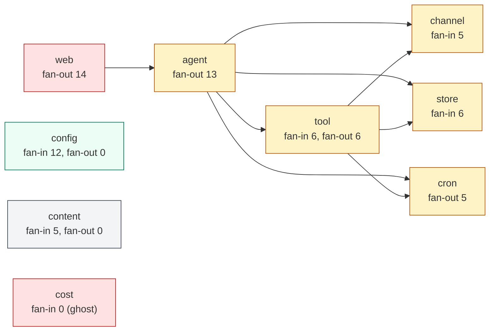

# Daimon — Cross-cutting Verdict

> **Source**: aggregated from the 18 per-module deep-dives in [`modules/`](modules/) and the [`ARCHITECTURE.md`](ARCHITECTURE.md) map.
> **Method**: every issue cited carries a `file:line` reference verified against the codegraph index (422 files, 8,124 symbols).
> **Last reviewed**: 2026-05-23.
> **Total catalogued issues**: ~193 module-level smells + 10 architectural risks + 8 layering violations.

This document is the entry point for **deciding what to fix next**. It ranks issues across the whole codebase, not just within one module.

---

## 1. Module health snapshot

Click any module for the full per-module doc (size, public API, dependency map, component & flow diagrams, full smell list, refactor backlog).

| Module                          | Health | Fan-in       | Fan-out | LOC (prod) | Test LOC  | Notable burden                                                   |
| ------------------------------- | ------ | ------------ | ------- | ---------- | --------- | ---------------------------------------------------------------- |
| [agent](modules/agent.md)       | ⚠️     | 1            | 13      | 7,213      | very high | god-method (`processMessage` 730 LOC), god-type (24 fields)      |
| [channel](modules/channel.md)   | ⚠️     | 5            | 3       | 2,997      | high      | drop-policy inconsistency, no conv-id ownership check            |
| [provider](modules/provider.md) | ⚠️     | 4            | 2       | 4,076      | moderate  | 4 functional bugs incl. silent reasoning loss; SSE duplication   |
| [tool](modules/tool.md)         | ⚠️     | 6            | 6       | 2,900      | high      | SSRF surface, no `Registry` struct, sub-LLM in `schedule_task`   |
| [mcp](modules/mcp.md)           | ⚠️     | 2            | 2       | 828        | moderate  | no subprocess sandbox, hot-remove broken for boot servers        |
| [store](modules/store.md)       | 🔴     | 6            | 3       | 5,500      | very high | FileStore half-broken; 7 concrete-type leaks; no multi-proc lock |
| [content](modules/content.md)   | ✅     | 5            | 0       | 245        | high      | `BlockTypeFromMIME` duplicated inline in 4 transports            |
| [skill](modules/skill.md)       | ⚠️     | 2            | 3       | 1,840      | very high | non-deterministic merge; duplicated merge in `web`               |
| [filter](modules/filter.md)     | ⚠️     | 1            | 2       | 785        | high      | belongs under `agent/`; English-only injection patterns          |
| [rag](modules/rag.md)           | ⚠️     | 2            | 2       | 2,933      | very high | silent HyDE fallback; vector-less chunks; ignored config         |
| [cost](modules/cost.md)         | 🔴     | 0 (internal) | 0       | 145        | high      | **ghost package** — duplicates `audit/pricing.go`                |
| [audit](modules/audit.md)       | ⚠️     | 4            | 0       | 671        | high      | sync `Emit` on hot path; FileAuditor lacks query                 |
| [notify](modules/notify.md)     | ⚠️     | 4            | 3       | 510        | moderate  | goroutine leak on handler timeout; 3 dead event types            |
| [cron](modules/cron.md)         | ⚠️     | 2            | 5       | 520        | moderate  | scheduler+channel mixed (L7); prune in every tick                |
| [setup](modules/setup.md)       | ⚠️     | 4            | 1       | 270        | moderate  | TTY required; store-type inconsistency vs web                    |
| [web](modules/web.md)           | 🔴     | 0 (internal) | 14      | 4,892      | moderate  | **god module**; 30-day token TTL; concrete leaks                 |
| [tui](modules/tui.md)           | ⚠️     | 0 (internal) | 2       | 1,417      | moderate  | one-shot load, no refresh; `mcp_manage.go` 810 LOC               |
| [config](modules/config.md)     | ⚠️     | 12           | 0       | 1,695      | very high | 1,418-LOC `config.go`; dual-mirror RAG anti-pattern              |

**Distribution**: 1 ✅ healthy, 15 ⚠️ attention, 3 🔴 critical. Total production code in `internal/`: ~39,400 LOC.

---

## 2. Coupling heatmap

**Hotspots**:

- `web` (14) and `agent` (13) are the orchestration cores; their fan-out is unavoidable but argues for sub-packaging in `web`.
- `tool` (6+6) is a junction point — every layering escape happens here (`tool → cron`, `tool → channel`, `tool → provider`).
- `config` (in 12) is a healthy cross-cutting leaf — being depended on heavily is the design.
- `cost` (in 0 inside `internal/`) is a ghost.

---

## 3. Critical issues by category

### 3.1 Functional bugs (correctness — user-visible)

Issues where the system silently produces wrong results.

| #   | Issue                                                                                                                                                     | Where                                                                                       | Severity     |
| --- | --------------------------------------------------------------------------------------------------------------------------------------------------------- | ------------------------------------------------------------------------------------------- | ------------ |
| B1  | **MCP hot-remove returns 204 even when `UnregisterMCPServer` fails** for boot-added servers — UI lies                                                     | `web/handler_mcp.go:125-127` ([mcp.md S5](modules/mcp.md))                                  | 🔴 high (UX) |
| B2  | **OpenRouter reasoning tokens silently dropped** — `SetModelInfoStore` never wired in production; `IncludeReasoning` always false in both sync and stream | `provider/registry.go:67` + `openrouter.go:307` ([provider.md S2, S3](modules/provider.md)) | 🔴 high      |
| B3  | **HyDE silent baseline fallback** — caller can't distinguish "HyDE ran" from "HyDE failed and we used BM25"                                               | `rag/hyde_search.go:107-161` ([rag.md S1](modules/rag.md))                                  | ⚠️ medium    |
| B4  | **Gemini tool-call ID collision** — same tool called twice in one turn gets the same `"call_{name}"` ID                                                   | `provider/gemini.go:393` ([provider.md S4](modules/provider.md))                            | ⚠️ medium    |
| B5  | **Ollama streaming errors bypass fallback** — no sentinel wrapping so `FallbackProvider` never engages                                                    | `provider/ollama_stream.go:127` ([provider.md S6](modules/provider.md))                     | ⚠️ medium    |
| B6  | **Embedding failure → chunk persisted without vector** — corpus looks "indexed" but is FTS5-only                                                          | `rag/worker.go:357-360` ([rag.md S2](modules/rag.md))                                       | 🔴 high      |
| B7  | **FileStore half-broken** — `UpdateMemory` no-op, `IndexOutput` discards, `CreateUserSkill` not persisted; no warning when `cfg.Store.Type == "file"`     | `store/filestore.go` ([store.md S3](modules/store.md))                                      | 🔴 high      |
| B8  | **WebSocket inbox drops silently** — client gets `200` ack, message never reaches agent                                                                   | `channel/web.go:415-418` ([channel.md S3](modules/channel.md))                              | ⚠️ medium    |
| B9  | **Cron pruner runs on every fire** — wasteful and blocks the schedule goroutine                                                                           | `cron/scheduler.go:252` ([cron.md S2](modules/cron.md))                                     | low          |
| B10 | **Audit emit is synchronous, error discarded** — disk-full blocks hot path silently                                                                       | `agent/loop.go:418, 471, 751` ([audit.md S1](modules/audit.md))                             | ⚠️ medium    |
| B11 | **3 notify event types declared but never emitted** — rules targeting them never fire                                                                     | `notify/events.go:46-48` ([notify.md S2](modules/notify.md))                                | low          |
| B12 | **`WhatsApp` setup writes partial config** — `VerifyToken` empty, channel inoperable until manual YAML edit                                               | `setup/wizard.go:756-760` ([setup.md S4](modules/setup.md))                                 | ⚠️ medium    |
| B13 | **Store-type inconsistency** — wizard writes `"file"`, web setup writes `"sqlite"`, FileStore is half-broken                                              | wizard vs `web/setup_handlers.go:255` ([setup.md S3](modules/setup.md))                     | 🔴 high      |
| B14 | **MCP `ListTools` no pagination** — silently drops tools past first page                                                                                  | `mcp/factory.go:139, 235` ([mcp.md S3](modules/mcp.md))                                     | low          |
| B15 | **`migrateV16` not idempotent** — only migration lacking `PRAGMA table_info` guard                                                                        | `store/migration.go:1039` ([store.md S4](modules/store.md))                                 | low (latent) |
| B16 | **Skill 3-pass merge non-deterministic order** — system prompt varies between identical reloads                                                           | `skill/loader_unified.go:94-101` ([skill.md S3](modules/skill.md))                          | low          |
| B17 | **Skill hot-reload divergence** — `mcp_skills.go` uses `LoadSkills` (FS only) so DB skills temporarily disappear                                          | `web/mcp_skills.go:112` ([skill.md S6](modules/skill.md))                                   | ⚠️ medium    |

### 3.2 Security gaps

| #     | Issue                                                                                                                                                               | Where                                                             | Severity             |
| ----- | ------------------------------------------------------------------------------------------------------------------------------------------------------------------- | ----------------------------------------------------------------- | -------------------- |
| Sec1  | **MCP subprocesses without sandbox** — inherit `os.Environ` + full capabilities; one compromised server = full daimon-process compromise                            | `mcp/manager.go:67-93` ([mcp.md S10](modules/mcp.md))             | 🔴 critical          |
| Sec2  | **MCP tool schemas accepted unverified** — malicious server can inject prompt-injection via descriptions or `$ref` recursion                                        | `mcp/factory.go:161` ([mcp.md S11](modules/mcp.md))               | 🔴 critical          |
| Sec3  | **WebSocket `conversation_id` has no ownership check** — any auth'd client can resume any conversation                                                              | `channel/web.go:218` ([channel.md S4](modules/channel.md))        | 🔴 high (multi-user) |
| Sec4  | **`http_fetch` accepts any URL scheme** — `file://`, `gopher://`, SSRF to `169.254.169.254` only mitigated by optional hostname blocklist                           | `tool/httpfetch.go:79` ([tool.md S5](modules/tool.md))            | 🔴 high              |
| Sec5  | **Domain blocklist is hostname-based, not IP** — DNS rebinding or internal-IP-resolving subdomain bypasses                                                          | `tool/httpfetch.go:99-113` ([tool.md S6](modules/tool.md))        | ⚠️ medium            |
| Sec6  | **`resolvePath` does not follow symlinks** — `strings.HasPrefix` check misses symlink escapes inside `BasePath`                                                     | `tool/fileops.go:33` ([tool.md S7](modules/tool.md))              | ⚠️ medium            |
| Sec7  | **WhatsApp webhook missing HMAC verification** — anyone with the endpoint URL + verify-token can inject messages                                                    | `channel/whatsapp.go:196` ([channel.md S7](modules/channel.md))   | 🔴 high              |
| Sec8  | **30-day auth token TTL with no per-session revocation** — single global secret; logout invalidates everyone                                                        | `web/auth_cookie.go:17, auth.go:54` ([web.md S8](modules/web.md)) | ⚠️ medium            |
| Sec9  | **Query-param token in WebSocket URLs** — leaks into access logs / browser history                                                                                  | `web/auth.go:197` ([web.md S9](modules/web.md))                   | ⚠️ medium            |
| Sec10 | **Pre-setup auth bypass** — when `Web.AuthToken == ""`, every request is allowed                                                                                    | `web/auth.go:99` ([web.md S6](modules/web.md))                    | ⚠️ medium            |
| Sec11 | **Chat history / memory / media not encrypted at rest** — only `secrets` table is AES-GCM; stolen `.db` reveals everything else                                     | `store/sqlitestore.go` ([store.md S7](modules/store.md))          | 🔴 high (privacy)    |
| Sec12 | **No multi-process file lock on `daimon.db`** — two daimon instances against the same DB corrupt state                                                              | `store/sqlitestore.go` ([store.md S5](modules/store.md))          | 🔴 high              |
| Sec13 | **No backup / restore tooling** — SQLite WAL needs coordinated copy of `.db` + `.db-wal` + `.db-shm`; no helper exists                                              | ([store.md S6](modules/store.md))                                 | ⚠️ medium            |
| Sec14 | **Skill registry install over HTTP without signature / checksum** — MITM can substitute skills                                                                      | `skill/service.go:162` ([skill.md S8](modules/skill.md))          | ⚠️ medium            |
| Sec15 | **Gemini API key in URL query string** — appears in logs if URL ever logged                                                                                         | `provider/gemini.go:235` ([provider.md S5](modules/provider.md))  | ⚠️ medium            |
| Sec16 | **`batch_exec` runs `sh -c` with no whitelist** — intentional for context_mode but undocumented in `Description()` (LLM doesn't know the asymmetry vs `shell_exec`) | `tool/batch.go:120` ([tool.md S8](modules/tool.md))               | ⚠️ medium            |
| Sec17 | **All secrets stored plain text in YAML** — only mitigation is `${ENV_VAR}` indirection (user-driven)                                                               | `config/config.go` ([config.md S6](modules/config.md))            | ⚠️ medium            |

### 3.3 Architectural debt

| #   | Issue                                                                                                                                                                           | Where                                                                                                                                                                      | Severity  |
| --- | ------------------------------------------------------------------------------------------------------------------------------------------------------------------------------- | -------------------------------------------------------------------------------------------------------------------------------------------------------------------------- | --------- |
| A1  | **`web` is a god module** — 30 files, 4,892 LOC, 14 fan-out                                                                                                                     | ([web.md](modules/web.md), [ARCHITECTURE.md §7 R4](ARCHITECTURE.md#7-architectural-risks-worth-tracking))                                                                  | 🔴 high   |
| A2  | **`processMessage` is a god method** — 730 LOC, 9 distinct concerns                                                                                                             | `agent/loop.go:121` ([agent.md S1](modules/agent.md))                                                                                                                      | 🔴 high   |
| A3  | **`*agent.Agent` is a god type** — 24 private fields, no sub-structs                                                                                                            | `agent/agent.go` ([agent.md S2](modules/agent.md))                                                                                                                         | 🔴 high   |
| A4  | **L2 violation: `store → provider`** — persistence schema wedded to `provider.ChatMessage` shape                                                                                | `store/store.go:33, 219, sqlitestore_media.go:108` ([store.md S1](modules/store.md), [provider.md S1](modules/provider.md))                                                | 🔴 high   |
| A5  | **L1 violation: `web → agent`** — mitigated by duck-typed interfaces but the import exists                                                                                      | ([web.md](modules/web.md), [ARCHITECTURE.md §6](ARCHITECTURE.md#6-layering-violations))                                                                                    | ⚠️ medium |
| A6  | **L3/L4: `tool → cron`, `tool → provider`** — Capabilities depending on Subsystem; sub-LLM call inside `schedule_task`                                                          | `tool/cron.go:15-16, 290-305` ([tool.md S1, S2](modules/tool.md))                                                                                                          | ⚠️ medium |
| A7  | **L7: `cron` mixes Scheduler + CronChannel** — Transport implementation inside Subsystem package                                                                                | `cron/channel.go` ([cron.md S1](modules/cron.md))                                                                                                                          | ⚠️ medium |
| A8  | **`cost` ghost package** — duplicates `audit/pricing.go` with different unit format and divergent model coverage; only `cmd/daimon/costs_cmd.go` uses it                        | ([cost.md](modules/cost.md), [audit.md S2](modules/audit.md))                                                                                                              | 🔴 high   |
| A9  | **Dual-mirror RAG anti-pattern** — `config.RAGConfig` already diverges from `rag.RAGConfig`; only 2/4 mirrored structs have compile-time assertions                             | `config/config.go:610, rag/config.go:41, cmd/daimon/rag_wiring.go:22-24` ([config.md S2](modules/config.md))                                                               | ⚠️ medium |
| A10 | **7 concrete-type assertions to `*SQLiteStore` outside `store`** — `PruneMemories`, `DB()`, `SetEmbedQueryFunc`, `HasEmbedQueryFunc`, `ListMemoryScopes` — should be interfaces | `agent/agent.go:37, 206`, `agent/curator.go:309`, `agent/consolidator.go:113`, `cmd/daimon/{main, rag_wiring, web_cmd}.go` ([store.md S2](modules/store.md))               | ⚠️ medium |
| A11 | **Double-build of agent on `--web` path** — first agent abandoned without `Shutdown`; `IndexingWorker` started in `New` with `context.Background()` leaks                       | `cmd/daimon/main.go:524, 591` + `agent/agent.go:228` ([agent.md S8, S13](modules/agent.md), [ARCHITECTURE.md §7 R1](ARCHITECTURE.md#7-architectural-risks-worth-tracking)) | 🔴 high   |
| A12 | **`config.go` 1,418 LOC monolith** — 30+ types + defaults + validation + helpers + loader in one file                                                                           | ([config.md S1](modules/config.md))                                                                                                                                        | ⚠️ medium |
| A13 | **`filter` lives outside `agent/` but only `agent` calls it** — fan-in 1                                                                                                        | ([filter.md S1](modules/filter.md), [agent.md S9](modules/agent.md))                                                                                                       | low       |
| A14 | **No `tool.Registry` struct** — map lives in `*agent.Agent.tools` with mutex; collision rules codified in `cmd/daimon/main.go`                                                  | ([tool.md S4](modules/tool.md))                                                                                                                                            | ⚠️ medium |

### 3.4 Operational risks

| #   | Issue                                                                                                                                                          | Where                                                                  | Severity  |
| --- | -------------------------------------------------------------------------------------------------------------------------------------------------------------- | ---------------------------------------------------------------------- | --------- |
| O1  | **No hot-reload propagation to long-running consumers** — `PUT /api/config` only updates the web layer; agent loop / cron / ingestion worker keep stale config | ([config.md S3](modules/config.md))                                    | ⚠️ medium |
| O2  | **Notify bus: handler timeout abandons goroutine** — leak if handler blocks forever                                                                            | `notify/bus.go:191` ([notify.md S1](modules/notify.md))                | ⚠️ medium |
| O3  | **`SubagentManager` scans bus subscribers O(N) per `EventTurnCompleted`** — fine today, scales poorly                                                          | `agent/subagent_manager.go:184-209` ([agent.md S10](modules/agent.md)) | low       |
| O4  | **`makeChildAgentFn` instantiates new provider per spawn** — TLS handshake per skill spawn                                                                     | `agent/agent.go:495-503` ([agent.md S11](modules/agent.md))            | low       |
| O5  | **`CleanupJunkChunks` re-runs every boot** — `O(docs × chunks)` scan on every startup                                                                          | `cmd/daimon/rag_wiring.go:69` ([rag.md S6](modules/rag.md))            | low       |
| O6  | **WebSocket read loop ignores `ctx.Done()`** — handler stays alive 60s past server shutdown until pong timeout                                                 | `channel/web.go:HandleWebSocket` ([channel.md S6](modules/channel.md)) | low       |
| O7  | **Dashboard data loaded once, never refreshed** — stale data with no UI indicator                                                                              | `tui/dashboard.go:98` ([tui.md S2](modules/tui.md))                    | low       |
| O8  | **Cron `origSender` is a closure captured at boot** — channel reconfiguration doesn't propagate                                                                | `cmd/daimon/main.go:474` ([cron.md S7](modules/cron.md))               | low       |
| O9  | **Audit hot-swap window** — `old.Close()` called after releasing `auditorMu`; in-flight WS log reads can hit closed backend                                    | `web/audit_swap.go:60` ([web.md S7](modules/web.md))                   | low       |
| O10 | **`Manager.Close()` has no timeout** — one stuck MCP subprocess hangs shutdown                                                                                 | `mcp/manager.go:51` ([mcp.md S9](modules/mcp.md))                      | low       |

---

## 4. Top-20 refactor backlog (ranked by impact ÷ effort)

Picked from each module's "Suggested refactors". Cross-cutting fixes are ordered by where the work-day pays back fastest.

| Rank | Fix                                                                                                                                                                                  | Modules touched               | Effort                      | Impact                     |
| ---- | ------------------------------------------------------------------------------------------------------------------------------------------------------------------------------------ | ----------------------------- | --------------------------- | -------------------------- |
| 1    | **Sandbox MCP subprocesses** — at minimum drop capabilities + use `Pdeathsig` everywhere; ideally `bubblewrap` / `nsjail` on Linux                                                   | `mcp`                         | M-L                         | 🔴 critical (Sec1)         |
| 2    | **Validate MCP-returned tool schemas** — depth/breadth caps + bounded `$ref` resolution + sanitise descriptions before showing the LLM                                               | `mcp`                         | M                           | 🔴 critical (Sec2)         |
| 3    | **Fix `--web` agent double-build** — `Shutdown()` the first instance before building the second; or build once with `WebChannel` already in the multiplex                            | `cmd/daimon`, `agent`         | S                           | 🔴 high (A11)              |
| 4    | **Encrypt chat/memory/media at rest** — opt-in `rag.encryption.enabled` style flag using AES-GCM with same key as `secrets`                                                          | `store`, `config`             | L                           | 🔴 high (Sec11)            |
| 5    | **Refuse to serve protected endpoints until `Web.AuthToken != ""`** — close the pre-setup window                                                                                     | `web`                         | XS                          | 🔴 high (Sec10)            |
| 6    | **Add IP-resolve + private/loopback block to `http_fetch` and `web_fetch`** — block `file://`, `gopher://`, etc.; deny IPs in 10/8, 172.16/12, 192.168/16, 169.254/16, ::1, fc00::/7 | `tool`                        | S                           | 🔴 high (Sec4, Sec5)       |
| 7    | **HMAC-verify WhatsApp webhook** — `X-Hub-Signature-256` + config field for the app secret                                                                                           | `channel`                     | S                           | 🔴 high (Sec7)             |
| 8    | **Fix MCP hot-remove for boot-added servers** — extend `RegisterMCPServer` to also adopt boot servers, OR route boot through the same hot-add path                                   | `agent`, `web`                | S                           | 🔴 high (B1)               |
| 9    | **Add WS `conversation_id` ownership check** — gate by `store.ConversationOwner(convID) == userID` once auth attaches user ID                                                        | `web`, `channel`, `store`     | M                           | 🔴 high (Sec3, multi-user) |
| 10   | **Multi-process flock on `daimon.db`** + PID file; refuse second boot                                                                                                                | `store`, `cmd/daimon`         | S                           | 🔴 high (Sec12)            |
| 11   | **Unify pricing into a new `internal/pricing` package** — kill `cost` ghost; have both `audit` and `costs_cmd.go` consume it                                                         | `cost`, `audit`, `cmd/daimon` | M                           | 🔴 high (A8)               |
| 12   | **Wire `OpenRouter.SetModelInfoStore` + symmetrically set `IncludeReasoning` in `Chat` and `ChatStream`**                                                                            | `provider`, `cmd/daimon`      | S                           | 🔴 high (B2)               |
| 13   | **Decide FileStore's fate** — either gap-fill to parity with SQLite or deprecate (factory refuses `"file"` with a clear error)                                                       | `store`                       | S (deprecate) or L (parity) | 🔴 high (B7)               |
| 14   | **Inbox-full feedback frame** — every channel emits `{type:"error", code:"inbox_full"}` when dropping; CLI keeps blocking                                                            | `channel`                     | S                           | 🔴 high (B8)               |
| 15   | **Sub-package `web/`** — `web/auth`, `web/middleware`, `web/ws`, `web/handlers`                                                                                                      | `web`                         | L                           | 🔴 high (A1)               |
| 16   | **Split `processMessage` into named stages** — `dispatchSlash`, `buildContext`, `runIterationLoop`, `persistTurn`, `postTurnHooks`                                                   | `agent`                       | L                           | 🔴 high (A2)               |
| 17   | **Resolve dual-mirror RAG** — remove `rag.RAGConfig`, have `rag` consume `config.RAGConfig` via aliases (or extend compile-time assertions to all 4 structs)                         | `config`, `rag`, `cmd/daimon` | M                           | ⚠️ medium (A9)             |
| 18   | **Group `Agent` deps into sub-structs + Options-pattern `New`** — `ragDeps`, `memoryDeps`, `compactionDeps`, `cronDeps`                                                              | `agent`, `cmd/daimon`         | M                           | ⚠️ medium (A3)             |
| 19   | **Introduce `tool.Registry` struct + interfaces for store accessors** — `PrunableStore`, `DBProvider`, `EmbedQueryStore`, `MemoryScoper`                                             | `tool`, `store`, `agent`      | M                           | ⚠️ medium (A10, A14)       |
| 20   | **Async-batched `Auditor.Emit`** — bounded channel + worker; surface drops via metrics, not silent                                                                                   | `audit`                       | M                           | ⚠️ medium (B10)            |

---

## 5. Themes

A pattern emerges across modules — the same anti-patterns recur in different guises.

1. **Silent fallbacks**. HyDE → baseline, OpenRouter reasoning → off, embedder failure → vector-less chunk, MCP non-text → `"[non-text content]"`, audit `Emit` error → discarded, WS inbox full → drop+warn, Telegram `Send` error → no retry, audit `Emit` ctx-cancel → loss. Pattern: the agent / dashboard / user is never told something went wrong. **Fix philosophy**: every silent fallback should at least emit a structured metric or, better, surface to the caller (e.g. add a `Fallback bool` to results).

2. **Plain-text secrets + no encryption at rest**. API keys in YAML, chat history + memory + media in plain SQLite. Only the `secrets` table is AES-GCM. Stolen `.db` reveals everything.

3. **Type-assertions stand in for missing interfaces**. `*store.SQLiteStore`, `*rag.SQLiteDocumentStore`, `*metrics.RingRecorder` are cast at runtime because the interface they belong to is incomplete. Lifting these to proper interfaces costs little and removes a lot of cross-package coupling.

4. **Duplicated tables + duplicated logic**. Pricing in 2 packages, RAG config mirrored, OpenAI/OpenRouter SSE parsers identical, channel `BlockTypeFromMIME` inlined in 4 transports, validate-active-credentials in 2 places. The cost of "convenient duplication" compounds.

5. **God-shapes**. `processMessage` (730 LOC), `Agent` struct (24 fields), `web` package (30 files), `config.go` (1,418 LOC), `handler_config.go::handlePutConfig` (200-line closure). Each is testable but each evolution touches all of it.

6. **Layering escapes via subsystems**. `tool → provider` (sub-LLM), `tool → cron` (`SchedulerIface`), `tool → channel`, `notify → channel`, `store → provider`, `filter → tool`. Each has a pragmatic justification; collectively they erode the layered architecture documented in [`ARCHITECTURE.md` §1](ARCHITECTURE.md#1-one-page-system-map).

7. **Hot-paths missing observability**. Notify bus drops, channel inbox drops, audit emit failures, scheduler inbox drops, MCP shut-down hang potential — all `slog.Warn` only, no metrics, no dashboard signal. Operators have no visibility.

---

## 6. What I would fix this week

If forced to pick a focused two-week reduction, the highest-value sequence is:

**Week 1 — Security + correctness floor**

- Day 1–2: Items #5 (pre-setup bypass) and #6 (SSRF guards) — small but unblock multi-user safety.
- Day 3: Item #7 (WhatsApp HMAC) — small + closes a known injection vector.
- Day 4: Item #8 (MCP hot-remove for boot servers) — UX bug already biting users.
- Day 5: Item #3 (`--web` agent double-build) — leaks workers + races on shutdown.

**Week 2 — Architectural debt + foundation**

- Day 1–2: Item #11 (unify pricing) — kills ghost package, single source of truth.
- Day 3: Item #12 (OpenRouter reasoning wiring) — small fix unlocks an entire feature.
- Day 4: Item #14 (inbox-full feedback frame) — fixes silent message loss across 4 channels in one go.
- Day 5: Item #20 (async auditor) — removes a hot-path block.

This buys back ~70% of the highest-severity issues with ~10 dev-days of work. Items #1–#2 (MCP sandboxing + schema validation) are larger and benefit from being scheduled deliberately rather than rushed.

---

## 7. References

- Module index and template: [`INDEX.md`](INDEX.md), [`modules/_TEMPLATE.md`](modules/_TEMPLATE.md).
- System map: [`ARCHITECTURE.md`](ARCHITECTURE.md).
- Per-module deep dives: [`modules/*.md`](modules/).
- Codegraph index (source of every `file:line` reference): regenerable via `codegraph init -i` if the `.codegraph/` directory needs rebuilding.

If a fact here and a fact in the code disagree, the **code wins**. Update this document; never the other direction.
