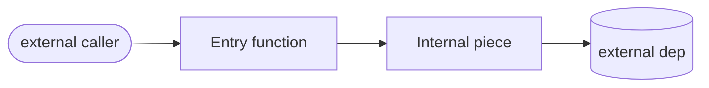
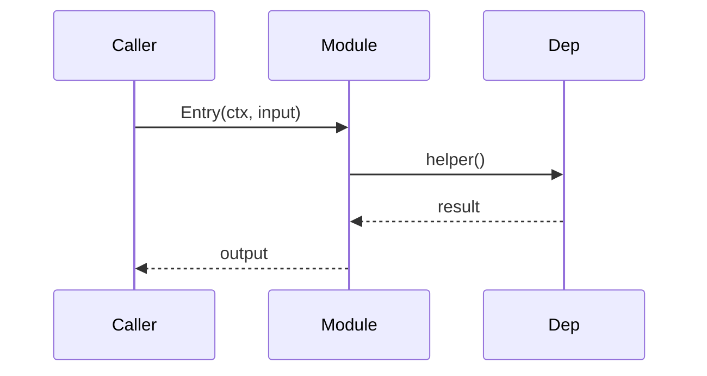

# `<module>` — <one-line role>

> **Status**: ✅ healthy | ⚠️ attention | 🔴 critical
> **Stability**: stable | evolving | experimental
> **Last reviewed**: YYYY-MM-DD
> **Code under**: `internal/<module>/`
> **Public surface**: `<count>` exported symbols (`go doc ./internal/<module>` for full list)

<!--
This file follows the canonical module-doc template at docs/modules/_TEMPLATE.md.
Section order and headings are FIXED so both humans and LLMs can navigate predictably.
Do NOT add or remove top-level sections without updating the template + INDEX.
-->

## 1. Purpose

One paragraph (3–6 lines) answering: **What problem does this module solve, and where does it sit in the agent's lifecycle?** Avoid restating implementation; describe the contract this module fulfills for the rest of the system.

## 2. Submodules & Key Files

| File / Subpackage | Responsibility | Notable types   |
| ----------------- | -------------- | --------------- |
| `foo.go`          | …              | `Foo`, `NewFoo` |
| `bar/`            | …              | `Bar`, `Baz`    |

If the package is flat (no subpackages), use one row per `.go` file grouped by role. Skip `*_test.go`.

## 3. Public API

The contracts the rest of the codebase consumes. Group by kind.

### Interfaces

```go
// Pasted verbatim from source — keep signatures, drop bodies. One block per interface.
type Foo interface {
    Bar(ctx context.Context, in Input) (Output, error)
}
```

### Structs / Types

Only the ones that cross the package boundary. For each, one line on intent.

### Constructors & Entry Points

`NewX(...)`, package-level functions that other modules call. Note any **side effects** (goroutines spawned, files opened, network bound).

## 4. Dependencies

### Imports (outbound)

What this module depends on. Generated from `go list -deps` or codegraph; do not invent.

| Depends on        | Why                |
| ----------------- | ------------------ |
| `internal/config` | Reads `<field>`    |
| `internal/store`  | Persists `<thing>` |

### Importers (inbound)

Who depends on this module. From `codegraph_callers` on the package's exported symbols.

| Used by          | How                                 |
| ---------------- | ----------------------------------- |
| `internal/agent` | Calls `NewX` in `wire.go`           |
| `internal/web`   | Mounts handler via `RegisterRoutes` |

### Layering position

One sentence: which architectural layer (transport / core / capability / persistence / cross-cutting) and which other layers this module is allowed to import.

## 5. Component Diagram



## 6. Key Flows

For each non-trivial flow the module participates in, one Mermaid sequence diagram. Typical examples:

- Cold-start / initialization
- Happy-path request
- Error / cancellation path



## 7. Verdict

**Overall health**: ✅ | ⚠️ | 🔴 — one-sentence justification.

| Dimension                       | Rating                       | Evidence                                          |
| ------------------------------- | ---------------------------- | ------------------------------------------------- |
| **Coupling** (fan-in × fan-out) | low / medium / high          | e.g. 4 importers, 6 imports — within normal range |
| **Size / bloat**                | lean / acceptable / inflated | LOC, biggest file, % test                         |
| **Cohesion**                    | focused / mixed / scattered  | does the package do one thing?                    |
| **Testability**                 | easy / moderate / hard       | mockable interfaces? hidden globals?              |
| **Stability**                   | stable / churning            | recent commits touching this package              |

### Smells / risks

- Concrete code smell with file:line reference. Why it matters. Severity.
- …

### Suggested refactors / patterns

Ordered by **impact ÷ effort**. Each item: what to change, why, rough size.

1. **<Refactor name>** — one paragraph. Touches `<files>`. Effort: S/M/L.
2. …

## 8. References

- Related modules: [[channel]], [[provider]] ← use module slug, will resolve when other docs land
- External: link to provider API docs, RFCs, spec sections
- SDD changes that shaped this module: `openspec/changes/archive/...`
- Source of truth for any non-obvious behavior — pointers, not duplication.
