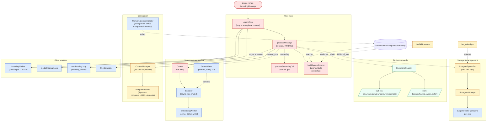
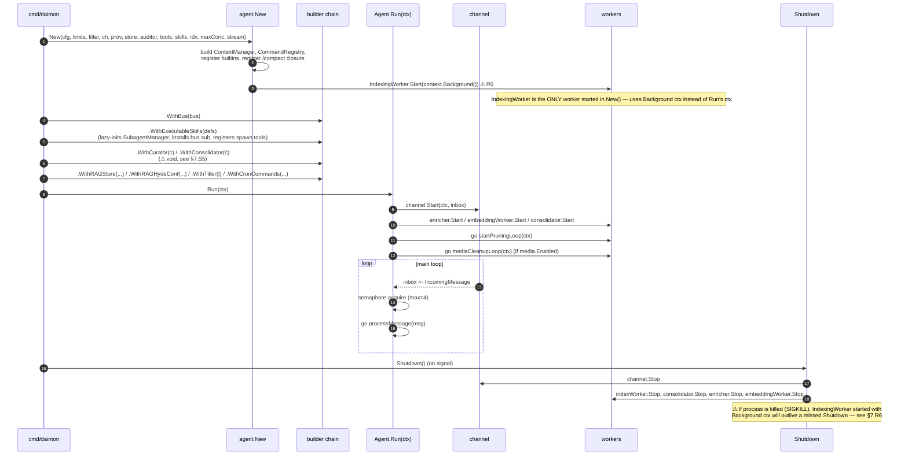
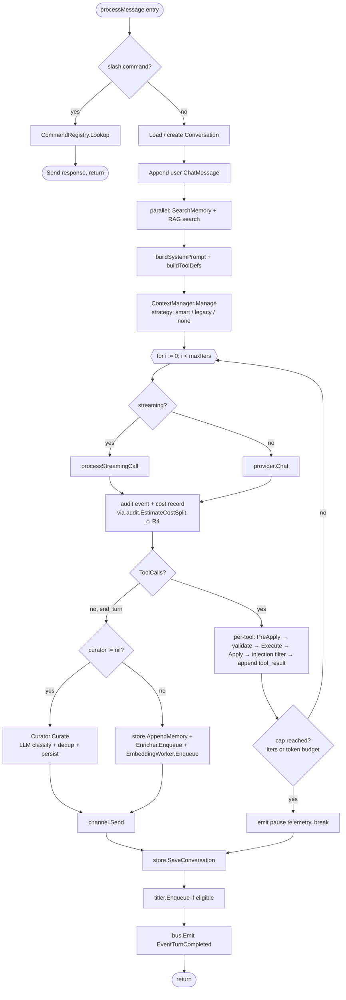
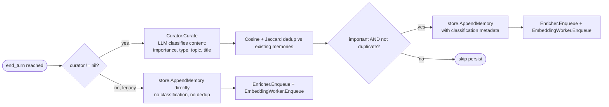

# `agent` — message processing core

> **Status**: ⚠️ attention (functional and well-tested, but god-type + god-method + 5 layering/wiring smells)
> **Stability**: stable
> **Last reviewed**: 2026-05-23
> **Code under**: `internal/agent/`
> **Size**: 28 production files, ~7,213 LOC, 41 `_test.go` files (one of the most heavily tested packages in the repo)
> **Public surface**: 5 exported interfaces, 7 exported structs, 13 builder methods, 17 package-level functions

## 1. Purpose

The agent package is the orchestration core of Daimon. It owns the message-processing loop: pop an `IncomingMessage` from the inbox, build the prompt (system + memories + RAG + history + tools), drive the LLM through possibly several tool-use rounds, and emit one or more `OutgoingMessage`s back through the channel. It also owns the lifecycle of conversation persistence, smart-memory curation, conversation compaction, title generation, subagent spawning, and a handful of background workers (embedding, enrichment, consolidation, indexing, media cleanup, memory pruning). It is the only package that knows how all the surrounding contracts fit together — everything else either feeds it (transports) or is called by it (capabilities, persistence, subsystems).

## 2. Submodules & Key Files

The package is **flat** — every file lives directly under `internal/agent/`. Files group logically into eight responsibilities:

### Core loop

| File         | LOC | Responsibility                                                                                                 | Key exports                                       |
| ------------ | --- | -------------------------------------------------------------------------------------------------------------- | ------------------------------------------------- |
| `agent.go`   | 747 | `Agent` struct, `New`, all `With*` builders, `Run`, `Shutdown`, accessors                                      | `Agent`, `New`, `Titler`                          |
| `loop.go`    | 995 | `processMessage` — slash dispatch → RAG → context build → LLM iteration → tool exec → memory save → title hook | (no exports; `processMessage` is package-private) |
| `stream.go`  | 157 | `processStreamingCall` adapts `StreamingProvider`+`StreamSender` to the loop                                   | (no exports)                                      |
| `context.go` | 288 | `buildSystemPrompt`, `buildContext`, `buildToolDefs`                                                           | (no exports)                                      |

### Subagent management

| File                  | LOC | Responsibility                                                            | Key exports                                                                                                      |
| --------------------- | --- | ------------------------------------------------------------------------- | ---------------------------------------------------------------------------------------------------------------- |
| `subagent_manager.go` | 633 | `SubagentManager`: spawn / track / budget-monitor / finalize child agents | `SubagentManager`, `SubagentStatus`, `SubagentResult`, `SubagentHandle`, `SpawnMode`, `ErrSubagentDepthExceeded` |
| `subagent_tool.go`    | 125 | `SubagentSpawnTool` — each executable skill becomes a tool                | `SubagentSpawnTool`                                                                                              |

### Smart memory pipeline

| File              | LOC | Responsibility                                                                       | Key exports                             |
| ----------------- | --- | ------------------------------------------------------------------------------------ | --------------------------------------- |
| `curator.go`      | 538 | Hot-path curation: classify via LLM, dedup (cosine+jaccard), persist with importance | `Curator`, `NewCurator`                 |
| `enricher.go`     | 177 | Background tag extraction via LLM, rate-limited                                      | `Enricher`, `NewEnricher`               |
| `embedding.go`    | 178 | Background vector embedding worker                                                   | `EmbeddingWorker`, `NewEmbeddingWorker` |
| `consolidator.go` | 285 | Periodic memory consolidation by topic                                               | `Consolidator`, `NewConsolidator`       |

### Compaction & context management

| File                  | LOC | Responsibility                                                                                          | Key exports                                                            |
| --------------------- | --- | ------------------------------------------------------------------------------------------------------- | ---------------------------------------------------------------------- |
| `context_manager.go`  | 277 | Strategy dispatcher (`smart`/`legacy`/`none`) — inline compaction per turn                              | `ContextManager`, `NewContextManager`, `TokenUsage`                    |
| `compact_pipeline.go` | 311 | Three-pass inline pipeline: compress tool results → LLM summarize → hard truncate                       | (no exports beyond helpers)                                            |
| `compactor.go`        | 315 | Background `ConversationCompactor`: writes `CompactedSummary` for idle convs                            | `ConversationCompactor`, `CompactorConfig`, `NewConversationCompactor` |
| `summarize.go`        | 285 | Legacy helpers: `legacyTruncate`, `mechanicalSummary`. Also `manageContextTokens` (dead in production). | (no exports)                                                           |

### Slash commands

| File               | LOC | Responsibility                                                                               | Key exports                                                                 |
| ------------------ | --- | -------------------------------------------------------------------------------------------- | --------------------------------------------------------------------------- |
| `commands.go`      | 294 | `CommandRegistry`, built-ins (`/help`, `/reset`, `/status`, `/whoami`, `/retry`, `/compact`) | `CommandRegistry`, `CommandContext`, `CommandHandler`, `NewCommandRegistry` |
| `commands_cron.go` | 301 | Cron commands wired via `WithCronCommands`: `/tasks`, `/schedule`, `/cancel`, `/history`     | `WithCronCommands`                                                          |

### Skill injection & hot reload

| File            | LOC | Responsibility                                                            | Key exports                                                                                                  |
| --------------- | --- | ------------------------------------------------------------------------- | ------------------------------------------------------------------------------------------------------------ |
| `injection.go`  | ~60 | Splits skills into autoload (inline) vs indexed (dynamic) by token budget | `InitSkillInjection`                                                                                         |
| `hot_reload.go` | 165 | Runtime mutation of skills and MCP servers without restart                | `ReplaceExecutableSkills`, `RegisterMCPServer`, `UnregisterMCPServer`, `ReplaceSkills`, `CloseHotMCPServers` |

### Title generation

| File        | LOC | Responsibility                                              | Key exports                           |
| ----------- | --- | ----------------------------------------------------------- | ------------------------------------- |
| `titler.go` | 252 | Worker that LLM-generates titles for eligible conversations | `TitleGenerator`, `NewTitleGenerator` |

### Workers & utilities

| File                 | LOC | Responsibility                                             | Key exports                                                                                                                  |
| -------------------- | --- | ---------------------------------------------------------- | ---------------------------------------------------------------------------------------------------------------------------- |
| `indexing_worker.go` | 99  | Indexes `store.ToolOutput` for `search_output`             | `IndexingWorker`, `NewIndexingWorker`                                                                                        |
| `media_cleanup.go`   | ~50 | Periodic prune of unreferenced media blobs                 | (no exports)                                                                                                                 |
| `tokens.go`          | 106 | Heuristic token estimation per string / message / provider | `EstimateTokens`, `EstimateMessageTokens`, `EstimateMessageTokensFor`, `EstimateMessagesTokens`, `EstimateMessagesTokensFor` |
| `validate.go`        | ~30 | JSON Schema validation for tool inputs                     | (no exports)                                                                                                                 |
| `ratelimiter.go`     | ~45 | Token-bucket limiter (used by Enricher)                    | (no exports)                                                                                                                 |

## 3. Public API

### Interfaces

```go
// agent.go:168
type Titler interface {
    Enqueue(ctx context.Context, convID string)
}
```

All other "interfaces" the agent consumes (`channel.Channel`, `provider.Provider`, `store.Store`, `audit.Auditor`, `tool.Tool`, `rag.DocumentStore`, `notify.Bus`, `metrics.Recorder`) belong to other packages.

### Structs / Types

```go
// agent.go (entire struct privée — no exported fields; accessors below)
type Agent struct { /* 19 dependency fields + 5 runtime-state fields */ }

// subagent_manager.go:69
type SubagentResult struct {
    Status    string            `json:"status"`
    Summary   string            `json:"summary"`
    Artifacts map[string]string `json:"artifacts,omitempty"`
    Cost      float64           `json:"cost_usd"`
    Turns     int               `json:"turns"`
    Errors    []string          `json:"errors,omitempty"`
    Metadata  map[string]string `json:"metadata,omitempty"`
}

// subagent_manager.go:80
type SubagentStatus struct {
    ID, BatchID, SkillName, ConvID, ParentConvID string
    Status    string
    Cost      float64
    Turns     int
    SpawnedAt time.Time
    Budget    skill.BudgetConfig
}

// subagent_manager.go:89
type SubagentHandle struct{ ID, BatchID string /* …rec privée */ }
func (h *SubagentHandle) Wait(ctx context.Context) (*SubagentResult, error)
func (h *SubagentHandle) Cancel()
func (h *SubagentHandle) Status() SubagentStatus

// subagent_manager.go:25
type SpawnMode string
const (
    SpawnModeSync  SpawnMode = "sync"
    SpawnModeAsync SpawnMode = "async"
)

var ErrSubagentDepthExceeded = errors.New(...)
```

### Constructor & builders

```go
// agent.go:172 — 13 positional parameters
func New(
    cfg config.AgentConfig, limits config.LimitsConfig, filterCfg config.FilterConfig,
    ch channel.Channel, prov provider.Provider, st store.Store, auditor audit.Auditor,
    tools map[string]tool.Tool,
    skills []skill.SkillContent, skillIndex skill.SkillIndex,
    maxConcurrent int, stream bool,
    storeCfg ...config.StoreConfig,
) *Agent

// Fluent builders (return *Agent — chainable)
func (a *Agent) WithAuditorAccessor(fn func() audit.Auditor) *Agent
func (a *Agent) WithMediaConfig(cfg config.MediaConfig) *Agent
func (a *Agent) WithBus(bus notify.Bus) *Agent
func (a *Agent) WithRAGStore(st rag.DocumentStore, embedFn …, maxChunks, maxTokens int) *Agent
func (a *Agent) WithRAGRetrievalConf(conf rag.RAGRetrievalConf) *Agent
func (a *Agent) WithRAGHydeConf(conf config.RAGHydeConf, hypothesisFn …) *Agent
func (a *Agent) WithRAGMetrics(r metrics.Recorder) *Agent
func (a *Agent) WithTitler(t Titler) *Agent
func (a *Agent) WithAIConfig(cfg config.AIConfig) *Agent
func (a *Agent) WithExecutableSkills(defs []skill.ExecutableSkillDef) *Agent
func (a *Agent) WithCronCommands(scheduler cron.SchedulerIface, cronStore store.CronStore) *Agent

// Void "builders" (DO NOT chain — see Smell §7.S5)
func (a *Agent) WithCurator(c *Curator)
func (a *Agent) WithConsolidator(c *Consolidator)
```

### Lifecycle

```go
func (a *Agent) Run(ctx context.Context) error    // agent.go:650
func (a *Agent) Shutdown() error                  // agent.go:722
```

### Accessors

```go
func (a *Agent) SubagentManager() *SubagentManager
func (a *Agent) ActiveSubagents() []SubagentStatus
func (a *Agent) SubagentBus() notify.Bus
func (a *Agent) CancelSubagent(id string) error
func (a *Agent) Enricher() *Enricher
func (a *Agent) EmbeddingWorker() *EmbeddingWorker
func (a *Agent) RAGRetrievalConfig() rag.RAGRetrievalConf
```

### Hot-reload (exported on `*Agent`)

```go
func (a *Agent) ReplaceExecutableSkills(defs []skill.ExecutableSkillDef)
func (a *Agent) RegisterMCPServer(serverName string, tools map[string]tool.Tool, caller interface{ Close() error })
func (a *Agent) UnregisterMCPServer(serverName string) error
func (a *Agent) CloseHotMCPServers()
func (a *Agent) ReplaceSkills(skills []skill.SkillContent, idx skill.SkillIndex)
```

### Package-level functions

```go
func InitSkillInjection(allSkills []skill.SkillContent, maxContextTokens int) ([]skill.SkillContent, skill.SkillIndex)
func NewCurator(prov provider.Provider, st store.Store, enricher *Enricher, embWorker *EmbeddingWorker,
                curationCfg config.MemoryCurationConfig, dedupCfg config.DeduplicationConfig) *Curator
func NewConsolidator(prov provider.Provider, st store.Store, enricher *Enricher, embWorker *EmbeddingWorker,
                     cfg config.ConsolidationConfig) *Consolidator
func NewConversationCompactor(st compactorStoreAPI, prov compactorProviderAPI, cfg CompactorConfig) *ConversationCompactor
func NewTitleGenerator(st titleStoreAPI, prov titleProviderAPI, cfg config.TitleGenYAMLConfig) *TitleGenerator
func NewEmbeddingWorker(embProvider any, db *sql.DB, cfg config.StoreConfig) *EmbeddingWorker
func NewEnricher(prov provider.Provider, st store.Store, cfg config.AgentConfig) *Enricher
func NewSubagentManager(bus notify.Bus, st store.Store) *SubagentManager
func EstimateTokens(s string) int
func EstimateMessageTokens(msg provider.ChatMessage) int
// … plus per-provider variants
```

## 4. Dependencies

### Outbound (what `agent` consumes)

Fan-out = 13 packages inside `internal/`. The interesting column is which **concrete types** leak through interface contracts.

| Dependency             | Interface-based                                                   | Concrete types referenced                                                                                                                                 |
| ---------------------- | ----------------------------------------------------------------- | --------------------------------------------------------------------------------------------------------------------------------------------------------- |
| `internal/audit`       | ✅ `Auditor` interface                                            | also calls `audit.EstimateCostSplit` (free function), `audit.NoopAuditor`                                                                                 |
| `internal/channel`     | mostly ✅                                                         | **`*channel.SubagentChannel`** (concrete) — used in `makeChildAgentFn` and `subRecord`. No interface equivalent exists for the pre-started-inbox pattern. |
| `internal/config`      | n/a (config structs)                                              | 14 config sub-structs                                                                                                                                     |
| `internal/content`     | n/a (value types)                                                 | `content.Blocks`, `TextBlock`, `DegradationNotice`                                                                                                        |
| `internal/cron`        | ✅ `SchedulerIface`                                               | also `cron.NewParser`, `ActiveJob`                                                                                                                        |
| `internal/filter`      | ⚠️ free functions only                                            | `filter.Apply`, `filter.PreApply`, `filter.ApplyInjectionFilter` — see §7 R3                                                                              |
| `internal/notify`      | ✅ `Bus` interface                                                | event constants                                                                                                                                           |
| `internal/provider`    | ✅ `Provider`, `StreamingProvider`, `EmbeddingProvider`           | uses `provider.NewFromConfig` (free fn) inside `makeChildAgentFn` — see §7 R8                                                                             |
| `internal/rag`         | ✅ `DocumentStore`                                                | also `PerformHydeSearch` (free fn)                                                                                                                        |
| `internal/rag/metrics` | ✅ `Recorder`                                                     |                                                                                                                                                           |
| `internal/skill`       | n/a                                                               | `SkillContent`, `SkillIndex`, `ExecutableSkillDef`, `BudgetConfig`                                                                                        |
| `internal/store`       | ✅ `Store`, `OutputStore`, `CostStore`, `MediaStore`, `CronStore` | **`*store.SQLiteStore`** (concrete) — type-asserted in `startPruningLoop` and in `New` for embedding wiring. See §7 R7.                                   |
| `internal/tool`        | ✅ `Tool`                                                         | `WithScope`, `WithConvID` (context helpers)                                                                                                               |

### Inbound (who consumes `agent`)

Fan-in = **8 non-test files** across 2 packages.

| Caller                              | What it consumes                                                                                                              |
| ----------------------------------- | ----------------------------------------------------------------------------------------------------------------------------- |
| `cmd/daimon/main.go`                | `agent.New`, `InitSkillInjection`, `NewTitleGenerator`, `NewConversationCompactor`, `CompactorConfig`                         |
| `cmd/daimon/web_cmd.go`             | same set as `main.go`                                                                                                         |
| `cmd/daimon/memory_wiring.go`       | `*agent.Agent` (param), `NewCurator`, `NewConsolidator`                                                                       |
| `cmd/daimon/rag_wiring.go`          | `*agent.Agent` (param)                                                                                                        |
| `internal/web/server.go`            | `agent.SubagentStatus`; `*agent.Agent` matched against private interfaces `AgentReloader` and `SubagentProvider` (duck-typed) |
| `internal/web/handler_subagents.go` | `agent.SubagentStatus`                                                                                                        |
| `internal/web/handler_skills.go`    | `agent.InitSkillInjection`                                                                                                    |
| `internal/web/mcp_skills.go`        | `agent.InitSkillInjection`                                                                                                    |

### Layering position

`agent` sits at the **Core** layer. It is allowed to import Capabilities, Persistence, Subsystems, and Cross-cutting (`config`, `content`). It is the only Core package; only `web` (Transport) imports it. See [`../ARCHITECTURE.md` §6](../ARCHITECTURE.md#6-layering-violations) for the layering violation L1 (`web → agent`).

## 5. Component Diagram



## 6. Key Flows

### 6.1 Lifecycle (boot → steady state → shutdown)



### 6.2 `processMessage` high-level path

The full sequence diagram is in [`../ARCHITECTURE.md` §4.1](../ARCHITECTURE.md#41-happy-path-user-message--response) (happy path) and §4.2 (tool-use loop). What's specific to the `agent` package internally:



### 6.3 Smart memory hot-path vs legacy path

When the LLM returns `end_turn` (no more tool calls), the agent persists the exchange to memory. Two mutually exclusive paths:



The Curator hot-path adds an extra LLM call per turn but materially raises memory signal-to-noise.

### 6.4 Subagent spawn (parent → child)

See [`../ARCHITECTURE.md` §4.6](../ARCHITECTURE.md#46-subagent-spawn-executable-skill). Internal anchors specific to this package: `subagent_manager.go:214` (`Spawn`), `:354` (`budgetMonitor`), `:423` (`finalize`), `:188` (bus subscription — O(N) scan, see §7.R2), `agent.go:465` (`makeChildAgentFn` closure that constructs the child `*Agent`).

## 7. Verdict

**Overall health**: ⚠️ **Attention** — the module works and is heavily tested (41 test files), but it carries five structural smells (god-method, god-type, leaky concretes, double-build, void builders) that would block a senior reviewer from green-lighting it as-is.

| Dimension                       | Rating              | Evidence                                                                                                                                                                                                          |
| ------------------------------- | ------------------- | ----------------------------------------------------------------------------------------------------------------------------------------------------------------------------------------------------------------- |
| **Coupling (fan-in × fan-out)** | high                | Fan-out = 13 (largest in `internal/`). Fan-in = 8 files / 2 packages — the choke-point everyone depends on. Two concrete-type leaks (`*store.SQLiteStore`, `*channel.SubagentChannel`).                           |
| **Size / bloat**                | inflated            | 7,213 prod LOC across 28 files. `loop.go::processMessage` is 730 LOC; `agent.go::New` is ~138 LOC.                                                                                                                |
| **Cohesion**                    | mixed               | The package does 9 things (loop, subagent mgmt, memory pipeline, compaction, titler, commands, hot-reload, indexing, media cleanup) — high cohesion _within_ each subsystem, but the package as a whole is a bag. |
| **Testability**                 | moderate            | Excellent test coverage (41 files), but constructor with 13 params + 24 fields makes unit-testing painful. Most tests rely on builder helpers.                                                                    |
| **Stability**                   | stable but churning | Many recent SDD changes have touched it (subagents-crud, RAG, compactor) — see `openspec/changes/archive/`.                                                                                                       |

### Smells & risks

References below use `agent/<file>:<line>`.

**S1. `processMessage` is a god-method (730 LOC)** — `loop.go:121`.
Single function handling: slash dispatch, RAG search, context build, the iteration loop (`for i := 0; i < maxIters`), the streaming/non-streaming branch, per-tool execution (PreApply / validate / Execute with timeout / Apply / auto-index / injection filter / CDATA wrap), loop detection, iteration/token cap checking, smart vs legacy memory save, title hook, event emission. Single biggest predictor of bugs in this module — any change requires re-reasoning about all of it.

**S2. `*agent.Agent` is a god-type (24 private fields)** — `agent.go`.
19 dependency fields + 5 runtime-state fields, no sub-structs. RAG alone occupies 8 fields (`ragStore`, `ragEmbedFn`, `ragMaxChunks`, `ragMaxTokens`, `ragRetrievalConf`, `ragHydeConf`, `ragHypothesisFn`, `ragMetrics`). Memory pipeline occupies 4 (`enricher`, `embeddingWorker`, `curator`, `consolidator`). Classic "bag of dependencies" accumulated via builder pattern.

**S3. `New` has 13 positional parameters** — `agent.go:172`.
Any reordering of same-typed parameters is a silent bug. Callers mitigate with one-arg-per-line formatting, but the compiler does not enforce. Options-pattern or builder-struct refactor would eliminate this category of bug.

**S4. Two concrete-type leaks force `type` assertions**

- `*store.SQLiteStore` — type-asserted in `agent.go:37` (`startPruningLoop`) and `agent.go:206` (`New`, to access `*sql.DB` for `EmbeddingWorker`). Interface `store.Store` does not expose pruning or DB. Solution: extract `store.PrunableStore` and `store.DBProvider` interfaces.
- `*channel.SubagentChannel` — required in `makeChildAgentFn` and `SubagentManager.subRecord` for the pre-started-inbox pattern. Smaller smell.

**S5. `WithCurator` and `WithConsolidator` break the fluent chain** — `agent.go:339`, `:342`.
They are the only `With*` methods that don't return `*Agent`. Currently safe because they are called separately in `cmd/daimon/memory_wiring.go`, but the inconsistency is an API trap.

**S6. `audit` and `cost` packages duplicate pricing logic**

- `audit.EstimateCostSplit` / `audit.EstimateCost` (used in production by `loop.go:481`)
- `cost.ComputeCost` / `cost.FormatCost` (used only by `cmd/daimon/costs_cmd.go`)

Two implementations of the same pricing math. Diverges on every price update unless someone remembers both. See [`../ARCHITECTURE.md` §7.3](../ARCHITECTURE.md#7-architectural-risks-worth-tracking) (cost ghost-package risk).

**S7. `manageContextTokens` is dead code in production** — `summarize.go:167`.
Pre-`ContextManager` predecessor with no production callers (only test callers). Confusing artifact alongside `ContextManager.Manage`. Delete or annotate `// Deprecated: superseded by ContextManager`.

**S8. `IndexingWorker` started with `context.Background()` in the constructor** — `agent.go:228-230`.
Every other worker starts inside `Run(ctx)` and inherits cancellation. `IndexingWorker` cannot be cancelled by Run's context — only by an explicit `indexWorker.Stop()` in `Shutdown`. If `Shutdown` is missed (SIGKILL, panic before defer), the goroutine outlives the process intent.

**S9. `filter` lives outside `agent/` but only `agent` calls it** — `internal/filter/`.
Functions `filter.Apply`, `filter.PreApply`, `filter.ApplyInjectionFilter` have only test importers outside `agent`. The package boundary doesn't reflect actual coupling.

**S10. `SubagentManager` performs an O(N) linear scan of `subs` per bus event** — `subagent_manager.go:184-209`.
The closure registered on `notify.Bus` iterates `m.subs` for every `EventTurnCompleted` to find the matching subagent by channel ID. With current V1 cap (`maxConcurrent=4`, depth=1) the impact is negligible, but the design will not scale once subagent depth grows.

**S11. `makeChildAgentFn` instantiates a brand-new provider per spawn** — `agent.go:495-503`.
When `def.ProviderName != ""`, `provider.NewFromConfig(cfg)` is called inside the spawn closure — no pooling. A skill with a configured provider and frequent spawns pays a TLS-handshake + auth round-trip per spawn.

**S12. Hard-coded 30-second timeout on semaphore drain** — `loop.go:705`.
The `case <-time.After(30 * time.Second)` is not derived from `limits.TotalTimeout` or any config field. Messages dropped here only emit `slog.Warn`; the user gets nothing.

**S13. Double-build of the agent on the `--web` path** — `cmd/daimon/main.go:524` + `main.go:591`.
Already cataloged in `../ARCHITECTURE.md` §7 R1. Mentioned here because the `IndexingWorker.Start(context.Background())` in `New` (S8) interacts: the abandoned first agent's IndexingWorker goroutine has no cancellation path other than a `Stop` that never runs.

### Suggested refactors (impact ÷ effort)

1. **Extract `processMessage` into a pipeline of small stages** (S1) — split into `dispatchSlash`, `buildContext`, `runIterationLoop`, `persistTurn`, `postTurnHooks`. Each becomes independently testable. **Effort: L. Impact: high.** Touches `loop.go` only.
2. **Group `Agent` dependencies into sub-structs** (S2) — e.g. `ragDeps`, `memoryDeps`, `compactionDeps`, `cronDeps`. Cuts the field count from 24 to ~8. **Effort: M. Impact: high.** Touches `agent.go` + builders + accessors.
3. **Adopt an Options struct for `New`** (S3) — `func New(deps Deps, opts ...Option) *Agent`. Combine with #2. **Effort: M. Impact: high.** Touches `agent.go` and every caller (4 files in `cmd/daimon` + 2 in `internal/web`).
4. **Unify pricing into `internal/cost`** (S6) — `audit.EstimateCostSplit` becomes a thin caller of `cost.ComputeCostSplit`. Resolves the ghost-package smell. **Effort: S. Impact: medium.**
5. **Index `SubagentManager.subs` by channel ID** (S10) — second map `byChannelID map[string]*subRecord` updated alongside `subs`. **Effort: S. Impact: medium (latent).**
6. **Introduce `store.PrunableStore` / `store.DBProvider` interfaces** (S4) — remove the `*store.SQLiteStore` type assertion. **Effort: S. Impact: low-medium.** Cross-package — also touches `store`.
7. **Make `WithCurator` / `WithConsolidator` return `*Agent`** (S5) — trivial. **Effort: XS. Impact: low.**
8. **Move `IndexingWorker.Start` from `New` to `Run(ctx)`** (S8) — accept the ctx, store cancel func. **Effort: XS. Impact: medium (leak prevention).**
9. **Connect the 30-s semaphore timeout to `limits` config** (S12). **Effort: XS. Impact: low.**
10. **Delete `manageContextTokens`** (S7) — verify no tests rely on it; if they do, port them. **Effort: XS. Impact: low (clarity).**
11. **Move `filter` under `agent/` (subpackage) or wrap as an interface** (S9) — see also [`filter` module doc](filter.md) once it lands. **Effort: M. Impact: medium.**

## 8. References

- Higher-level system map and message flows: [`../ARCHITECTURE.md`](../ARCHITECTURE.md).
- Related modules:
  - [[channel]] — owns the inbox and `*SubagentChannel` concrete type.
  - [[provider]] — `Provider`, `StreamingProvider`, `EmbeddingProvider`.
  - [[tool]] — `Tool` interface; `WithScope` / `WithConvID` context helpers.
  - [[skill]] — `SkillContent`, `ExecutableSkillDef`, `BudgetConfig`.
  - [[store]] — `Store` family of interfaces (with `*SQLiteStore` leak — see S4).
  - [[notify]] — `Bus` events consumed by `SubagentManager`.
  - [[rag]] — retrieval pipeline invoked from `loop.go`.
  - [[filter]] — see S9.
- Originating SDD changes (in `openspec/changes/archive/`): `subagents-crud`, prior RAG and compactor changes.
- Anti-cross-references: `DAIMON.md` §5 and §12c are conceptual; trust `internal/agent/` for behaviour and this doc for the current map.
