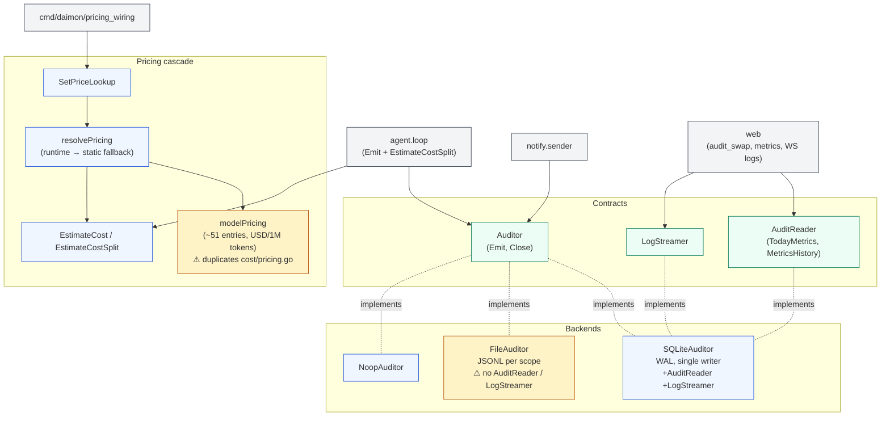
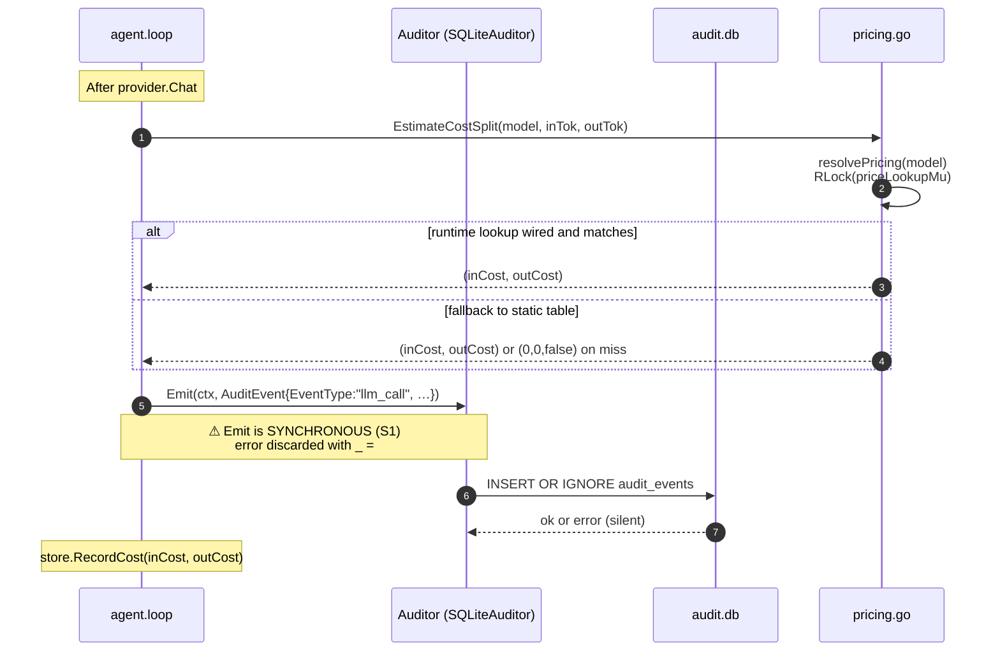
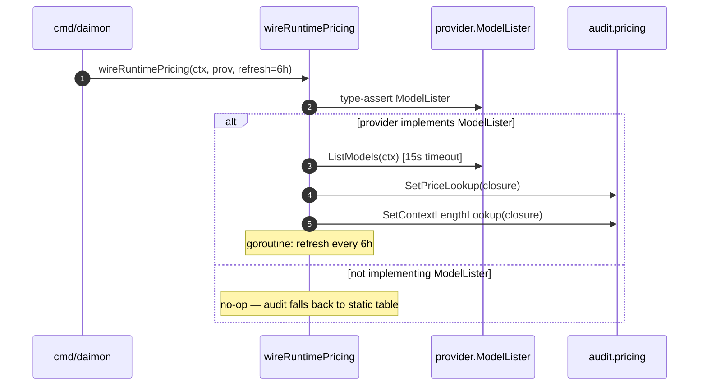

# `audit` — event log + runtime pricing cascade

> **Status**: ⚠️ attention (sync `Emit` in hot path; FileAuditor lacks query capability; pricing duplicated with `cost`)
> **Stability**: stable
> **Last reviewed**: 2026-05-23
> **Code under**: `internal/audit/`
> **Size**: 5 production files, ~671 LOC (+ 757 LOC of tests)
> **Public surface**: 1 interface (`Auditor`), 1 streaming interface, 3 backends, 7 pricing-related functions

## 1. Purpose

The `audit` package records a tamper-resistant log of every agent decision: LLM calls (success and failure), tool invocations, and notification deliveries. It also owns the **runtime pricing cascade** — `wireRuntimePricing` registers a `PriceLookup` callback here at boot, and the agent loop calls `audit.EstimateCostSplit` to convert (model, tokens) into dollars on the hot path. Two backends exist: `SQLiteAuditor` (query-capable, indexed) and `FileAuditor` (append-only JSONL, no query). `NoopAuditor` is the cheap-zero option for tests and disabled audit.

## 2. Submodules & Key Files

| File               | LOC | Responsibility                                                                                                      |
| ------------------ | --- | ------------------------------------------------------------------------------------------------------------------- |
| `audit.go`         | 44  | `AuditEvent` struct, `Auditor` interface, `NoopAuditor`                                                             |
| `pricing.go`       | 154 | Runtime cascade (`SetPriceLookup` + static fallback) + `EstimateCost` / `EstimateCostSplit` + `LookupContextLength` |
| `sqliteauditor.go` | 185 | `SQLiteAuditor` — `audit.db`, WAL mode, single writer, indexed schema, `RecentEvents` + `LogStreamer`               |
| `fileauditor.go`   | 92  | `FileAuditor` — append-only JSONL per scope, file-handle cache                                                      |
| `reader.go`        | 196 | `AuditReader` interface — `TodayMetrics`, `MetricsHistory` aggregates with `estimateDayCost`                        |

## 3. Public API

### Core types

```go
// audit.go:9
type AuditEvent struct {
    ID, ScopeID, EventType string
    Timestamp              time.Time
    DurationMs             int64

    // LLM
    Model               string
    InputTokens         int     // ⚠ S5: int here, int64 in EstimateCostSplit
    OutputTokens        int
    StopReason          string
    Iteration           int

    // Tool
    ToolName            string
    ToolOK              bool
    Details             map[string]string

    // Filter metrics
    OriginalBytes, CompressedBytes int
    FilterName                     string
}

// audit.go:35
type Auditor interface {
    Emit(ctx context.Context, event AuditEvent) error
    Close() error
}

// audit.go:41
type NoopAuditor struct{}
```

### Pricing

```go
// pricing.go:9, :16
type PriceLookup         func(model string) (inputPer1M, outputPer1M float64, ok bool)
type ContextLengthLookup func(model string) (contextLength int, ok bool)

// pricing.go:27, :35 — goroutine-safe (RWMutex)
func SetPriceLookup(lookup PriceLookup)
func SetContextLengthLookup(lookup ContextLengthLookup)

// pricing.go:43
func LookupContextLength(model string) (int, bool)

// pricing.go:55 (private) → cascades runtime → static
func resolvePricing(model string) (inputPer1M, outputPer1M float64, ok bool)

// pricing.go:136, :147
func EstimateCost(model string, inputTokens, outputTokens int64) float64
func EstimateCostSplit(model string, inputTokens, outputTokens int64) (inCost, outCost float64)
```

### Reader (SQLite-only)

```go
// reader.go:12
type AuditReader interface {
    TodayMetrics(ctx) (DailyMetrics, error)
    MetricsHistory(ctx, days int) ([]DailyMetrics, error)
}
```

### Backends

```go
func NewSQLiteAuditor(basePath string) (*SQLiteAuditor, error)  // sqliteauditor.go:45
func NewFileAuditor(basePath string)   (*FileAuditor, error)    // fileauditor.go:23
```

`*SQLiteAuditor` additionally implements `LogStreamer` (`sqliteauditor.go:104`) and `AuditReader`. `*FileAuditor` implements neither — see S3 below.

## 4. Dependencies

| Direction | Edge                                                                                                                                                                                   |
| --------- | -------------------------------------------------------------------------------------------------------------------------------------------------------------------------------------- |
| Outbound  | stdlib only (`database/sql`, `os`, `encoding/json`, `log/slog`, `sync`)                                                                                                                |
| Inbound   | `internal/agent` (Emit + EstimateCostSplit), `internal/notify` (Emit), `internal/web` (audit_swap, metrics handler, WS logs), `cmd/daimon` (wireRuntimePricing + backend construction) |

The package **does not import `internal/cost`** — the static fallback table lives in `audit/pricing.go:74` independently. See [`cost.md`](cost.md) for the duplication.

### Layering position

Persistence + Subsystem hybrid. Allowed to import stdlib only (no `internal/` dependencies). Clean.

## 5. Component Diagram



## 6. Key Flows

### 6.1 Hot-path emit + cost estimate



### 6.2 Runtime pricing registration at boot



### 6.3 Event taxonomy

| EventType                    | Emitted in          | Carries                                                  |
| ---------------------------- | ------------------- | -------------------------------------------------------- |
| `"llm_call"` (success)       | `agent/loop.go:471` | Model, InputTokens, OutputTokens, StopReason, Iteration  |
| `"llm_call"` (error/timeout) | `agent/loop.go:418` | Iteration, StopReason ∈ {"error", "turn_timeout"}        |
| `"tool_use"`                 | `agent/loop.go:751` | ToolName, ToolOK, Details (url, status_code, command, …) |
| `"notification.sent"`        | `notify/sender.go`  | —                                                        |
| `"notification.failed"`      | `notify/sender.go`  | —                                                        |

## 7. Verdict

**Overall health**: ⚠️ **Attention** — the design is sound but three operational hazards live in production today: synchronous emit on the hot path, FileAuditor without query, and pricing duplication.

| Dimension        | Rating   | Evidence                                                                 |
| ---------------- | -------- | ------------------------------------------------------------------------ |
| **Coupling**     | very low | Outbound: stdlib only. Inbound: 4 packages, all legitimate.              |
| **Size / bloat** | lean     | 671 LOC + tests.                                                         |
| **Cohesion**     | mixed    | Events + pricing in one package is convenient but they are two concerns. |
| **Testability**  | high     | 757 LOC of tests including reader aggregates and price-cascade paths.    |
| **Stability**    | stable   | Few recent edits to the public API.                                      |

### Smells & risks

**S1. `Emit` is synchronous and the error is discarded** — `agent/loop.go:418, 471, 751` all do `_ = a.auditorFn().Emit(ctx, ev)`. `SQLiteAuditor.Emit` issues a `db.ExecContext` (`sqliteauditor.go:73`) with `MaxOpenConns(1)`. If the disk is full or the connection is stuck, the agent loop blocks waiting for the write, then silently continues with the error eaten by `_ =`. Either move emit to a buffered async writer, or surface the error.

**S2. Pricing tables duplicate `internal/cost`** — `pricing.go:74` (~51 entries, USD/1M tokens) versus `cost/pricing.go:22` (22 entries, USD/token). Different unit format, divergent model set. See [`cost.md` S2/S3](cost.md#smells--risks).

**S3. `FileAuditor` is silently a dead-end** — `fileauditor.go` implements `Auditor` but not `AuditReader`, not `LogStreamer`. If the user sets `Audit.Type = "file"`, the dashboard metrics widget and WebSocket log stream are non-functional, but neither boot logs nor the UI warn about it.

**S4. `details` stored as JSON blob, never read back** — `sqliteauditor.go:79-83` serialises `Details map[string]string` into a TEXT column. `RecentEvents` (`:114`) scans 12 columns but **not** `details` — the field is write-only. Any future feature that reads tool details out of the audit log has to add the column and the scan.

**S5. Type mismatch between `AuditEvent.InputTokens` (int) and `EstimateCostSplit(int64)`** — `audit.go:19` declares `int`; `pricing.go:147` takes `int64`. `agent/loop.go:482` does `int64(resp.Usage.InputTokens)`. On 32-bit systems `int` is 32-bit, so values near 2^31 truncate; in practice token counts never reach that scale, but the inconsistency is a smell.

**S6. `INSERT OR IGNORE` silently drops duplicates** — `sqliteauditor.go:71`. Re-emitting an event with the same ID (a retry path that re-runs `loop.go`) drops the second event without warning. Useful, but worth documenting.

**S7. `SetPriceLookup(nil)` semantics** — `wireRuntimePricing` stop function (`cmd/daimon/pricing_wiring.go`) sets the lookup to `nil`. After that, `resolvePricing` falls through to the static table without any "runtime pricing unavailable" log. Operators have no visibility into when runtime pricing was disabled.

**S8. `estimateDayCost` recomputes per-row** — `reader.go:139`. For each row in a day's history, it looks up pricing again. Acceptable today (small `audit.db`) but does not scale.

**S9. The static fallback table is hand-maintained** — `pricing.go:74`. Same shelf-life issue as `cost/pricing.go`: a new model release means editing this file.

**S10. `Emit` ctx is the agent loop's ctx** — if the agent loop ctx cancels mid-emit (turn timeout), the audit write is cancelled too. Defensible — the audit reflects the work that finished — but worth knowing.

### Suggested refactors (impact ÷ effort)

1. **Async emit buffer in front of `SQLiteAuditor`** (S1) — bounded channel + worker goroutine that batches inserts. Drops with `slog.Warn` on full; surfaces errors via metrics. **Effort: M. Impact: high (hot-path latency).**
2. **Unify pricing with `cost` into a new `internal/pricing` package** (S2) — see [`cost.md` §7 option 2](cost.md#suggested-refactors-impact--effort). **Effort: M. Impact: high.**
3. **Make `FileAuditor` implement `AuditReader` (by tailing JSONL) or warn at boot when chosen with audit dashboard enabled** (S3). **Effort: M. Impact: medium.**
4. **Read `details` back in `RecentEvents`** (S4) — add scan + deserialise. **Effort: XS. Impact: medium.**
5. **Promote `AuditEvent.InputTokens` to `int64`** (S5). **Effort: S (touches all emitters). Impact: low.**
6. **Log when `SetPriceLookup(nil)` is called** (S7). **Effort: XS. Impact: low.**
7. **Cache pricing lookups inside `estimateDayCost`** (S8). **Effort: XS. Impact: low.**

## 8. References

- Hot-path estimator: `internal/agent/loop.go:482` (`audit.EstimateCostSplit`).
- Hot-path emit: `internal/agent/loop.go:418, 471, 751`.
- Pricing wiring: `cmd/daimon/pricing_wiring.go:25` (`wireRuntimePricing`).
- Web hot-swap: `internal/web/audit_swap.go` (`CurrentAuditor`, `rebuildAuditor`).
- WebSocket logs: `internal/web/handler_ws_logs.go:92, 126, 176`.
- Related modules:
  - [[cost]] — duplicate pricing table, see comparison + recommendation in `cost.md`.
  - [[provider]] — providers that implement `ModelLister` enable the runtime pricing path.
  - [[agent]] — primary emitter; [`agent.md` S6](agent.md#smells--risks) calls out the same audit/cost duplication.
  - [[notify]] — secondary emitter (`notification.sent` / `notification.failed`).
