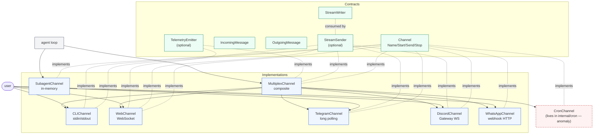

# `channel` — transport contracts and implementations

> **Status**: ⚠️ attention (works, but multiple silent-drop & auth gaps; one architectural anomaly)
> **Stability**: stable
> **Last reviewed**: 2026-05-23
> **Code under**: `internal/channel/` (+ one anomaly in `internal/cron/`)
> **Size**: 12 production files, ~2,997 LOC
> **Public surface**: 4 exported interfaces, 8 exported structs/types, 8 constructors

## 1. Purpose

The `channel` package defines the Transport layer of Daimon: the `Channel` interface — a four-method contract (`Name`, `Start`, `Send`, `Stop`) — plus every concrete way a user (or process) talks to the agent. CLI, WebSocket, Telegram, Discord, WhatsApp, an in-memory subagent channel, and a composite multiplex are all here. Each implementation is a self-contained "dumb pipe": it knows how to receive bytes from its specific transport, package them as `IncomingMessage`, push them into the agent's inbox, and write `OutgoingMessage` back. It must not know anything about the agent loop, the provider, or persistence.

## 2. Submodules & Key Files

The package is flat. Files group by responsibility:

### Contracts

| File         | LOC | Responsibility                                                                                                               |
| ------------ | --- | ---------------------------------------------------------------------------------------------------------------------------- |
| `channel.go` | 100 | `Channel`, `IncomingMessage`, `OutgoingMessage`, `StreamWriter`, `StreamSender`, `TelemetryEmitter`, `ErrStreamNotSupported` |

### Transport implementations

| File(s)                              | LOC       | Transport                        | Key types                                               |
| ------------------------------------ | --------- | -------------------------------- | ------------------------------------------------------- |
| `cli.go` + `cli_stream.go`           | 194 + 39  | stdin/stdout with `/attach`      | `CLIChannel`, `NewCLIChannel`, `NewCLIChannelDefault`   |
| `web.go`                             | 487       | WebSocket (Gorilla)              | `WebChannel`, `NewWebChannel`, `DocExtractor` interface |
| `telegram.go` + `telegram_stream.go` | 513 + 121 | Telegram Bot long-polling        | `TelegramChannel`, `NewTelegramChannel`                 |
| `discord.go` + `discord_stream.go`   | 357 + 124 | Discord Gateway                  | `DiscordChannel`, `NewDiscordChannel`                   |
| `whatsapp.go`                        | 559       | WhatsApp Cloud API webhook       | `WhatsAppChannel`, `NewWhatsAppChannel`                 |
| `subagent.go`                        | 137       | in-memory (parent ↔ child agent) | `SubagentChannel`, `NewSubagentChannel`                 |
| `mux.go` + `mux_stream.go`           | 101 + 55  | composite (fan-in N → 1)         | `MultiplexChannel`, `NewMultiplexChannel`               |

**Architectural anomaly**: `CronChannel` also satisfies `channel.Channel` but lives in `internal/cron/channel.go` rather than here. See [§7 R-A1](#anomaly) and [`../ARCHITECTURE.md` §6 L7](../ARCHITECTURE.md#6-layering-violations).

## 3. Public API

### Interfaces

```go
// channel.go:52
type Channel interface {
    Name() string
    Start(ctx context.Context, inbox chan<- IncomingMessage) error  // MUST be non-blocking
    Send(ctx context.Context, msg OutgoingMessage) error
    Stop() error
}

// channel.go:70
type StreamWriter interface {
    WriteChunk(text string) error
    WriteReasoning(s string) error
    Finalize() error
    Abort(err error) error
}

// channel.go:88
type StreamSender interface {                                // OPTIONAL — type-asserted in agent loop
    BeginStream(ctx context.Context, channelID string) (StreamWriter, error)
}

// channel.go:98
type TelemetryEmitter interface {                            // OPTIONAL — type-asserted in agent loop
    EmitTelemetry(ctx context.Context, channelID string, frame map[string]any) error
}

// web.go:71 — injected into WebChannel via SetDocExtractor
type DocExtractor interface {
    Supports(mime string) bool
    Extract(ctx context.Context, data []byte, mime string) (text string, err error)
}
```

### Message types

```go
// channel.go:11
type IncomingMessage struct {
    ID, ChannelID, SenderID string
    Content                 content.Blocks   // multimodal blocks
    Metadata                map[string]string
    Timestamp               time.Time
    ConversationID          string           // explicit override of derived conv id
    IsContinuation          bool             // resume turn that hit iteration cap
    Unlimited               bool             // when IsContinuation, lift iter cap
}
func (m IncomingMessage) Text() string

// channel.go:45
type OutgoingMessage struct {
    ChannelID, RecipientID, Text string
    Metadata                     map[string]string
}

// channel.go:93
var ErrStreamNotSupported = errors.New("...")
```

### Constructors

```go
NewCLIChannel(cfg, media, mediaStore, in io.Reader, out io.Writer) *CLIChannel       // cli.go:32
NewCLIChannelDefault(cfg, media, mediaStore) *CLIChannel                              // cli.go:37
NewWebChannel(allowedOrigins ...string) *WebChannel                                   // web.go:114
NewTelegramChannel(cfg, media, mediaStore) (*TelegramChannel, error)                  // telegram.go:32
NewDiscordChannel(cfg, media, mediaStore) (*DiscordChannel, error)                    // discord.go:31
NewWhatsAppChannel(cfg, media, mediaStore) (*WhatsAppChannel, error)                  // whatsapp.go:43
NewSubagentChannel(id string) *SubagentChannel                                        // subagent.go:30
NewMultiplexChannel(channels []Channel) *MultiplexChannel                             // mux.go:20 (panics on empty)
```

### `SubagentChannel` extras (used by `agent` for parent ↔ child)

```go
func (c *SubagentChannel) ID() string
func (c *SubagentChannel) Deliver(prompt string) error          // push prompt into the pre-started inbox
func (c *SubagentChannel) FinalAssistant() string               // last non-empty Send()
func (c *SubagentChannel) Outputs() []OutgoingMessage
```

## 4. Dependencies

### Outbound

| Package            | What's consumed                                                                              |
| ------------------ | -------------------------------------------------------------------------------------------- |
| `internal/config`  | `ChannelConfig`, `MediaConfig`, `BoolVal()`                                                  |
| `internal/content` | `Blocks`, `ContentBlock`, `BlockText/Image/Audio/Document`, `TextBlock`, `BlockTypeFromMIME` |
| `internal/store`   | `store.MediaStore` interface (`StoreMedia`, `GetMedia`)                                      |

No imports of `agent`, `provider`, `tool`, `web`, or `rag`. The `DocExtractor` interface is declared **inside** `web.go` so `channel` does not have to depend on `rag` — the concrete extractor is wired from `cmd/daimon` (`attach_wiring.go:21`).

### Inbound

| Importer          | Symbols consumed                                                                                                                                                                                                      |
| ----------------- | --------------------------------------------------------------------------------------------------------------------------------------------------------------------------------------------------------------------- |
| `internal/agent`  | `Channel`, `IncomingMessage`, `OutgoingMessage`, `StreamSender`, `TelemetryEmitter`, `StreamWriter`, **`*SubagentChannel`** (concrete leak — see §7 S2), `NewSubagentChannel`, `Deliver`, `FinalAssistant`, `Outputs` |
| `internal/cron`   | `Channel` (interface — `CronChannel` implements it), `IncomingMessage`, `OutgoingMessage`                                                                                                                             |
| `internal/notify` | `OutgoingMessage`; `Channel` is consumed via a local interface `channelSender`                                                                                                                                        |
| `internal/web`    | `*WebChannel` (concrete) — `server.go:93` registers `HandleWebSocket` on `/ws/chat`                                                                                                                                   |
| `cmd/daimon`      | All constructors + `DocExtractor`                                                                                                                                                                                     |

### Layering position

Transport layer. Allowed to import Core (`agent` does **not** import Transport; the reverse is fine via interface), Capabilities, Persistence, Subsystems, and cross-cutting. Currently imports only `config`, `content`, and `store`. No layering violations originate from `channel` itself; the recipient of the violation is the `*SubagentChannel` concrete leak into `agent` (see §7 S2) and the `CronChannel` misplacement (see [Anomaly](#anomaly)).

## 5. Component Diagram



| Capability matrix   | CLI        | Web       | Telegram  | Discord   | WhatsApp  | Subagent             | Multiplex               | Cron |
| ------------------- | ---------- | --------- | --------- | --------- | --------- | -------------------- | ----------------------- | ---- |
| `Channel`           | ✓          | ✓         | ✓         | ✓         | ✓         | ✓                    | ✓                       | ✓    |
| `StreamSender`      | ✓          | ✓         | ✓         | ✓         | —         | —                    | ✓ (delegates)           | —    |
| `TelemetryEmitter`  | —          | ✓         | —         | —         | —         | —                    | ✓ (delegates)           | —    |
| Reasoning frame     | —          | ✓         | —         | —         | —         | —                    | passthrough             | —    |
| Inbound drop policy | **blocks** | drop+warn | drop+warn | drop+warn | drop+warn | error if not started | propagates child policy | n/a  |

## 6. Key Flows

### 6.1 WebChannel lifecycle (full picture lives in `../ARCHITECTURE.md` §4.3)

```mermaid
sequenceDiagram
  autonumber
  participant Cmd as cmd/daimon
  participant W as WebChannel
  participant Srv as web/server.go
  participant Cli as Client
  participant Inbox as agent inbox
  participant Ping as ping goroutine

  Cmd->>W: NewWebChannel(origins...)
  Cmd->>W: SetMediaStore, SetDocExtractor
  Cmd->>Srv: server.RegisterRoutes(W)
  Note over W: Start(ctx, inbox) just stores inbox — no goroutines yet
  Cli->>Srv: GET /ws/chat (auth middleware)
  Srv->>W: HandleWebSocket(w, r)
  W->>W: upgrade; connID = "web:" + uuid[:8]
  W->>W: register in conns sync.Map
  W->>Ping: go pingLoop (every 50s, pongWait 60s)
  loop read loop
    Cli->>W: frame
    alt type=="message"
      W->>W: parse text + attachments<br/>(mediaStore.GetMedia, docExtractor for PDFs/DOCX)
      W->>Inbox: select { inbox <- msg : default → drop+warn }
    else type=="continue_turn"
      W->>Inbox: IncomingMessage{IsContinuation, Unlimited}
    end
  end
  Note over W,Cli: outbound: Send / BeginStream / EmitTelemetry write JSON under wsConn.mu
  Note over Ping: defer close(pingDone) on handler exit
```

### 6.2 SubagentChannel pre-started inbox pattern

The subtle bit: `SubagentChannel.Deliver` writes to the child agent's inbox **before** `Run` has installed it. Sequence:

```mermaid
sequenceDiagram
  autonumber
  participant Mgr as SubagentManager
  participant Sub as SubagentChannel
  participant Child as child *Agent
  participant Box as inbox(chan, cap=100)

  Mgr->>Sub: NewSubagentChannel(id)
  Mgr->>Box: make(chan IncomingMessage, 100)
  Mgr->>Child: childAgent.preStartedInbox = inbox
  Mgr->>Sub: Sub.Start(subCtx, inbox)  -- stores ref only
  Mgr->>Child: go childAgent.Run(subCtx)
  Note over Child: Run sees preStartedInbox != nil → reuses it<br/>calls channel.Start(ctx, inbox) which is idempotent
  Mgr->>Sub: Sub.Deliver(prompt)
  Sub->>Box: push IncomingMessage{Text: prompt}
  Child->>Box: pop (now reading)
```

`SubagentChannel.Send` from the child writes into an internal buffer; the parent retrieves it via `FinalAssistant()` or `Outputs()` when the subagent completes.

### 6.3 MultiplexChannel fan-in

```mermaid
sequenceDiagram
  autonumber
  participant Cmd
  participant Mux as MultiplexChannel
  participant Cb as childInbox (cap 64)
  participant Box as shared inbox
  participant Child as child Channel

  Cmd->>Mux: Start(ctx, inbox)
  loop for each child
    Mux->>Cb: make(chan IncomingMessage, 64)
    Mux->>Child: child.Start(ctx, childInbox)
    Mux->>Mux: go fanInLoop(childInbox, inbox, ctx)
  end
  Child->>Cb: push
  Mux-->>Box: forward (blocks on full inbox until ctx.Done)
  Note over Mux: Send: routes by ChannelID prefix to matching child
```

The fan-in goroutine has **no default branch** when forwarding to the shared inbox — it blocks until either ctx cancels or the inbox drains. This is opposite to each child's own backpressure policy; the shared inbox can therefore become the bottleneck.

## 7. Verdict

**Overall health**: ⚠️ **Attention** — the contract is clean and the implementations work, but the user-facing transports drop silently, lack ownership checks, and several have weak retry / verification stories. None of these will surface in a single-user CLI run; they will surface the moment Daimon is shipped multi-user.

| Dimension        | Rating                                              | Evidence                                                                                                                                      |
| ---------------- | --------------------------------------------------- | --------------------------------------------------------------------------------------------------------------------------------------------- |
| **Coupling**     | low                                                 | Outbound: only `config`, `content`, `store`. Fan-in: 5 packages. One concrete leak to `agent` (`*SubagentChannel`).                           |
| **Size / bloat** | acceptable but `web.go::HandleWebSocket` is 219 LOC | total 2997 LOC across 12 files; `whatsapp.go::handleMediaMessage` 128 LOC                                                                     |
| **Cohesion**     | mixed                                               | the package has 7 implementations of one contract — high per-file cohesion, mixed cross-file (each transport stands alone, no helpers shared) |
| **Testability**  | moderate                                            | Each implementation has a test file; `WebChannel.HandleWebSocket` is hard to unit-test because of size and goroutine fan-out                  |
| **Stability**    | stable                                              | Few recent edits; most transports have been frozen since pre-MVP                                                                              |

### Smells & risks

**S1. `WebChannel.HandleWebSocket` is a god-function (219 LOC)** — `web.go:202`.
One function performs: WS upgrade → connID assignment → start ping goroutine → register in `conns` → read loop → parse frame → resolve attachments → run DocExtractor → push to inbox. Three distinct concerns inside one body.

**S2. Concrete leak: `*channel.SubagentChannel` into `agent`** — referenced from `subagent_manager.go:43` and `agent.go:469,477`. No interface wraps the `Deliver` + `FinalAssistant` + `Outputs` methods, so the agent imports the concrete type. Solvable with a small interface (`SubagentTransport`) but requires touching both packages.

**S3. Silent message drop, policy not uniform across transports**:

- `web.go:415-418`, `telegram.go:460-463`, `discord.go:295-299`, `whatsapp.go:239-244` — `select{ … default: slog.Warn(); }`. Client gets `200`/sent ack; message is gone.
- `cli.go` does **not** drop; it blocks the read goroutine until inbox drains.
  The inconsistency means the same agent-saturation symptom looks different per channel.

**S4. WebSocket `conversation_id` accepted without ownership check** — `web.go:218`.
Only validation is `len ≤ 200`. Anyone holding a valid auth token can resume any conversation by guessing or scraping IDs. Critical the moment Daimon is multi-user.

**S5. 8-char `connID` truncates UUID to 32 bits** — `web.go:237`.
With 50 concurrent connections, collision probability ~6×10⁻⁷ per connection; on collision the `sync.Map.Store` overwrites silently and leaks the previous `*wsConn`.

**S6. WebSocket read loop does not watch `ctx.Done()`** — `web.go:HandleWebSocket`.
Server shutdown cancels ctx but the read goroutine stays blocked on `conn.ReadMessage()` until pong timeout (60 s) or client disconnect.

**S7. WhatsApp webhook missing HMAC signature check** — `whatsapp.go:196`.
Meta recommends verifying `X-Hub-Signature-256` on each POST. The current handler reads and parses the body directly. Anyone who learns the endpoint URL + verify-token can inject arbitrary messages.

**S8. Telegram `Send` has no retry / backoff** — `telegram.go:481`.
Streaming writer has 429 backoff (`telegram_stream.go:106-113`); the synchronous `Send` returns the first chunk error and the rest of the response is lost.

**S9. WebChannel ping goroutine well-managed, but read loop not** — see S6.

**S10. `MultiplexChannel` fan-in blocks on full shared inbox** — `mux.go:55-59`.
No `default` branch when forwarding to the shared inbox. Backpressure propagates upward into the child, overriding the child's own (drop or block) policy.

**S11. `SubagentChannel.shortID` is a 32-bit truncation of `time.Now().UnixNano()`** — `subagent.go:124-133`.
Not cryptographically random. Used only as `IncomingMessage.ID`, not as a persistence key, so risk is low — but inconsistent with the UUID approach taken elsewhere.

**S12. Discord reconnection behaviour is implicit** — `discordgo` reconnects internally; the code doesn't configure `ShouldReconnectOnError` nor surface its result. A token revocation logs in `session.Close` but the agent never learns about it.

**S13. Per-transport HTTP timeouts are 30 s flat** — `telegram.go:57`, `discord.go:63`, `whatsapp.go:76`.
Same timeout for tiny Graph API metadata calls and large media downloads. Pick wrong and either short of the slowest legitimate call or generous of the fastest.

<a id="anomaly"></a>**R-A1. Architectural anomaly: `CronChannel` lives in `internal/cron/` not `internal/channel/`** — `cron/channel.go:20`.
It implements the `Channel` interface and behaves like a Transport. It exists outside this package because of the entanglement with `cron.Scheduler`. See [`../ARCHITECTURE.md` §6 L7](../ARCHITECTURE.md#6-layering-violations). Suggested fix lives there.

### Suggested refactors (impact ÷ effort)

1. **Split `HandleWebSocket` into `upgrade` → `parseFrame` → `resolveAttachments` → `enqueue`** (S1). Each unit-testable. **Effort: M. Impact: high.**
2. **Adopt a uniform inbox policy: drop with feedback frame** (S3) — instead of `default: slog.Warn`, send `{type:"error", code:"inbox_full"}` back through the same channel. CLI keeps blocking but emits a warning to the user. **Effort: S per channel. Impact: high (UX + ops visibility).**
3. **Add ownership check on `?conversation_id=`** (S4) — once the auth layer attaches a user ID, the channel should verify `store.ConversationOwner(convID) == userID` before accepting. **Effort: M (touches store + web). Impact: high if multi-user is on the roadmap.**
4. **Use full UUID for `connID`** (S5) — `uuid.New().String()`. **Effort: XS. Impact: low but trivial.**
5. **Watch `ctx.Done()` in the WS read loop** (S6) — read in a goroutine that sends into a channel; select over ctx and that channel. **Effort: M. Impact: medium.**
6. **HMAC-verify WhatsApp webhook** (S7) — `crypto/hmac` + a config field for the app secret. **Effort: S. Impact: high (security).**
7. **Retry `Telegram.Send` with bounded backoff** (S8) — share helper with the streaming writer. **Effort: S. Impact: medium.**
8. **Extract a `SubagentTransport` interface** (S2) — eliminates the concrete leak into `agent`. **Effort: S. Impact: low-medium.**
9. **Move `CronChannel` here, leave `cron.Scheduler` in `internal/cron/`** (R-A1) — cleaner layering. **Effort: M (rewrites imports in agent + cmd). Impact: medium (clarity).**
10. **Configurable per-call timeouts** (S13) — distinct values for metadata vs media calls. **Effort: S. Impact: low.**

## 8. References

- System-wide flows: [`../ARCHITECTURE.md` §4.3](../ARCHITECTURE.md#43-websocket-wschat-lifecycle), [§4.4](../ARCHITECTURE.md#44-cron--heartbeat-trigger), [§4.6](../ARCHITECTURE.md#46-subagent-spawn-executable-skill).
- Related modules:
  - [[agent]] — primary consumer; details the subagent spawn flow + concrete leak.
  - [[provider]] — `StreamingProvider` produces the events fed to `StreamWriter`.
  - [[notify]] — `NotificationSender` borrows the `Channel` interface for outbound notifications.
  - [[cron]] — hosts `CronChannel` (anomaly).
  - [[web]] — owns the HTTP server that registers `WebChannel.HandleWebSocket`.
- Auth middleware (`/ws/chat` protection): `internal/web/server.go:164-170`.
