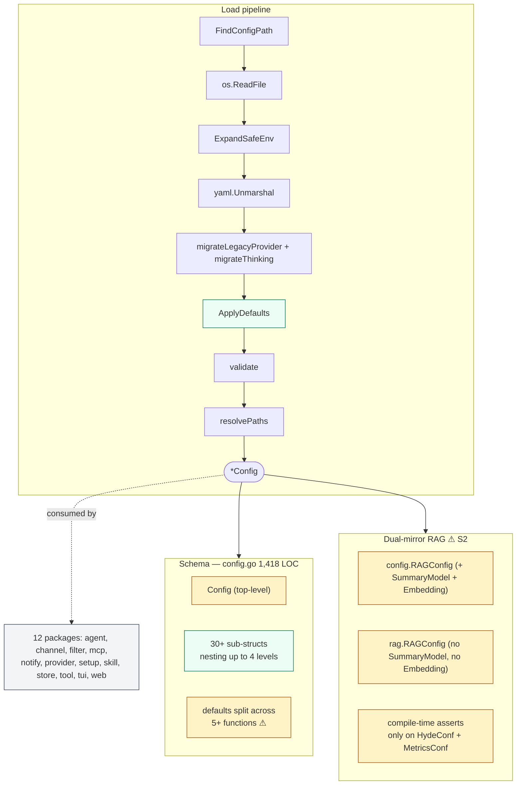
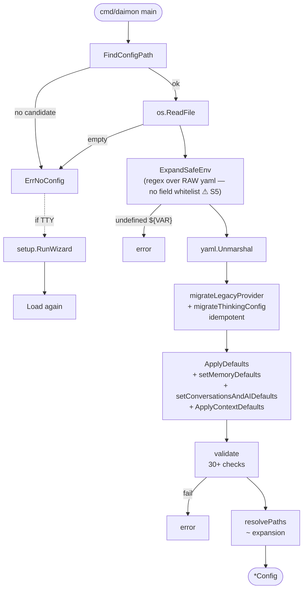
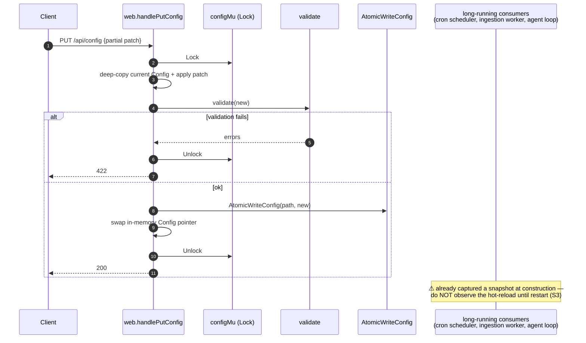

# `config` — YAML schema, validation, defaults, env-expansion

> **Status**: ⚠️ attention (1,418-LOC `config.go`; dual-mirror RAG anti-pattern with real divergence; secrets plain text; no schema versioning)
> **Stability**: stable but heavily extended
> **Last reviewed**: 2026-05-23
> **Code under**: `internal/config/`
> **Size**: 5 production files, ~1,695 LOC; 6 test files, 3,188 LOC
> **Public surface**: 30+ structs, 1 sentinel error, ~12 helpers, 1 leaf package

## 1. Purpose

`config` owns the YAML schema of Daimon: every section the user can edit (`agent:`, `providers:`, `models:`, `channel:`, `tools:`, `rag:`, `store:`, `audit:`, `web:`, `notifications:`, `cron:`, `media:`, `ai:`, `limits:`, …). It loads the file, expands `${VAR}` references in the raw text, migrates legacy v1 fields to v2 in place, applies a long list of defaults, runs structural validation, and exposes a handful of helpers (`BoolVal`, `MaskSecret`, `IsKnownProvider`, `ResolveActiveProvider`, `AtomicWriteConfig`, `ExpandSafeEnv`). It is the **only package with fan-in 12 and fan-out 0** — a true cross-cutting leaf. Every other layer reads its data through this schema.

## 2. Submodules & Key Files

| File             | LOC       | Responsibility                                                                                            |
| ---------------- | --------- | --------------------------------------------------------------------------------------------------------- |
| `config.go`      | **1,418** | Entire schema (30+ structs), `Load`, `ApplyDefaults`, `validate`, `ExpandSafeEnv`, helpers, `ErrNoConfig` |
| `migrate.go`     | 123       | v1→v2 provider migration; legacy `thinking_effort` / `thinking_budget_tokens` migration                   |
| `atomicwrite.go` | 75        | `AtomicWriteConfig` (temp + rename + best-effort `.v1.bak`)                                               |
| `resolve.go`     | 52        | `ResolveActiveProvider` — assembles v1-shape `ProviderConfig` from v2 `Providers` + `Models.Default`      |
| `mask.go`        | 27        | `MaskSecret`, `IsMasked`, `MaskedPattern` (regex shared with frontend)                                    |

## 3. Public API

### Schema top-level (`Config`)

```go
type Config struct {
    Agent          AgentConfig
    Provider       *ProviderConfig                   // DEPRECATED v1, nulled post-migration
    Providers      map[string]ProviderCredentials    // v2: keyed by provider name
    Models         ModelsConfig                      // v2: Default ModelRef
    Fallback       *FallbackConfig
    Channel        ChannelConfig
    Tools          ToolsConfig
    Store          StoreConfig
    Logging        LoggingConfig
    Limits         LimitsConfig
    Audit          AuditConfig
    Cron           CronConfig
    Filter         FilterConfig
    Media          MediaConfig
    Web            WebConfig
    Notifications  NotificationsConfig
    Skills         []string
    SkillsDir      string
    SkillsRegistryURL string
    RAG            RAGConfig
    Conversations  ConversationsConfig
    AI             AIConfig
}
```

The 30+ sub-structs (see [deep-dive Bloque B](#)) cover `AgentConfig`, `ContextConfig`, `MemoryConfig`/`Curation`/`Deduplication`/`Consolidation`, `ContextModeConfig`, `ProviderCredentials` + `ProviderThinkingConfig`, `ModelsConfig` + `ModelRef`, `ChannelConfig`, `ToolsConfig` (Shell/File/HTTP/WebFetch/MCP), `MCPConfig` + `MCPServerConfig` (`.Validate()`), `RAGConfig` + `Embedding/Retrieval/Hyde/Metrics` confs, `StoreConfig`, `AuditConfig`, `WebConfig`, `NotificationsConfig` + `NotificationRule`, `CronConfig`, `MediaConfig`, `LoggingConfig`, `LimitsConfig`, `FilterConfig`, `AIConfig` + `TitleGenYAMLConfig` + `CompactionConfig`, `ConversationsConfig` + `PruneConfig`, `FallbackConfig`.

### Sentinel error

```go
var ErrNoConfig = errors.New("no config file found")           // config.go:20
```

Fired by `Load` when no candidate path resolves, or the file is empty/whitespace-only.

### Loader + write

```go
func Load(path string) (*Config, error)                // config.go:1382
func FindConfigPath(override string) (string, error)   // config.go:1358 — override → ~/.daimon/config.yaml → ./config.yaml
func AtomicWriteConfig(path string, cfg *Config) error // atomicwrite.go:26 — temp + rename + .v1.bak best-effort
func MigrateLegacyProviderPublic(cfg *Config)          // migrate.go:11
func (c *Config) ApplyDefaults()                       // config.go:670 — also called by Load
```

### Helpers

```go
func BoolVal(b *bool) bool                              // config.go:1078 — nil → false
func MaskSecret(s string) string                        // mask.go:22 — "ab****yz" (≤8 chars → "****")
func IsMasked(s string) bool                            // mask.go:14
var MaskedPattern *regexp.Regexp                        // mask.go:11 — shared with frontend
func IsKnownProvider(name string) bool                  // config.go:86
func IsProviderConfigured(cfg Config) (bool, []string)  // config.go:412
func ResolveActiveProvider(cfg Config) ProviderConfig   // resolve.go:20 — defaults Timeout=60s, MaxRetries=3, Stream=true
func ExpandSafeEnv(s string) (string, error)            // config.go:1339 — ${VAR} expansion; error on undefined
```

### Constants & enums

`ContextMode` (`off | conservative | auto`), channel types (`cli | telegram | discord | whatsapp`), provider types (`anthropic | openai | gemini | openrouter | ollama` via `KnownProviders` mutable var), store types (`file | sqlite`), audit types (`sqlite | file`), MCP transport (`stdio | http`), filter levels (`aggressive | minimal | no`), context strategy (`smart | legacy | none`), thinking effort (`low | medium | high`).

## 4. Dependencies

| Direction                     | Edge                                                                                                                 |
| ----------------------------- | -------------------------------------------------------------------------------------------------------------------- |
| Outbound (`internal/*`)       | **none** — leaf package                                                                                              |
| Outbound (stdlib + 3rd-party) | `os`, `path/filepath`, `regexp`, `strings`, `text/template`, `time`, `errors`, `fmt`, `log/slog`, `gopkg.in/yaml.v3` |
| Inbound                       | 12 packages (highest fan-in in the codebase)                                                                         |

### Layering position

Cross-cutting. Allowed to import stdlib only. Imported by **every layer** except where deliberately avoided (`content`, `audit`, `notify/events.go`).

## 5. Component Diagram



## 6. Key Flows

### 6.1 `Load` pipeline (boot)



### 6.2 Hot-reload via `PUT /api/config`



### 6.3 Dual-mirror RAG synchronization

```mermaid
flowchart LR
  CFG[config.RAGConfig<br/>+ SummaryModel<br/>+ Embedding]:::warn
  RAG[rag.RAGConfig<br/>NO SummaryModel<br/>NO Embedding]:::warn
  AS["rag_wiring.go:22-24<br/>compile-time asserts for<br/>RAGHydeConf + RAGMetricsConf only"]:::ok
  MISS["RAGRetrievalConf has<br/>NO compile-time assert<br/>⚠ silent-drift risk"]:::warn
  classDef warn fill:#fef3c7,stroke:#b45309
  classDef ok fill:#ecfdf5,stroke:#047857

  CFG -.field-by-field copy in rag_wiring.go:89.- RAG
  CFG -.partial mirror.- AS
  CFG -.NOT mirrored.- MISS
```

## 7. Verdict

**Overall health**: ⚠️ **Attention** — well-tested, leaf-pure, but the file size, the dual-mirror anti-pattern with real divergence, plain-text secrets, and no schema versioning are real concerns.

| Dimension        | Rating                     | Evidence                                                                  |
| ---------------- | -------------------------- | ------------------------------------------------------------------------- |
| **Coupling**     | low (out) / very high (in) | Outbound 0; inbound 12.                                                   |
| **Size / bloat** | inflated                   | `config.go` alone is 1,418 LOC.                                           |
| **Cohesion**     | mixed                      | Schema + load + defaults + validation in one file.                        |
| **Testability**  | very high                  | 3,188 LOC of tests across 6 files.                                        |
| **Stability**    | high schema churn          | v1→v2 migration plus thinking-config migration evidence of past breakage. |

### Smells & risks

**S1. 1,418-LOC `config.go`** — 30+ types, defaults (~270 lines), validation (~230 lines), helpers, and the loader all in one file. Split into `schema.go`, `defaults.go`, `validate.go`, `load.go` at minimum.

**S2. Dual-mirror RAG anti-pattern with real divergence**:

- `config.RAGConfig` has `SummaryModel` + `Embedding RAGEmbeddingConf` that `rag.RAGConfig` lacks.
- Compile-time mirror assertions in `cmd/daimon/rag_wiring.go:22-24` only cover `RAGHydeConf` + `RAGMetricsConf`. `RAGRetrievalConf` and `RAGConfig` have no enforcement.
- Field-by-field copy in `rag_wiring.go:89-93` is manual; adding a field to `config.RAGRetrievalConf` and forgetting to wire it through the copy silently loses the field at runtime.

**S3. Hot-reload via `PUT /api/config` does not reach long-running consumers** — the agent loop, ingestion worker, cron scheduler, etc. capture their configs at construction. Only new requests at the web layer see the new config. Documented nowhere visible to operators.

**S4. No schema versioning** — migrations v1→v2 detected heuristically (presence of `provider:` top-level). A future v3 has no declarative marker. The `.v1.bak` backup in `AtomicWriteConfig` is the only safety net.

**S5. `ExpandSafeEnv` runs on the raw YAML text with no field whitelist** — every string in the file is a candidate for `${VAR}` expansion, including fields like `agent.name`. Users embedding literal `${...}` for any reason get expansion they did not ask for.

**S6. Secrets stored plain text in YAML** — `ProviderCredentials.APIKey`, `ChannelConfig.Token` / `AccessToken` / `VerifyToken`, `Web.AuthToken`, `StoreConfig.EncryptionKey`. The only mitigation is `${ENV_VAR}` indirection that the user must set up.

**S7. Defaults spread across 5+ functions** — `ApplyDefaults`, `setMemoryDefaults`, `setConversationsAndAIDefaults`, `ApplyContextDefaults`, plus `ResolveActiveProvider` applies its own provider defaults that are _not persisted_ into `Providers`. `rag.ApplyRAGDefaults` duplicates the RAG defaults again. Five places to keep in sync; reading the merged result requires touching all five.

**S8. 9 `*bool` fields require `BoolVal` callers everywhere** — `ProviderThinkingConfig.Enabled`, `FilterConfig.InjectionDetection`, `ContextModeConfig.AutoIndexOutputs`, `ContextConfig.Notify`, `FallbackConfig.Stream`, `ProviderConfig.Stream`, `WebFetchConfig.Enabled`, `AuditConfig.Enabled`, `MediaConfig.Enabled`. The pattern is intentional (distinguish missing from `false`) but a typed `OptBool` would reduce ceremony.

**S9. Validation gaps**:

- `ContextConfig.MaxTokens interface{}` not validated (only interpreted in `ResolveMaxTokens`). A list or unsupported scalar returns 0 silently.
- `FallbackConfig.Type == ""` allowed without a clear meaning.
- `RAGConfig.SummaryModel` not validated against any provider's model list.
- `NotificationRule.EventType` is a free-text string — no enum check against `KnownEventTypes` (which is in `notify`, not `config`).
- `Web.AllowedOrigins == ["*"]` accepted without security warning.

**S10. `KnownProviders` is a mutable `var`** — `config.go:83`. Could be modified at runtime; should be `const` or a function returning a fresh slice.

**S11. Path-traversal vector in override** — `FindConfigPath` accepts any `--config` argument without restriction (low risk because it's a CLI argument).

**S12. `validateActiveCredentials` logic exists in two places** — `validate` (here) and `web/handler_config.go` repeat the check.

### Suggested refactors (impact ÷ effort)

1. **Split `config.go`** (S1) — `schema.go`, `defaults.go`, `validate.go`, `load.go`. **Effort: M. Impact: high (readability).**
2. **Resolve dual-mirror RAG** (S2) — either remove `rag.RAGConfig` (have `rag` consume `config.RAGConfig` directly via `rag.Config(config.RAGConfig)` aliases) or extend the compile-time assertions to every mirrored struct. **Effort: M. Impact: high.**
3. **Document the hot-reload contract** (S3) — at minimum, log a startup warning listing which subsystems do not observe hot-reload. Better: emit a structured `config.changed` event on the bus. **Effort: S. Impact: medium.**
4. **Add `schema_version` field with declarative migrations** (S4). **Effort: M. Impact: medium-high.**
5. **Whitelist fields for `${VAR}` expansion** (S5) — only `*.api_key`, `*.token`, `*.password`, `*.access_token`, `*.verify_token`, similar. **Effort: S. Impact: medium.**
6. **Optional config encryption** (S6) — sealed-box for the whole file, key from OS keychain / env var. Aligns with [`store.md` S7](store.md#smells--risks). **Effort: L. Impact: high.**
7. **Centralise defaults** (S7) — one `ApplyDefaults` that owns all (memory, conversations, AI, context). Have `ResolveActiveProvider` mutate the `Providers` map in place so the persisted config matches the resolved view. **Effort: M. Impact: medium.**
8. **Add validation for `MaxTokens`, `FallbackConfig.Type`, `EventType`, `AllowedOrigins==["*"]`** (S9). **Effort: S. Impact: medium.**
9. **Make `KnownProviders` `const`-like** (S10) — either return-a-copy function or `var Known = [5]string{...}`. **Effort: XS. Impact: low.**
10. **Single source of truth for `validateActiveCredentials`** (S12). **Effort: XS. Impact: low.**

## 8. References

- Schema: `config.go:95` (`Config` struct) and forward.
- Load pipeline: `config.go:1382`.
- Defaults table: `config.go:670` (`ApplyDefaults`).
- Validation table: `config.go:1106` (`validate`).
- Dual-mirror RAG synchronization: `cmd/daimon/rag_wiring.go:22-24` (compile-time asserts), `:89-93` (field-by-field copy).
- Web hot-reload: `internal/web/handler_config.go:158` (`handlePutConfig`).
- Setup wizard write path: `internal/setup/configwriter.go:54`.
- Related modules: every other entry under [`modules/`](.) — `config` is the spine they share.
