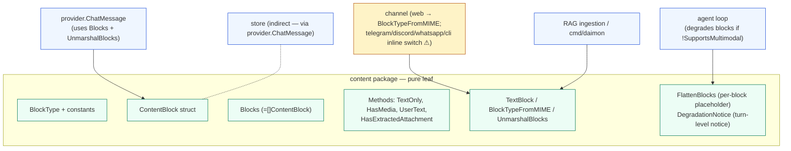
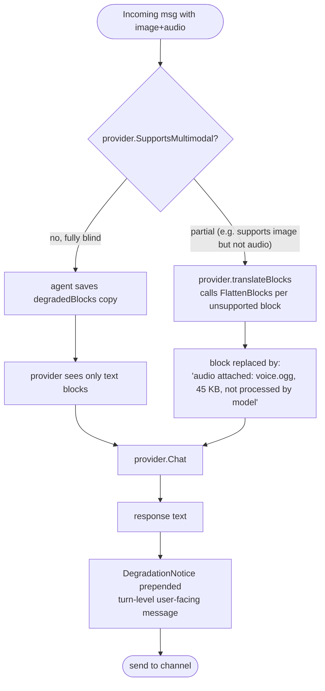
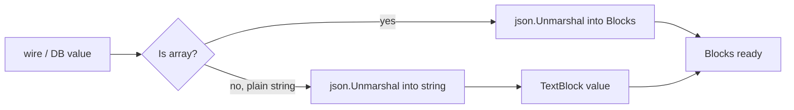

# `content` — multimodal block primitives

> **Status**: ✅ healthy (small, focused, leaf package; one duplication smell)
> **Stability**: stable
> **Last reviewed**: 2026-05-23
> **Code under**: `internal/content/`
> **Size**: 2 production files (`block.go`, `degrade.go`), ~245 LOC
> **Public surface**: 1 type alias, 1 struct (7 fields), 4 const, 5 free functions, 4 methods

## 1. Purpose

The `content` package defines Daimon's internal multimodal representation: a `ContentBlock` is one slice of text / image / audio / document; `Blocks` is a sequence of them. Every layer — channels, agent, provider, store, tool — passes messages around as `content.Blocks`. The package is a pure leaf: no other `internal/*` package is imported, no I/O, no goroutines, no global state. It also owns the two-layer **degradation strategy**: per-block silent fallbacks for providers that don't support a block type, and a turn-level user-facing notice when the active provider is fully multimodal-blind.

## 2. Submodules & Key Files

| File            | LOC | Responsibility                                                                                                              |
| --------------- | --- | --------------------------------------------------------------------------------------------------------------------------- |
| `block.go`      | 160 | Type definitions, methods on `Blocks`, `TextBlock`, `BlockTypeFromMIME`, `UnmarshalBlocks` (with legacy-string back-compat) |
| `degrade.go`    | 85  | `FlattenBlocks` (per-block placeholder for unsupported types), `DegradationNotice` (turn-level user-facing notice)          |
| `block_test.go` | 336 | Round-trips, `BlockTypeFromMIME`, `FlattenBlocks`                                                                           |

## 3. Public API

### Types & constants

```go
// block.go:10
type BlockType string
const (
    BlockText     BlockType = "text"
    BlockImage    BlockType = "image"
    BlockAudio    BlockType = "audio"
    BlockDocument BlockType = "document"
)

// block.go:24-37
type ContentBlock struct {
    Type                    BlockType `json:"type"`
    Text                    string    `json:"text,omitempty"`
    MediaSHA256             string    `json:"media_sha256,omitempty"`   // content-addressed lookup key
    MIME                    string    `json:"mime,omitempty"`
    Size                    int64     `json:"size,omitempty"`
    Filename                string    `json:"filename,omitempty"`
    ExtractedFromAttachment bool      `json:"extracted_from_attachment,omitempty"`
}

// block.go:41
type Blocks []ContentBlock
```

### Methods on `Blocks`

```go
func (b Blocks) TextOnly() string                 // concat text blocks, newline-separated; ignores media
func (b Blocks) HasMedia() bool                   // true if any block is not text
func (b Blocks) UserText() string                 // TextOnly minus blocks with ExtractedFromAttachment=true
func (b Blocks) HasExtractedAttachment() bool     // true if any block has ExtractedFromAttachment=true
```

### Free functions

```go
func TextBlock(s string) Blocks                                       // helper for the common one-text case
func BlockTypeFromMIME(mime string) BlockType                         // image/* → BlockImage etc; default BlockDocument
func UnmarshalBlocks(raw json.RawMessage) (Blocks, error)             // accepts new array format OR legacy plain string
func FlattenBlocks(bs Blocks) string                                  // per-block placeholders for unsupported types
func DegradationNotice(bs Blocks) string                              // turn-level user-facing notice ("" if no media)
```

There is no `MarshalBlocks` — serialization is plain `encoding/json` via struct tags.

## 4. Dependencies

### Outbound

`block.go` imports only `encoding/json`, `fmt`, `strings`.
`degrade.go` imports only `fmt`.
**Zero imports from `internal/`** — leaf confirmed.

### Inbound

24 non-test files across 7 packages import `content`:

| Package             | What it touches                                                                                                                                                                            |
| ------------------- | ------------------------------------------------------------------------------------------------------------------------------------------------------------------------------------------ |
| `internal/provider` | `ChatMessage.Content content.Blocks`; custom `UnmarshalJSON` calls `UnmarshalBlocks` for legacy back-compat; per-vendor `translateBlocks` calls `FlattenBlocks`                            |
| `internal/agent`    | `TextBlock` (everywhere it builds prompts / tool results); `TextOnly`, `HasMedia`, `UserText`, `HasExtractedAttachment` in `loop.go`; `DegradationNotice` at turn end                      |
| `internal/channel`  | `IncomingMessage.Content content.Blocks`; `web.go` uses `BlockTypeFromMIME`; **other channels (telegram, discord, whatsapp, cli) duplicate the MIME → BlockType switch inline** (smell S1) |
| `internal/cron`     | `TextBlock` for scheduled-job prompts                                                                                                                                                      |
| `internal/tool`     | `TextBlock` in `cron.go` (only)                                                                                                                                                            |
| `internal/store`    | **only via test files** — production `store` does _not_ import `content` directly; it leaks through `provider.ChatMessage.Content`                                                         |
| `cmd/daimon`        | `TextBlock` in `rag_wiring.go`                                                                                                                                                             |

### Layering position

Cross-cutting leaf. No allowed imports beyond stdlib.

## 5. Component Diagram



## 6. Key Flows

### 6.1 Two-layer degradation



The key user-experience difference: the **turn-level notice** is shown only when the provider can process _no_ media at all. If the provider can do images but not audio, the audio is silently flattened into a placeholder string — the user never sees that anything was elided.

### 6.2 Legacy back-compat on read



Used by `provider.ChatMessage.UnmarshalJSON` (`provider/provider.go:63`) so older conversation rows (stored as plain strings before the multimodal switch) still load.

## 7. Verdict

**Overall health**: ✅ **Healthy** — small, focused, no I/O, no goroutines, no global state. The only structural smell is duplicated MIME → BlockType logic in four channel files. Nothing about this module blocks production.

| Dimension        | Rating               | Evidence                                                                                   |
| ---------------- | -------------------- | ------------------------------------------------------------------------------------------ |
| **Coupling**     | low                  | Outbound: stdlib only. Inbound: 7 packages, well-scoped use.                               |
| **Size / bloat** | lean                 | 245 LOC; the largest function is `UnmarshalBlocks` and it's straightforward.               |
| **Cohesion**     | focused              | One concept (multimodal blocks), one supporting concern (degradation).                     |
| **Testability**  | high for happy paths | 336 LOC of tests. `UserText`, `HasExtractedAttachment`, `DegradationNotice` are uncovered. |
| **Stability**    | stable               | Backwards-compatible JSON shape; legacy string support means past rows still load.         |

### Smells & risks

**S1. `BlockTypeFromMIME` is duplicated inline in four channel files** — `whatsapp.go:395-414`, `telegram.go`, `discord.go`, `cli.go` each implement the same `strings.HasPrefix(mime, "image/")` switch instead of calling `content.BlockTypeFromMIME`. `web.go:363` does it right. Six lines × four files = a bug waiting to happen the next time the heuristic changes.

**S2. `DegradationNotice` does not specifically handle `BlockDocument`** — `degrade.go:64-85` branches on `BlockImage` and `BlockAudio`; everything else falls into a generic `"Some media could not be processed"` message. Either rename it `BlockDocument` (acceptable today because document blocks usually arrive already extracted into text) or add a branch.

**S3. SHA256 is the only media identifier — no per-scope namespace** — `MediaSHA256` is the lookup key into `store.MediaStore`. Two users uploading the same file share the same blob (intentional dedup), but there is no access-control story. If `MediaStore.GetMedia(sha)` does not check ownership, a user holding a hash can fetch another user's content. The check, if it exists, belongs in `store` — `content` only carries the identifier.

**S4. No consumer-side SHA256 verification** — providers do `media.GetMedia(ctx, b.MediaSHA256)` and use the bytes without recomputing the hash. If the store is ever corrupted (or compromised), the LLM gets the corrupted bytes. Verifying at the provider boundary would catch this with negligible cost.

**S5. `TextOnly` reimplements `strings.Join`** — `block.go:45` builds a string with `strings.Builder` and manually inserts newlines, with a comment about "not importing strings at package level"; meanwhile `UserText` (same file) imports and uses `strings.Join`. Cosmetic only.

**S6. Uncovered methods** — `UserText`, `HasExtractedAttachment`, `DegradationNotice` have no direct tests. They are exercised indirectly through agent integration tests but not unit-pinned.

### Suggested refactors (impact ÷ effort)

1. **Consolidate the MIME switch** (S1) — replace the inline duplications in `telegram`/`discord`/`whatsapp`/`cli` with `content.BlockTypeFromMIME`. **Effort: XS. Impact: low-medium.**
2. **Add explicit `BlockDocument` branch in `DegradationNotice`** (S2). **Effort: XS. Impact: low.**
3. **Verify SHA256 on read at the provider boundary** (S4) — `hash := sha256.Sum256(bytes); if hex.EncodeToString(hash[:]) != b.MediaSHA256 { reject }`. **Effort: S. Impact: medium.**
4. **Add unit tests for `UserText`, `HasExtractedAttachment`, `DegradationNotice`** (S6). **Effort: XS. Impact: low.**

## 8. References

- Block usage in providers: [[provider]] — `translateBlocks` per vendor + `FlattenBlocks` for unsupported types.
- Block usage in transports: [[channel]] — `IncomingMessage.Content`; see S1 about duplicated MIME switch.
- Degradation strategy in the loop: [[agent]] — `agent/loop.go:355-365` captures `degradedBlocks`; `:513-517` prepends the `DegradationNotice`.
- Persistence shape: [[store]] — blocks ride inside `provider.ChatMessage` (which is the L2 violation surface — see [`store.md` §7 S1](store.md#smells--risks)).
- Custom JSON entry point: `internal/provider/provider.go:63` (`ChatMessage.UnmarshalJSON` → `UnmarshalBlocks`).
