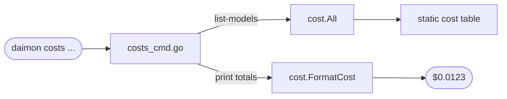
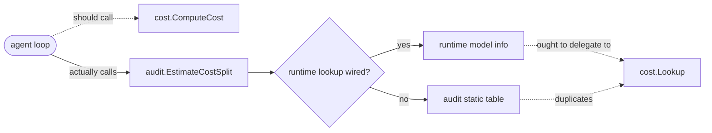

# `cost` — ghost pricing package

> **Status**: 🔴 critical (ghost package — fan-in inside `internal/` is 0; duplicated tables; divergent unit format; stale entries)
> **Stability**: stable but isolated
> **Last reviewed**: 2026-05-23
> **Code under**: `internal/cost/`
> **Size**: 2 production files, ~145 LOC (+ 250 LOC of tests)
> **Public surface**: 4 exported symbols (`ComputeCost`, `FormatCost`, `Lookup`, `All`), 2 structs (`CostResult`, `ModelPricing`), 1 unexported pricing table

## 1. Purpose

The `cost` package was intended as the source of truth for LLM pricing. In practice it is **not used by the hot path** — the agent loop and dashboard use `audit.EstimateCostSplit` from `internal/audit/pricing.go`. The only consumer of `internal/cost` is `cmd/daimon/costs_cmd.go` (the `daimon costs` CLI subcommand). The pricing data inside `cost/pricing.go` is a parallel, partially overlapping, format-incompatible table to the one in `audit/pricing.go`. This is the **ghost package** repeatedly flagged across [`../ARCHITECTURE.md` §7.3](../ARCHITECTURE.md#7-architectural-risks-worth-tracking) and the per-module docs ([agent.md S6](agent.md#smells--risks), [provider.md S8](provider.md#smells--risks)).

## 2. Submodules & Key Files

| File         | LOC | Responsibility                                                              |
| ------------ | --- | --------------------------------------------------------------------------- |
| `cost.go`    | 49  | `ComputeCost`, `FormatCost`, `CostResult`, `roundUSD`                       |
| `pricing.go` | 96  | Static table (22 entries) + `Lookup` (exact + longest-prefix match) + `All` |

## 3. Public API

```go
// pricing.go:15
type ModelPricing struct {
    Input  float64    // USD per input token   ⚠ NOTE: per-token, not per-1M
    Output float64    // USD per output token
}

// pricing.go:76 — exact match first, then longest-prefix
func Lookup(model string) (ModelPricing, bool)

// pricing.go:90 — defensive copy of the package-private map
func All() map[string]ModelPricing

// cost.go:12
type CostResult struct {
    InputCostUSD, OutputCostUSD, TotalCostUSD float64
    Timestamp                                  time.Time
    Ok                                         bool   // false = model not in table
}

// cost.go:22 — never returns error; Ok=false on miss
func ComputeCost(model string, inputTokens, outputTokens int) CostResult

// cost.go:42 — formats USD with 4 decimal places: "$0.0012"
func FormatCost(usd float64) string
```

### Table contents (22 entries)

Anthropic 6 / OpenAI 8 / Google 3 / DeepSeek 3 / Qwen 4 / Xiaomi 1. **Missing**: `claude-opus-4-5`, `claude-sonnet-4-5`, `o1`, `gpt-4`, `gemini-2.5-pro-preview`, all OpenRouter `vendor/model` pass-throughs. The audit table has all of those.

## 4. Dependencies

| Direction                  | Edge                                                          |
| -------------------------- | ------------------------------------------------------------- |
| Outbound                   | stdlib only                                                   |
| Inbound inside `internal/` | **none**                                                      |
| Inbound from `cmd/daimon/` | `cmd/daimon/costs_cmd.go:102, 118, 140` (`FormatCost`, `All`) |

### Layering position

Logically Subsystem. Architecturally a leaf with no consumers in `internal/`.

## 5. Component Diagram

```mermaid
flowchart TB
  classDef ghost fill:#fef2f2,stroke:#b91c1c,stroke-dasharray:5 3
  classDef alive fill:#eff6ff,stroke:#1d4ed8
  classDef ext fill:#f3f4f6,stroke:#374151

  subgraph COST[internal/cost (GHOST — fan-in=0)]
    direction LR
    LK["Lookup<br/>(exact + longest-prefix)"]:::ghost
    AL["All<br/>(defensive copy)"]:::ghost
    CC["ComputeCost"]:::ghost
    FC["FormatCost"]:::ghost
    TBL["static table<br/>22 entries"]:::ghost
  end

  subgraph AUDIT[internal/audit/pricing.go (LIVE)]
    direction LR
    EC["EstimateCostSplit"]:::alive
    RP["resolvePricing<br/>(runtime + fallback)"]:::alive
    MP["modelPricing<br/>~51 entries inc. OpenRouter"]:::alive
  end

  CMD["cmd/daimon/costs_cmd.go<br/>(only consumer)"]:::ext --> FC
  CMD --> AL
  AGENT["agent.loop.go"]:::ext --> EC
  WIRE["cmd/daimon/pricing_wiring.go"]:::ext --> RP

  Note["⚠ Two parallel tables<br/>USD/token vs USD/1M-tokens<br/>different models covered"]:::ghost
  COST -.- Note
  AUDIT -.- Note
```

## 6. Key Flows

### 6.1 What actually uses the package



### 6.2 What was probably intended



## 7. Verdict

**Overall health**: 🔴 **Critical** — the package exists but is not actually wired into the production cost path. Every price update needs to happen in two places (here and `audit/pricing.go`) or the two diverge silently.

| Dimension        | Rating             | Evidence                                                     |
| ---------------- | ------------------ | ------------------------------------------------------------ |
| **Coupling**     | none (intentional) | Outbound: stdlib only. Inbound `internal/`: 0.               |
| **Size / bloat** | lean               | 145 LOC.                                                     |
| **Cohesion**     | focused            | One concern.                                                 |
| **Testability**  | high               | `cost_test.go` + `pricing_test.go` ≈ 250 LOC, full coverage. |
| **Stability**    | stable but ignored | The static table goes stale every time a new model ships.    |

### Smells & risks

**S1. Ghost package** — fan-in inside `internal/` is 0. The hot path uses `audit.EstimateCostSplit`. Two implementations of the same domain.

**S2. Pricing tables diverge** — `cost/pricing.go:22` (22 entries, USD/token) and `audit/pricing.go:74` (~51 entries, USD/1M-tokens) describe overlapping but non-identical model sets. Every release that touches pricing has to touch both files; the test suite does not enforce parity.

**S3. Unit format mismatch** — `cost.ModelPricing` is USD-per-token; `audit.modelPricing` is USD-per-1M-tokens. A reader skipping between the two files has to mentally translate units to compare.

**S4. `CostResult.Ok` collapses two failure modes** — `Ok=false` means "model unknown". An empty model string and a typo'd model both produce `Ok=false` with `TotalCostUSD=0`. The caller cannot distinguish "free model" from "unknown model" without inspecting `Ok`.

**S5. `ComputeCostSplit` does not exist here** — the name commonly cited in code review (and in `audit/pricing.go:147` as `EstimateCostSplit`) has no equivalent in `cost`. There is only `ComputeCost`. The asymmetry is a foothold for future divergence.

### Suggested refactors (impact ÷ effort)

Two paths, pick one:

1. **Minimal (deprecate)** — add the entries `cost/pricing.go` has that `audit` does not, switch `costs_cmd.go` to call `audit.EstimateCost` + a new `audit.AllModels()`, then delete `internal/cost`. **Effort: S. Impact: high (single source).**
2. **Architectural (extract)** — create a new `internal/pricing` package owning a single unified table (USD/1M tokens), the runtime cascade (`SetPriceLookup`), and the format helper. Have `internal/audit` and `cmd/daimon/costs_cmd.go` both consume it. Delete `internal/cost`. **Effort: M. Impact: high (clarity).**

Either way, the current state — two tables, two formats, one ghost — is the worst option.

## 8. References

- Live pricing path: [`audit.md` §3](audit.md), `audit/pricing.go:55` (`resolvePricing`).
- Runtime registration: `cmd/daimon/pricing_wiring.go:25` (`wireRuntimePricing`).
- Hot-path estimator: `internal/agent/loop.go:482` calls `audit.EstimateCostSplit`.
- The only consumer of this package: `cmd/daimon/costs_cmd.go:102, 118, 140`.
- Pricing duplication is also flagged in [`../ARCHITECTURE.md` §7.3](../ARCHITECTURE.md#7-architectural-risks-worth-tracking), [`agent.md` S6](agent.md#smells--risks), [`provider.md` S8](provider.md#smells--risks).
