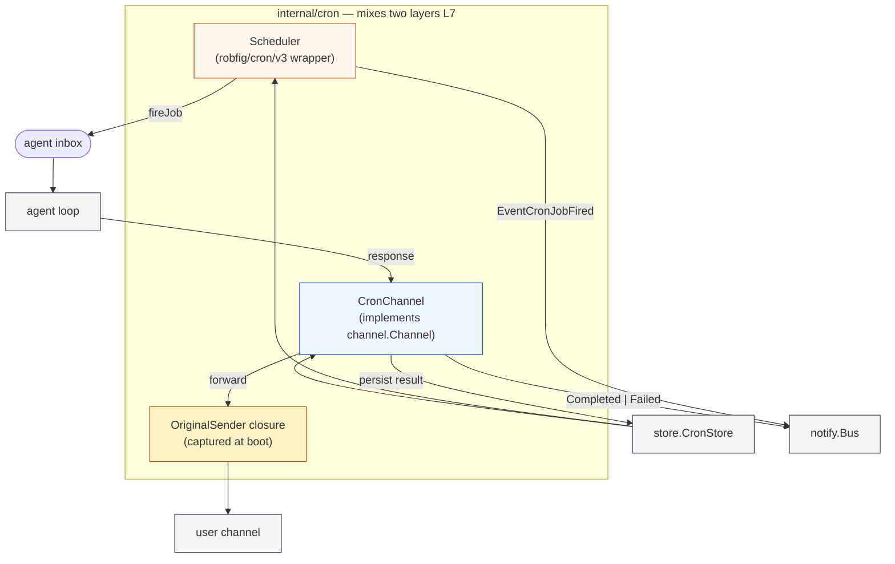
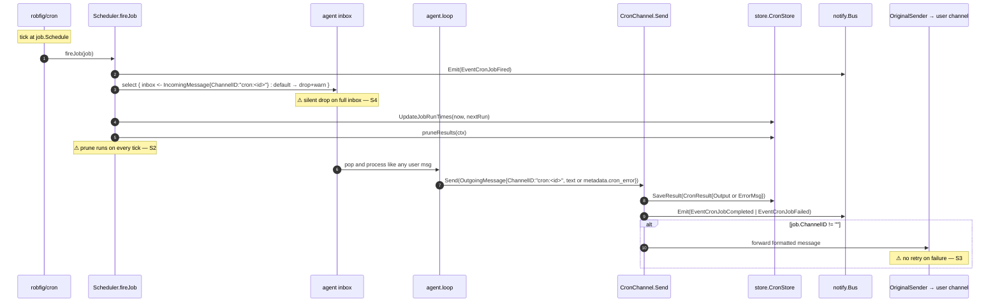

# `cron` — scheduler + virtual channel for time-driven turns

> **Status**: ⚠️ attention (scheduler + channel mixed in one package — L7 layering violation; pruning runs inside every tick; no retry on origSender)
> **Stability**: stable
> **Last reviewed**: 2026-05-23
> **Code under**: `internal/cron/`
> **Size**: 2 production files, ~520 LOC
> **Public surface**: 1 interface (`SchedulerIface`), 1 sentinel error, `Scheduler`, `CronChannel`, `ActiveJob`

## 1. Purpose

The `cron` package adds time-driven triggers to Daimon. The `Scheduler` wraps `robfig/cron/v3` to register and fire jobs persisted in `store.CronStore`. Each tick produces an `IncomingMessage` that the agent processes like any user message; the response flows back through `CronChannel.Send` which persists the result, emits a completion event, and forwards the text to the user's original channel. Both Scheduler and CronChannel live in the same package — a layering anomaly catalogued in [`../ARCHITECTURE.md` §6 L7](../ARCHITECTURE.md#6-layering-violations).

## 2. Submodules & Key Files

| File           | LOC  | Responsibility                                                                                                                |
| -------------- | ---- | ----------------------------------------------------------------------------------------------------------------------------- |
| `scheduler.go` | ~270 | `Scheduler` (wraps robfig), `SchedulerIface`, `ActiveJob`, registration / removal, fire path, retention pruning               |
| `channel.go`   | ~165 | `CronChannel` (implements `channel.Channel`), `OriginalSender`, result persistence, bus emission, original-channel forwarding |

## 3. Public API

```go
// scheduler.go:31
type SchedulerIface interface {
    Start(ctx context.Context, inbox chan<- channel.IncomingMessage) error
    Stop()
    AddJob(ctx context.Context, job store.CronJob) error
    RemoveJob(ctx context.Context, jobID string) error
    ListActiveJobs(ctx context.Context) ([]ActiveJob, error)
}

// scheduler.go:23
type ActiveJob struct {
    Job     store.CronJob
    NextRun time.Time
    LastRun time.Time
}

// scheduler.go:55 — tz=nil → UTC
func NewScheduler(cronStore store.CronStore, tz *time.Location, retentionDays, maxPerJob int) *Scheduler

// scheduler.go:19
var ErrJobNotFound = errors.New("cron job not found")

// channel.go:18 — captures the original user-channel.Send for forwarding
type OriginalSender func(ctx context.Context, msg channel.OutgoingMessage) error

// channel.go:26 — implements channel.Channel
type CronChannel struct{ /* … */ }
func NewCronChannel(scheduler SchedulerIface, cronStore store.CronStore,
                    origSender OriginalSender, notifyOnCompletion bool) *CronChannel

// fluent setter — wires the bus post-construction
func (s *Scheduler)  WithBus(bus notify.Bus) *Scheduler
func (c *CronChannel) WithBus(bus notify.Bus) *CronChannel
```

## 4. Dependencies

| Direction | Edge                                                                                                                               |
| --------- | ---------------------------------------------------------------------------------------------------------------------------------- |
| Outbound  | `internal/channel`, `internal/content`, `internal/notify`, `internal/store`, `github.com/robfig/cron/v3`, `github.com/google/uuid` |
| Inbound   | `cmd/daimon` (boot wiring), `internal/agent/commands_cron.go` (slash commands), `internal/tool/cron.go` (LLM tools)                |

### Layering position

Subsystem + Transport mixed. `Scheduler` belongs to the Subsystem layer; `CronChannel` is a Transport implementation that should live in `internal/channel/`. The L7 anomaly is documented but un-resolved.

## 5. Component Diagram



## 6. Key Flows

### 6.1 Job firing end-to-end



### 6.2 Dynamic add / remove

```mermaid
flowchart LR
  ToolCall([LLM tool: schedule_task]) --> CT[tool.scheduleTaskTool]
  CT --> AddJob[Scheduler.AddJob]
  AddJob --> Reg[registerJob → cron.AddFunc]
  Reg --> Map[entryIDs map under mu.Lock]
  ToolCall2([LLM tool: delete_cron]) --> RT[tool.deleteCronTool]
  RT --> RemoveJob[Scheduler.RemoveJob]
  RemoveJob --> Unreg[cron.Remove(entryID)]
  Unreg --> Map
```

No restart required; both paths mutate the running scheduler. `ListActiveJobs` (`scheduler.go:143`) is a snapshot under the same mutex.

## 7. Verdict

**Overall health**: ⚠️ **Attention** — functionally complete but architecturally muddled and operationally risky on busy schedulers.

| Dimension        | Rating             | Evidence                                                   |
| ---------------- | ------------------ | ---------------------------------------------------------- |
| **Coupling**     | medium             | Outbound: 4 internal packages + 2 third-party. Inbound: 3. |
| **Size / bloat** | lean               | ~520 LOC.                                                  |
| **Cohesion**     | low (two concerns) | scheduler (Subsystem) and channel (Transport) bundled.     |
| **Testability**  | moderate           | robfig/cron timing makes unit tests fragile.               |
| **Stability**    | stable             | Few recent edits.                                          |

### Smells & risks

**S1. L7 layering anomaly** — `CronChannel` lives here but implements `channel.Channel`. Should live in `internal/channel/cron.go` while `cron.Scheduler` stays here. See [`channel.md` Anomaly](channel.md#anomaly) and [`../ARCHITECTURE.md` §6 L7](../ARCHITECTURE.md#6-layering-violations).

**S2. `pruneResults` called inside every `fireJob`** — `scheduler.go:252` (approx). Each cron tick triggers a delete of stale `CronResult` rows. On a busy scheduler, this is a guaranteed write per tick on the same goroutine that fires the job. Move to a separate ticker or piggyback on `ConversationPruner`.

**S3. No retry on `origSender` failure** — `channel.go:127`. Result is persisted and event emitted, but the forwarded message can vanish silently. A flaky user channel (e.g. Telegram rate limit) drops the cron output without dead-lettering.

**S4. `fireJob` inbox push is non-blocking with silent drop** — `scheduler.go:212-216`. If the agent is saturated when a cron tick fires, the job result is `slog.Warn` only. Same pattern as the other channels — see [`channel.md` S3](channel.md#smells--risks).

**S5. `pruneResults` retention semantics not documented** — `scheduler.go` accepts `retentionDays, maxPerJob` in the constructor but their precise interaction (whose-rule-wins on conflict) is not in the godoc.

**S6. `ListActiveJobs` snapshots the map then calls store + cron per job** — `scheduler.go:143`. Two RPCs per job under the snapshot. For 100+ jobs this is sluggish; for 1000+ it materially affects dashboard latency.

**S7. `OriginalSender` is a closure captured at boot** — `cmd/daimon/main.go:474`. If the underlying user channel is reconfigured (e.g. dashboard hot-swap), the cron path keeps using the stale function. No re-binding mechanism.

**S8. Daemon mode has nil `origSender`** — `main.go:468-472`. The job fires, the agent responds, but the user never sees the result. Defensible by design (daemon = headless) but worth a startup log noting "cron forwarding disabled".

**S9. Job snapshot captured by value in `cron.AddFunc` closure** — `scheduler.go:182`. Mutations to the job in the store (e.g. updated prompt) don't propagate until a `RemoveJob + AddJob` cycle. Currently no UI exposes mid-flight edits, so the issue is latent.

**S10. `pruneResults` errors are silenced** — single `slog.Warn` on failure; no metric or escalation.

### Suggested refactors (impact ÷ effort)

1. **Move `CronChannel` to `internal/channel/`** (S1) — fixes L7. **Effort: M (touches all importers). Impact: medium-high.**
2. **Move `pruneResults` to a separate ticker** (S2) — every N minutes instead of every tick. **Effort: S. Impact: medium.**
3. **Retry `origSender` with bounded backoff** (S3) — share helper with the streaming writers if possible. **Effort: S. Impact: medium.**
4. **Emit a frame back when inbox is full** (S4) — see [`channel.md` recommendation 2](channel.md#suggested-refactors-impact--effort).
5. **Batch `ListActiveJobs`** (S6) — one query for next-run via `cron.Entries()` + one query for all jobs at once. **Effort: S. Impact: medium.**
6. **Re-bind `origSender` on user-channel hot-swap** (S7) — accept a getter `func() OriginalSender` instead of a captured value. **Effort: S. Impact: low.**

## 8. References

- High-level cron flow: [`../ARCHITECTURE.md` §4.4](../ARCHITECTURE.md#44-cron--heartbeat-trigger).
- Wiring: `cmd/daimon/main.go:462` (NewScheduler), `:474` (NewCronChannel), `:479` (`tool.BuildCronTools`); also `cmd/daimon/web_cmd.go:288`.
- Related modules:
  - [[channel]] — destination of the L7 move; see also the inbound-channel inventory in [`channel.md`](channel.md).
  - [[store]] — `CronStore` interface + `cron_jobs` / `cron_results` tables (only on `SQLiteStore`).
  - [[notify]] — emits `EventCronJobFired/Completed/Failed`.
  - [[tool]] — `schedule_task`, `list_crons`, `delete_cron` produce the dynamic mutation surface. See [`tool.md` §3 (Cron tools)](tool.md).
