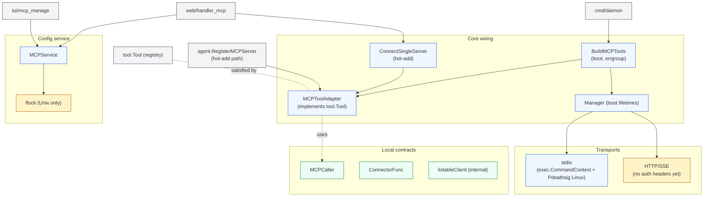
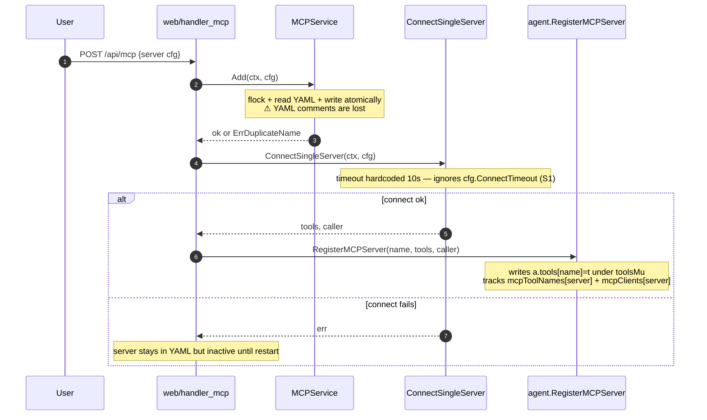
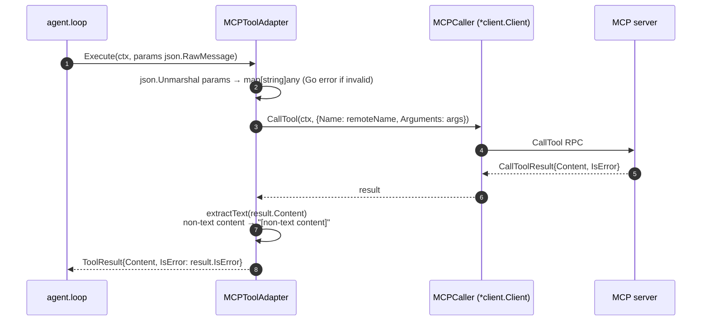
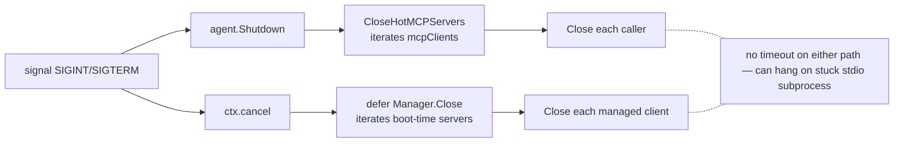

# `mcp` — Model Context Protocol client and bridge

> **Status**: ⚠️ attention (works; no sandboxing of subprocesses, no MCP schema validation, hot-remove broken for boot servers)
> **Stability**: evolving (most recent: hot-add + dashboard CRUD)
> **Last reviewed**: 2026-05-23
> **Code under**: `internal/mcp/`
> **Size**: 9 production files (+ 1 testdata server), ~828 LOC
> **Public surface**: 3 exported factories, 1 service, 1 manager, 1 adapter, 2 sentinel errors

## 1. Purpose

The `mcp` package bridges external MCP servers (stdio subprocesses or HTTP/SSE endpoints) to Daimon's `tool.Tool` contract. Each remote MCP server contributes a set of tools; each tool is wrapped in `MCPToolAdapter` that implements `tool.Tool` so the agent never knows the difference between a built-in shell tool and a tool living in another process. The package also owns the CRUD layer (`MCPService`) for the on-disk YAML config that lists configured servers, with cross-process file locking via `flock`.

The package is intentionally thin. It does not run an MCP server itself, it does not implement the wire protocol, and it does not validate the schemas remote servers return. Everything that talks the protocol comes from `github.com/mark3labs/mcp-go`.

## 2. Submodules & Key Files

| File                      | LOC | Responsibility                                                                               |
| ------------------------- | --- | -------------------------------------------------------------------------------------------- |
| `adapter.go`              | 104 | `MCPCaller` interface + `MCPToolAdapter` struct that wraps a remote tool as `tool.Tool`      |
| `factory.go`              | 259 | `BuildMCPTools` (boot) + `ConnectSingleServer` (hot-add); concurrent connect with `errgroup` |
| `manager.go`              | 117 | `Manager` (groups managed servers), `connectStdio`, `connectHTTP`, `envForServer`            |
| `service.go`              | 260 | `MCPService` — CRUD over the YAML config; in-process mutex + cross-process flock             |
| `proc_linux.go`           | 16  | Sets `Pdeathsig: SIGTERM` on stdio subprocesses (Linux only)                                 |
| `proc_other.go`           | 9   | No-op for non-Linux platforms                                                                |
| `service_lock_unix.go`    | 16  | `flock(LOCK_EX/LOCK_UN)` for Linux + Darwin                                                  |
| `service_lock_other.go`   | 8   | No-op for platforms without `flock`                                                          |
| `testdata/server/main.go` | 39  | Reference MCP server (`echo_tool`, `error_tool`) for integration tests                       |

## 3. Public API

### Interfaces

```go
// adapter.go:18
type MCPCaller interface {
    CallTool(ctx context.Context, req mcp.CallToolRequest) (*mcp.CallToolResult, error)
    Close() error
}

// factory.go:28
type ConnectorFunc func(ctx context.Context, cfg config.MCPServerConfig) (listableClient, error)
```

`MCPCaller` is the consumer-defined subset of `mark3labs/mcp-go`'s `*client.Client` — Daimon owns this abstraction so tests can mock without depending on the upstream package.

### Factories

```go
// factory.go:45 — boot-time factory; errors per-server are non-fatal
func BuildMCPTools(ctx context.Context, cfg config.MCPConfig) (map[string]tool.Tool, *Manager, error)

// factory.go:83 — testable core (inject connectors for stdio + HTTP/SSE)
func BuildMCPToolsWithConnector(ctx, cfg, stdio, http ConnectorFunc) (map[string]tool.Tool, *Manager, error)

// factory.go:213 — hot-add single server (used by dashboard)
func ConnectSingleServer(ctx context.Context, cfg config.MCPServerConfig) (map[string]tool.Tool, MCPCaller, error)
```

### Service

```go
// service.go:42
type MCPService struct { /* file path + in-process mutex */ }
func NewMCPService(cfgPath string) *MCPService

func (s *MCPService) List(ctx)          ([]ServerStatus, error)         // raw YAML, no live state
func (s *MCPService) Add(ctx, cfg)       error                           // flock + atomic write
func (s *MCPService) Remove(ctx, name)   error                           // flock + atomic write
func (s *MCPService) Validate(cfg)       error                           // structural only
func (s *MCPService) Test(ctx, cfg)      ([]string, error)               // connect + ListTools + Close

// service.go:30
type ServerStatus struct {
    Config    config.MCPServerConfig
    Connected bool                                                       // ALWAYS false in List
    ToolCount int                                                        // ALWAYS 0 in List
    Error     string
}

// service.go:19-20
var (
    ErrDuplicateName = errors.New("mcp server with this name already exists")
    ErrNotFound      = errors.New("mcp server not found")
)
```

### Adapter

```go
// adapter.go:26
type MCPToolAdapter struct { /* caller, toolDef, remoteName */ }
// implements tool.Tool: Name(), Description(), Schema(), Execute(ctx, params)
```

### Manager

```go
// manager.go:45
type Manager struct { /* []managedServer */ }
func (m *Manager) Close() error            // no timeout — can hang on stuck subprocess
```

## 4. Dependencies

### Outbound

| Package                                        | Why                                                                         |
| ---------------------------------------------- | --------------------------------------------------------------------------- |
| `internal/config`                              | `MCPConfig`, `MCPServerConfig`, `MCPServerConfig.Validate`, `ExpandSafeEnv` |
| `internal/tool`                                | `tool.Tool`, `tool.ToolResult`                                              |
| `github.com/mark3labs/mcp-go/client`           | `NewStdioMCPClientWithOptions`, `NewSSEMCPClient`                           |
| `github.com/mark3labs/mcp-go/client/transport` | `WithCommandFunc`                                                           |
| `github.com/mark3labs/mcp-go/mcp`              | request/response types, content types, `LATEST_PROTOCOL_VERSION`            |
| `golang.org/x/sync/errgroup`                   | concurrent server boot                                                      |
| `gopkg.in/yaml.v3`                             | config read/write                                                           |

### Inbound

| Importer                      | What it consumes                                                       |
| ----------------------------- | ---------------------------------------------------------------------- |
| `cmd/daimon/main.go`          | `BuildMCPTools`, `NewMCPService`                                       |
| `cmd/daimon/web_cmd.go`       | same                                                                   |
| `cmd/daimon/mcp_cmd.go`       | `NewMCPService` (CLI subcommand: list, add, remove, test, validate)    |
| `internal/web/handler_mcp.go` | `ConnectSingleServer`, sentinel errors                                 |
| `internal/web/server.go`      | `ServerStatus`, `MCPServerConfig` via the local `MCPManager` interface |
| `internal/tui/mcp_manage.go`  | `MCPService`, `ServerStatus`                                           |

### Layering position

Capability layer. Allowed to import `config` and `tool`. Clean direction — does not import `agent` / `channel` / `provider` / `store`.

## 5. Component Diagram



## 6. Key Flows

### 6.1 Boot-time connect (concurrent)

```mermaid
sequenceDiagram
  autonumber
  participant Main as cmd/daimon
  participant Fact as BuildMCPTools
  participant EG as errgroup
  participant Mgr as Manager
  participant SDK as mark3labs/mcp-go
  participant Proc as MCP subprocess

  Main->>Fact: BuildMCPTools(ctx, cfg.Tools.MCP)
  alt cfg.Enabled == false
    Fact-->>Main: nil map, nil mgr
  end
  loop for each enabled server (concurrent)
    Fact->>EG: g.Go(connect server)
    EG->>SDK: NewStdioMCPClientWithOptions(...) or NewSSEMCPClient(url)
    alt stdio
      SDK->>Proc: exec.CommandContext(ctx, command, args)
      Note over Proc: inherits os.Environ + cfg.Env<br/>Pdeathsig=SIGTERM (Linux)
    end
    SDK->>SDK: Initialize(ctx, {ProtocolVersion: LATEST})
    SDK->>SDK: ListTools(ctx, {}) — no cursor pagination
    SDK-->>EG: tools[]
    EG->>Fact: wrap each in MCPToolAdapter, register in map
  end
  Fact-->>Main: tools map, *Manager
  Note over Main: defer Manager.Close()
  Note over Main: collisions: first-writer-wins; built-in > skill > MCP at boot
```

Per-server errors are logged WARN and skipped — they never fail the whole boot. The orchestrator's connect timeout is `cfg.ConnectTimeout` (default hardcoded 10 s).

### 6.2 Hot-add via dashboard



### 6.3 Hot-remove (with the boot-server gap)

```mermaid
sequenceDiagram
  autonumber
  participant User
  participant Dash as web/handler_mcp
  participant Svc as MCPService
  participant Ag as agent.UnregisterMCPServer

  User->>Dash: DELETE /api/mcp/{name}
  Dash->>Svc: Remove(ctx, name)
  Svc-->>Dash: ok
  Dash->>Ag: UnregisterMCPServer(name)
  alt server was hot-added
    Ag->>Ag: lock toolsMu, delete each tool, caller.Close()
    Ag-->>Dash: ok
  else server was boot-added
    Ag-->>Dash: err "not registered via hot-add path"
    Note over Dash: logged DEBUG; HTTP returns 204<br/>⚠ Tools remain active until restart (S5)
  end
```

### 6.4 Tool execution through the adapter



### 6.5 Shutdown paths



## 7. Verdict

**Overall health**: ⚠️ **Attention** — clean dependency direction and a well-isolated abstraction, but every MCP subprocess inherits the parent's full environment and capabilities, and several hot-path corner cases are silently broken.

| Dimension        | Rating   | Evidence                                                                                                                                |
| ---------------- | -------- | --------------------------------------------------------------------------------------------------------------------------------------- |
| **Coupling**     | low      | Outbound: `config`, `tool`, mark3labs SDK only. Inbound: 6 callers — cleanly partitioned (boot, hot-paths, CRUD).                       |
| **Size / bloat** | lean     | 828 LOC across 9 files; the largest (`service.go`, 260 LOC) is YAML CRUD.                                                               |
| **Cohesion**     | focused  | each file has one job.                                                                                                                  |
| **Testability**  | moderate | `ConnectorFunc` makes the factory testable; `testdata/server/main.go` powers integration tests; `flock` paths are platform-conditional. |
| **Stability**    | evolving | hot-add + dashboard CRUD are new; protocol pinning to `LATEST_PROTOCOL_VERSION` defers compatibility issues to the SDK.                 |

### Smells & risks

**S1. `ConnectSingleServer` hardcoded timeout** — `factory.go:218` uses 10 s regardless of `cfg.ConnectTimeout`. `BuildMCPToolsWithConnector` does read it. Inconsistent.

**S2. Duplicated adapter-build loop** — `factory.go:146-164` (boot) and `:241-257` (hot-add) are nearly identical. Extract `buildAdapters(caller, tools, cfg) map[string]tool.Tool`.

**S3. No pagination of `ListTools`** — `mcp.ListToolsRequest{}` is empty; if a server returns more tools than fit in one page, the rest are silently dropped (`factory.go:139, 235`; `service.go:227`).

**S4. Non-text MCP content is silenced** — `adapter.go:99` replaces images / audio / embedded resources with `"[non-text content]"`. No log, no metadata. A tool that returns an image to be inspected becomes an opaque placeholder to the agent.

**S5. Hot-remove is broken for boot-added servers** — `handler_mcp.go:125-127` returns 204 even when `UnregisterMCPServer` errs (`not registered via hot-add path`). The YAML is updated but the tools remain active until restart. User-visible UI lies about state.

**S6. `MCPService.writeConfig` discards YAML comments** — `service.go:92, 143`. Documented but destructive for users who hand-edit. Use a YAML library that preserves comments (or operate on the AST).

**S7. `Env` for HTTP servers not implemented** — `config.go:486` says "(future)". HTTP path silently ignores the field; no warning surfaces if the user configures `env:` on an HTTP server.

**S8. `Add` reads the config file twice** — `service.go:100-135`. The first open holds the flock; the second `os.ReadFile` is a separate syscall. Works on Linux because flock blocks concurrent writers, but the code shape invites TOCTOU on systems without flock.

**S9. `Manager.Close()` has no timeout** — `manager.go:51` iterates serially. One stuck subprocess hangs the whole shutdown.

**S10. No subprocess sandboxing** — `manager.go:67-93`. MCP stdio subprocesses inherit `os.Environ()` plus extra env vars, with no `chroot` / `seccomp` / `capabilities` / `namespaces` / dropped privileges. A malicious or compromised MCP server has full filesystem + network access of the Daimon process.

**S11. No validation of returned tool schemas** — `factory.go:161` copies `t.InputSchema` directly to `MCPToolAdapter.toolDef`. A malicious server can return:

- `$ref` recursion that explodes the LLM's schema renderer.
- Tool descriptions containing prompt-injection payloads.
- Tool names colliding with built-ins (only mitigated by first-writer-wins).

**S12. No MCP-level rate limiting or timeout** — `Execute` (`adapter.go:61`) defers to the agent loop's `ToolTimeout`. A misbehaving server can saturate the agent's tool-call slots; no per-server quota.

**S13. Process leak on non-Linux platforms** — `Pdeathsig` is Linux-only (`proc_other.go:8` is no-op). On macOS or Windows, if Daimon dies with SIGKILL, MCP subprocesses become orphans until the OS reaps them.

**S14. No reconnection on server crash** — if a stdio subprocess dies mid-run, the next `CallTool` returns a transport error and stays broken. No watchdog, no relaunch.

### Suggested refactors (impact ÷ effort)

1. **Sandbox stdio subprocesses** (S10) — at minimum drop ambient capabilities, set `Setpgid: true`, optionally use bubblewrap / nsjail on Linux. **Effort: M-L. Impact: high (security).**
2. **Validate the tool schema returned by ListTools** (S11) — depth/breadth caps + bounded `$ref` resolution + sanitise description for the LLM. **Effort: M. Impact: high.**
3. **Fix hot-remove for boot servers** (S5) — extend `RegisterMCPServer` to also adopt boot-added servers (or restructure so boot goes through the same path). **Effort: S. Impact: high (UX/correctness).**
4. **Honour `cfg.ConnectTimeout` in `ConnectSingleServer`** (S1). **Effort: XS. Impact: low.**
5. **Add `Manager.Close(ctx)` with timeout** (S9). **Effort: XS. Impact: medium.**
6. **Extract `buildAdapters` helper** (S2). **Effort: XS. Impact: low.**
7. **Surface non-text content** (S4) — return a placeholder _with_ a `Meta` field describing what was elided. **Effort: S. Impact: medium.**
8. **Use a comment-preserving YAML writer** (S6). **Effort: S. Impact: medium.**
9. **Add per-server health check + reconnect for stdio** (S14) — periodic ping or detect EOF on read pipe, restart with backoff. **Effort: M. Impact: medium.**
10. **Implement Env injection for HTTP path** (S7) — map to `Authorization` headers or custom header keys. **Effort: S. Impact: medium.**

## 8. References

- Tool execution path: [`../ARCHITECTURE.md` §4.2](../ARCHITECTURE.md#42-tool-use-iteration-loop).
- Related modules:
  - [[tool]] — contract this adapter satisfies; collision rules + Registry verdict in [`tool.md`](tool.md).
  - [[agent]] — owns the live registry and the hot-reload entry points (`RegisterMCPServer`, `UnregisterMCPServer`, `CloseHotMCPServers`).
  - [[web]] — `/api/mcp` CRUD handler that drives hot-add / hot-remove.
  - [[tui]] — `mcp_manage.go` builds a TUI panel atop `MCPService`.
- Wiring: `cmd/daimon/main.go:255-269`, `cmd/daimon/web_cmd.go:159-163`.
