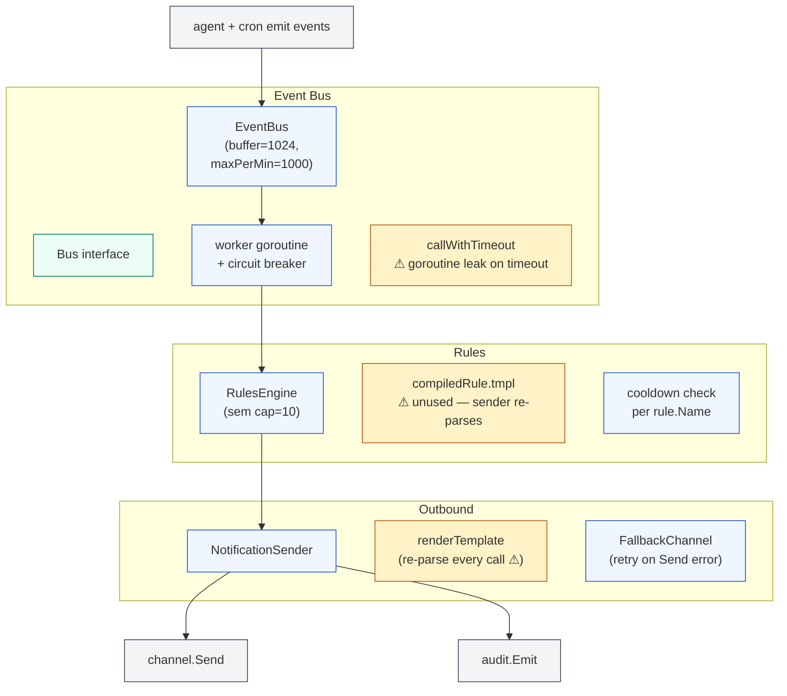
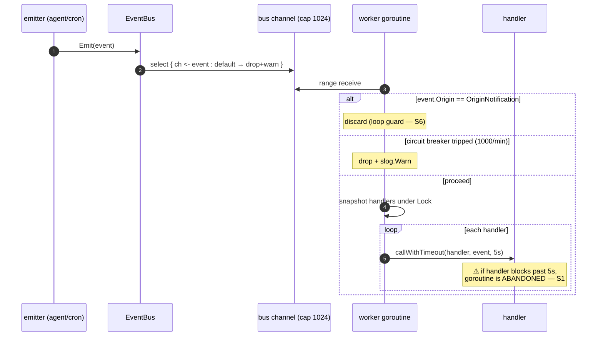
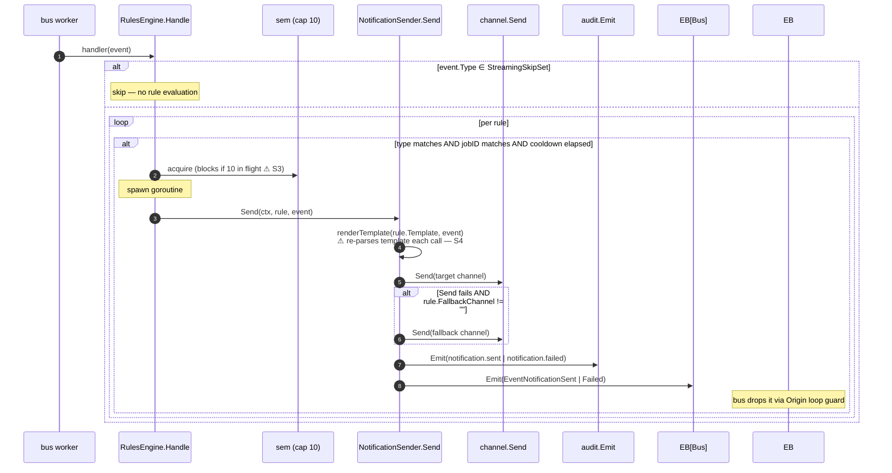

# `notify` — event bus + rules + external notification sender

> **Status**: ⚠️ attention (goroutine leak on handler timeout; 3 event types declared but never emitted; template duplication)
> **Stability**: stable
> **Last reviewed**: 2026-05-23
> **Code under**: `internal/notify/`
> **Size**: 4 production files, ~510 LOC (estimated)
> **Public surface**: 1 interface (`Bus`), 1 struct (`Event`), 13 event constants, `EventBus`, `NotificationSender`, `RulesEngine`

## 1. Purpose

The `notify` package owns Daimon's **internal event bus** and the **rule-driven outbound notification** layer that sits on top of it. The bus delivers typed `Event`s (cron, agent turns, subagent lifecycle, reasoning, tool events) to in-process subscribers with a bounded buffer, a per-minute circuit breaker, and per-handler timeouts. The `RulesEngine` listens on the bus, evaluates user-defined rules with cooldowns + templates, and delegates outbound delivery to `NotificationSender`, which writes to a channel (`Channel.Send`) and records the result to the audit log.

## 2. Submodules & Key Files

| File        | Symbols | Responsibility                                                                     |
| ----------- | ------- | ---------------------------------------------------------------------------------- |
| `bus.go`    | 13      | `Bus`, `Event`, `EventBus`, `NewEventBus`, worker goroutine, circuit breaker       |
| `events.go` | 26      | Event-type constants, `KnownEventTypes`, `StreamingSkipSet`, `Origin`              |
| `rules.go`  | 14      | `RulesEngine`, `compiledRule`, `Handle`, template compile, cooldown check          |
| `sender.go` | 15      | `NotificationSender`, `channelSender` interface, template render, audit + bus emit |

## 3. Public API

```go
// bus.go:33
type Bus interface {
    Emit(event Event)
    Subscribe(handler func(Event))
    Close()
}

// bus.go:10 — single Event type carrying everything; fields are omitempty
type Event struct {
    Type, Origin                            string
    JobID, JobPrompt                        string
    ChannelID, Text, Error                  string
    Timestamp                               time.Time
    Meta                                    map[string]string
    // Streaming/V2 fields
    ToolCallID, ToolName                    string
    Iteration                               int
    TokenCount                              int
    DurationMs                              int64
    CostUSD                                 float64
    IsError                                 bool
}

// bus.go:85 — defaults: buffer=1024, maxPerMin=1000, handlerTimeout=5s
func NewEventBus(bufferSize, maxPerMin int, handlerTimeout time.Duration) *EventBus

// sender.go:33
func NewNotificationSender(mux channelSender, auditor audit.Auditor, bus Bus) *NotificationSender

// rules.go:31 — pre-compiles all templates; returns *TemplateParseError if any fail
func NewRulesEngine(rules []config.NotificationRule, sender *NotificationSender) (*RulesEngine, error)
```

### Event type catalogue (`events.go`)

| Constant                                | Value                     | Emitted by                                              |
| --------------------------------------- | ------------------------- | ------------------------------------------------------- |
| `EventCronJobFired`                     | `cron.job.fired`          | `cron/scheduler.go:219`                                 |
| `EventCronJobCompleted`                 | `cron.job.completed`      | `cron/channel.go:108`                                   |
| `EventCronJobFailed`                    | `cron.job.failed`         | `cron/channel.go:108`                                   |
| `EventTurnStarted`                      | `agent.turn.started`      | `agent/loop.go:161`                                     |
| `EventTurnCompleted`                    | `agent.turn.completed`    | `agent/loop.go:839`                                     |
| `EventContextCompacted`                 | `agent.context.compacted` | `agent/context_manager.go:258`                          |
| `EventNotificationSent`                 | `notification.sent`       | `sender.go:103` (audit + bus; bus drops via loop guard) |
| `EventNotificationFailed`               | `notification.failed`     | `sender.go:103`                                         |
| `EventSubagentSpawned/Completed/Failed` | `agent.subagent.*`        | `agent/subagent_manager.go:267, 330, 479`               |
| `EventReasoningStart/End`               | `agent.reasoning.*`       | `agent/stream.go:76, 106`                               |
| `EventToolStart`                        | `agent.tool.start`        | **NOT emitted** ⚠ S2                                    |
| `EventToolEnd`                          | `agent.tool.end`          | **NOT emitted** ⚠ S2                                    |
| `EventTokensUsage`                      | `agent.tokens.usage`      | **NOT emitted** ⚠ S2                                    |

`StreamingSkipSet` (`events.go:87`) filters out high-frequency events (reasoning, tool stream, tokens) so rules never fire on them.

## 4. Dependencies

| Direction | Edge                                                    |
| --------- | ------------------------------------------------------- |
| Outbound  | `internal/audit`, `internal/channel`, `internal/config` |
| Inbound   | `agent`, `cron`, `web`, `cmd/daimon`                    |

### Layering position

Subsystem. The edge `notify → channel` is layering violation L5 (a Subsystem importing Transport). Pragmatically required: `NotificationSender` must call `Channel.Send` to deliver outbound notifications.

## 5. Component Diagram



## 6. Key Flows

### 6.1 Emit → handler dispatch (with circuit breaker + timeout)



### 6.2 Rule evaluation + outbound send



## 7. Verdict

**Overall health**: ⚠️ **Attention** — works but has a real goroutine-leak risk, a dead-emit set for three declared event types, and template-rendering duplication.

| Dimension        | Rating   | Evidence                                                       |
| ---------------- | -------- | -------------------------------------------------------------- |
| **Coupling**     | low      | Outbound: 3 packages (audit, channel, config). Inbound: 4.     |
| **Size / bloat** | lean     | ~510 LOC.                                                      |
| **Cohesion**     | mixed    | Bus + rules + sender in one package; could split.              |
| **Testability**  | moderate | Tests focus on logic; goroutine-leak path is hard to exercise. |
| **Stability**    | stable   | Few recent edits.                                              |

### Smells & risks

**S1. `callWithTimeout` leaks goroutines** — `bus.go:191`. When a handler exceeds `handlerTimeout`, the worker returns but the handler goroutine keeps running. A handler that blocks forever produces a permanent leak per event. Fix: pass a cancellable `context.Context` into handlers; require them to honour it.

**S2. Three event types declared but never emitted** — `events.go:46-48`. `EventToolStart`, `EventToolEnd`, `EventTokensUsage` are in `KnownEventTypes` and `StreamingSkipSet`, accepted by config validation, but no `bus.Emit` site exists. A rule that targets them never fires.

**S3. `RulesEngine` semaphore (cap=10) blocks the bus worker** — `rules.go:49, 93`. If 10 rules are mid-send, the 11th acquires the semaphore via blocking send. Since `Handle` runs on the bus worker's goroutine, the bus stalls until a send completes. Convert to bounded goroutine pool or fail-fast with `slog.Warn`.

**S4. Templates compiled twice** — `NewRulesEngine` parses every template into `compiledRule.tmpl` (`rules.go:36-40`) but `NotificationSender.renderTemplate` re-parses from `rule.Template` string on every call (`sender.go:141`). Wasted work per fire; also a possible behavioural divergence.

**S5. Circuit breaker is 60-second sliding window, not rolling** — `bus.go:156`. `sentCount` resets when `time.Since(windowStart) > 60s`, then starts counting again from 0. A burst right after the reset can again push 1000 in the first second of the next window without limiting.

**S6. `OriginNotification` loop guard buries delivery telemetry** — `bus.go:150`. Events with origin `notification` are discarded by the worker before handlers see them — to prevent infinite re-fire — but this means `EventNotificationSent/Failed` cannot be subscribed to by anything except the audit log. The dashboard cannot show "notifications sent" via bus subscription.

**S7. Drop policy is silent for both buffer overflow and circuit breaker** — `bus.go:119, 162-168`. Operators only see `slog.Warn`. There is no metric, no count exposed via the dashboard, no escalation.

**S8. Defaults conflict with prior intent** — historical notes mention `maxPerMin=30` as a circuit breaker; current default is 1000 (`bus.go:90`). If the original intent was anti-spam (30/min), it is no longer enforced. If the new default is correct, the documentation should call it out.

**S9. `Event` is a fat struct with overloaded semantics** — `bus.go:10`. Some fields apply only to cron events, some only to streaming, some only to subagents. Consumers must know which fields are valid per `Type`. A discriminated union per event family would be cleaner but Go-unfriendly; at minimum document the field matrix.

### Suggested refactors (impact ÷ effort)

1. **Add `context.Context` to handler signature** (S1) — let handlers respect cancellation; mark handler API as `func(ctx, Event)`. **Effort: M (cross-cutting). Impact: high (leak prevention).**
2. **Either wire emitters for `EventToolStart/End/TokensUsage` or remove them** (S2). **Effort: S. Impact: medium (correctness).**
3. **Replace `sem chan struct{}` with a worker pool of fixed size** (S3) — non-blocking. **Effort: S. Impact: medium.**
4. **Use pre-compiled templates in `NotificationSender`** (S4) — pass `compiledRule.tmpl` through. **Effort: S. Impact: low-medium.**
5. **Rolling-window circuit breaker** (S5) — ring buffer of per-second counts. **Effort: S. Impact: low-medium.**
6. **Expose drop counts as metrics** (S7). **Effort: XS. Impact: low.**
7. **Decide on `maxPerMin`** (S8) — pick a defensible default and document it. **Effort: XS. Impact: low.**

## 8. References

- Wiring: `cmd/daimon/main.go:497-516` (`NewEventBus` + `NewNotificationSender` + `NewRulesEngine`); also `cmd/daimon/web_cmd.go:309`.
- Bus subscriber from agent: `agent/subagent_manager.go:188-209` — scans all subs on every `EventTurnCompleted` (see [`agent.md` S10](agent.md#smells--risks)).
- Related modules:
  - [[channel]] — Sender targets a `channel.Channel`; subject of layering edge L5.
  - [[cron]] — biggest event emitter (cron job lifecycle).
  - [[agent]] — emits turn / context / subagent / reasoning events.
  - [[audit]] — Sender records every notification attempt.
