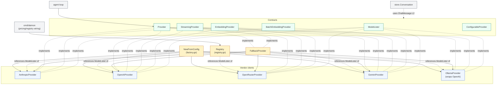
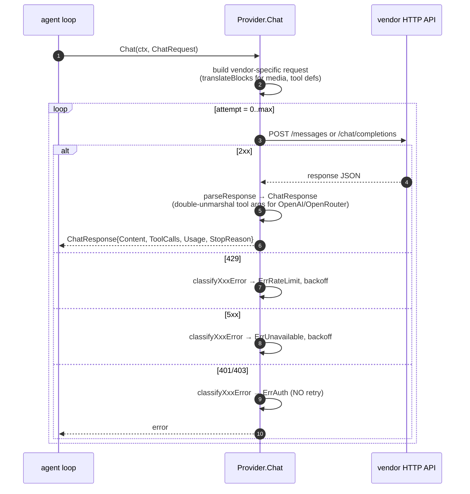
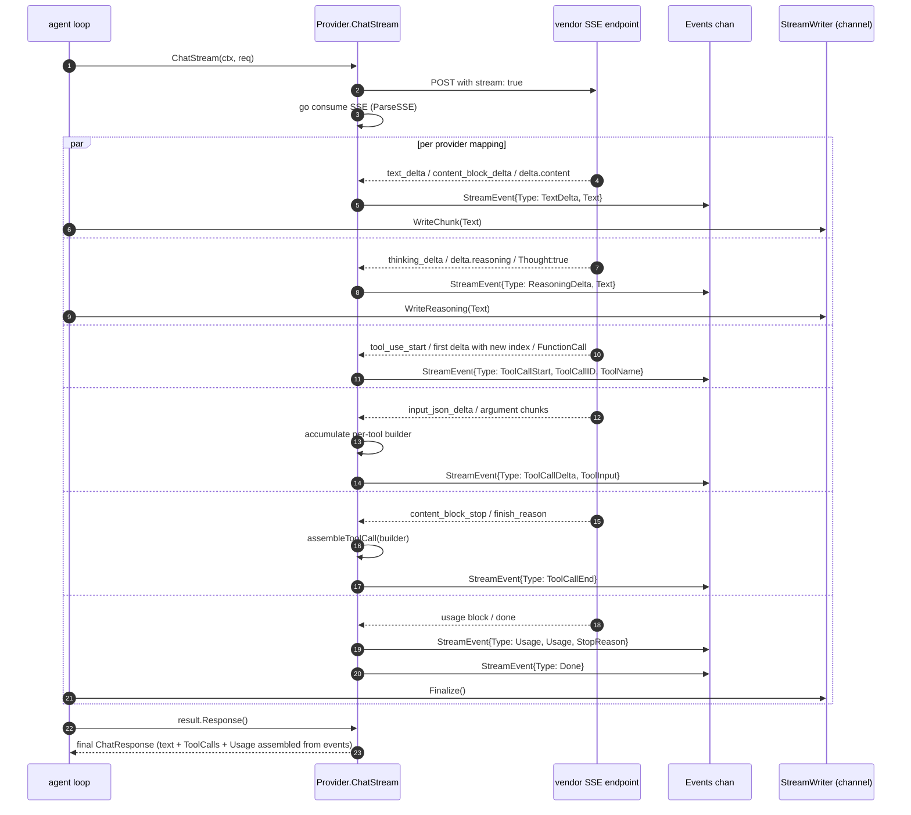
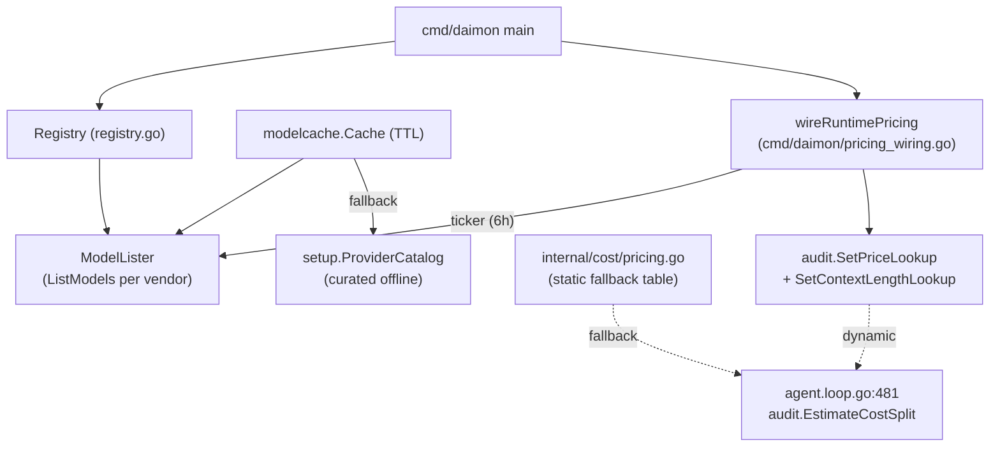

# `provider` — LLM API clients and streaming

> **Status**: ⚠️ attention (works; 4 functional bugs + heavy duplication across providers)
> **Stability**: stable but actively evolving (reasoning, model discovery, runtime pricing)
> **Last reviewed**: 2026-05-23
> **Code under**: `internal/provider/`
> **Size**: 18 production files, ~4,076 LOC
> **Public surface**: 6 exported interfaces, 8 exported structs/types, 8 constructors, 1 sentinel-error family

## 1. Purpose

The `provider` package translates Daimon's internal `ChatMessage` / `ChatRequest` shape into a specific LLM vendor's HTTP API and back. It also abstracts streaming (Server-Sent Events → `StreamEvent` channel), tool-use mapping (each vendor's tool format), reasoning / thinking tokens (when supported), embeddings, model discovery (`ListModels`), and runtime fallback. The agent loop never touches a vendor-specific JSON shape — it goes through this package.

## 2. Submodules & Key Files

### Contracts & shared utilities

| File                                 | LOC      | Responsibility                                                                                                                                                                              |
| ------------------------------------ | -------- | ------------------------------------------------------------------------------------------------------------------------------------------------------------------------------------------- |
| `provider.go`                        | 162      | All exported interfaces and types (`Provider`, `StreamingProvider`, `EmbeddingProvider`, `BatchEmbeddingProvider`, `ModelLister`, `ConfigurableProvider`, message structs, sentinel errors) |
| `stream.go`                          | 307      | `StreamEvent` types, SSE parser, `syncToStream` adapter, `assembleToolCall`                                                                                                                 |
| `factory.go`                         | 37       | `NewFromConfig` — single factory entry point                                                                                                                                                |
| `registry.go`                        | 103      | `Registry` (provider-name → `ModelLister`) + `RegisterTransient` for setup-wizard hot adds                                                                                                  |
| `media.go`                           | 16       | Internal `mediaReader` interface (load media from store)                                                                                                                                    |
| `fallback.go` + `fallback_stream.go` | 108 + 64 | Transparent `FallbackProvider` (primary fails over to secondary on rate-limit/unavailable)                                                                                                  |

### Vendor clients

| Vendor     | Files                                             | LOC            | Notes                                                         |
| ---------- | ------------------------------------------------- | -------------- | ------------------------------------------------------------- |
| Anthropic  | `anthropic.go`, `anthropic_stream.go`             | 339 + 422      | Adaptive vs manual `thinking`; SSE                            |
| OpenAI     | `openai.go`, `openai_stream.go`                   | 691 + 309      | Chat + Embed + EmbedBatch + ListModels                        |
| OpenRouter | `openrouter.go`, `openrouter_stream.go`           | 478 + 331      | Pricing via API; reasoning fields                             |
| Gemini     | `gemini.go`, `gemini_stream.go`                   | 746 + 394      | Schema sanitization; thought parts                            |
| Ollama     | `ollama.go`, `ollama_list.go`, `ollama_stream.go` | 46 + 109 + 259 | Wraps OpenAIProvider; native NDJSON `/api/chat` for streaming |

## 3. Public API

### Interfaces

```go
// provider.go:104 — base
type Provider interface {
    Name() string
    Model() string
    Chat(ctx context.Context, req ChatRequest) (*ChatResponse, error)
    SupportsTools() bool
    SupportsMultimodal() bool
    SupportsAudio() bool
    HealthCheck(ctx context.Context) (string, error)
}

// stream.go:126
type StreamingProvider interface {
    Provider
    ChatStream(ctx context.Context, req ChatRequest) (*StreamResult, error)
}

// provider.go:116, :132 — embedding family
type EmbeddingProvider interface {
    Embed(ctx context.Context, text string) ([]float32, error)
}
type BatchEmbeddingProvider interface {
    EmbedBatch(ctx context.Context, texts []string) ([][]float32, error)
}

// provider.go:149
type ModelLister interface {
    ListModels(ctx context.Context) ([]ModelInfo, error)
}

// provider.go:161 — optional: inherit credentials into subagents
type ConfigurableProvider interface {
    Config() config.ProviderConfig
}
```

### Sentinel errors

```go
// provider.go:15-20
var (
    ErrRateLimit  = errors.New("rate limited")
    ErrUnavailable = errors.New("provider unavailable")
    ErrAuth       = errors.New("provider auth failed")
    ErrBadRequest = errors.New("provider bad request")
)
```

Used by `FallbackProvider` (`isFallbackEligible`) to decide whether to retry on the secondary.

### Message & response types

```go
// provider.go:32, :71, :77, :83, :92, :99, :137
type ChatMessage struct {
    Role       string
    Content    content.Blocks
    ToolCalls  []ToolCall
    ToolCallID string
}
type ToolCall struct{ ID, Name string; Input json.RawMessage }
type ToolDefinition struct{ Name, Description string; InputSchema json.RawMessage }
type ChatRequest struct {
    Model        string
    SystemPrompt string
    Messages     []ChatMessage
    Tools        []ToolDefinition
    MaxTokens    int
    Temperature  float64
}
type ChatResponse struct {
    Content    string
    ToolCalls  []ToolCall
    Usage      UsageStats
    StopReason string
}
type UsageStats struct{ InputTokens, OutputTokens int }
type ModelInfo struct {
    ID, Name             string
    ContextLength        int
    PromptCost, CompletionCost float64
    Free                 bool
    SupportedParameters  []string
}
```

### Streaming types

```go
// stream.go:21-50 — event taxonomy
type StreamEventType int
const (
    StreamEventTextDelta StreamEventType = iota
    StreamEventReasoningDelta
    StreamEventToolCallStart
    StreamEventToolCallDelta
    StreamEventToolCallEnd
    StreamEventUsage
    StreamEventDone
    StreamEventError
)

// stream.go:57
type StreamEvent struct {
    Type       StreamEventType
    Text       string
    ToolCallID, ToolName, ToolInput string
    Usage      *UsageStats
    StopReason string
    Err        error
}

// stream.go:74
type StreamResult struct{ Events <-chan StreamEvent /* + privée */ }
func (r *StreamResult) Response() *ChatResponse
func NewStreamResult(events <-chan StreamEvent) *StreamResult
```

### Constructors

```go
NewAnthropicProvider(cfg) *AnthropicProvider                                  // anthropic.go:89
NewOpenAIProvider(cfg) (*OpenAIProvider, error)                               // openai.go:134
NewOpenRouterProvider(cfg) *OpenRouterProvider                                // openrouter.go:130
NewGeminiProvider(cfg) *GeminiProvider                                        // gemini.go:46
NewOllamaProvider(cfg) (*OllamaProvider, error)                               // ollama.go:29 (wraps OpenAI)
NewFallbackProvider(primary, fallback Provider, logger) *FallbackProvider     // fallback.go:19
NewFromConfig(cfg) (Provider, error)                                          // factory.go:14
NewStaticRegistry(cfg) *Registry                                              // registry.go:27
```

## 4. Dependencies

### Outbound

| Package            | What's consumed                                              |
| ------------------ | ------------------------------------------------------------ |
| `internal/config`  | `ProviderConfig`, `ProviderCredentials`, `Config`            |
| `internal/content` | `Blocks`, `ContentBlock`, `FlattenBlocks`, `UnmarshalBlocks` |

No imports of `store`, `agent`, `tool`, `web`, `rag`, `notify`, etc.

### Inbound

| Importer         | Symbols consumed                                                                                               |
| ---------------- | -------------------------------------------------------------------------------------------------------------- |
| `internal/agent` | every interface + every message/stream type; `NewFromConfig` inside `makeChildAgentFn`                         |
| `internal/store` | **`ChatMessage`** — embedded in `Conversation.Messages` (layering violation L2 — see §7 S1)                    |
| `internal/tool`  | `Provider`, `ChatRequest` (used by cron tool that schedules agent calls)                                       |
| `internal/web`   | `Registry`, `ModelLister`, `ModelInfo`, `NewFromConfig`, `ValidateConfiguredModel` (in `web/startup_check.go`) |
| `cmd/daimon`     | `Provider`, `ModelLister`, `ModelInfo`, `NewFromConfig`, `NewStaticRegistry`, `EmbeddingProvider`, `Registry`  |

### Layering position

Subsystem layer. Allowed to import `config` + `content` only. **Should not be imported by Persistence**; the `store → provider` edge is the L2 violation tracked in [`../ARCHITECTURE.md` §6](../ARCHITECTURE.md#6-layering-violations).

## 5. Component Diagram



## 6. Key Flows

### 6.1 Sync chat (with retries)



### 6.2 Streaming chat + tool-call accumulation

The cross-provider event model is uniform; the SSE → `StreamEvent` mapping is per-vendor (table in §6.3).



### 6.3 SSE → `StreamEvent` mapping (cross-vendor)

| Event      | Anthropic                           | OpenAI/OpenRouter                                | Ollama (NDJSON)                          | Gemini                         |
| ---------- | ----------------------------------- | ------------------------------------------------ | ---------------------------------------- | ------------------------------ |
| Text delta | `content_block_delta.text_delta`    | `choices[0].delta.content`                       | `chunk.Message.Content`                  | `part.Text`                    |
| Reasoning  | `thinking_delta` block              | `delta.reasoning` / `delta.reasoning_content`    | `chunk.Message.Thinking`                 | `part.Thought:true`            |
| Tool start | `content_block_start.type=tool_use` | first chunk with new `delta.tool_calls[i].index` | per tool in `chunk.ToolCalls` (complete) | `part.FunctionCall` (complete) |
| Tool delta | `input_json_delta`                  | `delta.tool_calls[i].function.arguments`         | n/a (single chunk)                       | n/a (single chunk)             |
| Tool end   | `content_block_stop`                | on `finish_reason` (sort by index)               | immediate                                | immediate                      |
| Usage      | `message_delta`                     | chunk with `finish_reason`                       | chunk with `done:true`                   | each chunk accumulates         |
| Done       | `message_stop`                      | `[DONE]` sentinel                                | `done:true`                              | STOP / MAX_TOKENS              |
| Error      | SSE `error` event                   | parse failure → ErrUnavailable                   | scanner error (no sentinel wrap — S9)    | `chunk.Error != nil`           |

### 6.4 Fallback flow

```mermaid
sequenceDiagram
  autonumber
  participant L as agent loop
  participant FB as FallbackProvider
  participant P1 as primary
  participant P2 as fallback

  L->>FB: Chat or ChatStream
  FB->>P1: try primary
  alt success
    P1-->>FB: response
    FB-->>L: response
  else ErrRateLimit / ErrUnavailable
    P1-->>FB: err
    FB->>FB: isFallbackEligible(err) == true
    FB->>P2: try fallback
    alt success
      P2-->>FB: response
      FB-->>L: response
    else fail
      P2-->>FB: err2
      FB-->>L: fmt.Errorf("primary: %w; fallback: %v", err, err2)
    end
  else ErrAuth / ErrBadRequest
    P1-->>FB: err (NOT eligible)
    FB-->>L: err (fail fast — no fallback attempt)
  end
```

Streaming caveat: `FallbackProvider.ChatStream` only retries on **pre-stream** errors (connection / first chunk). Mid-stream failures are not recoverable — the consumer sees `StreamEventError` and must restart.

### 6.5 Model discovery & runtime pricing



`ValidateConfiguredModel` (`web/startup_check.go:32`) is called from `cmd/daimon/main.go:626` with a 10 s timeout. It calls `ListModels`, searches for the configured ID, and emits a `slog.Warn` (never blocks) if absent.

## 7. Verdict

**Overall health**: ⚠️ **Attention** — works in production but has four real correctness/security bugs and large amounts of duplicated SSE / tool-accumulation code across providers.

| Dimension        | Rating                       | Evidence                                                                                           |
| ---------------- | ---------------------------- | -------------------------------------------------------------------------------------------------- |
| **Coupling**     | low                          | Outbound: only `config` + `content`. Inbound: 5 packages, including the L2 violation from `store`. |
| **Size / bloat** | inflated                     | 4,076 LOC across 18 files; `gemini.go` 746 LOC, `openai.go` 691 LOC. Heavy duplication.            |
| **Cohesion**     | mixed                        | high _within_ each vendor; the cross-vendor structure is parallel but unshared.                    |
| **Testability**  | moderate                     | Each provider has tests; some flows (reasoning, fallback mid-stream) are partially covered.        |
| **Stability**    | stable but actively evolving | Recent SDD changes added reasoning, model discovery, runtime pricing.                              |

### Smells & risks

**S1. `store` imports `provider`** — `store/store.go:33` (`Conversation.Messages []provider.ChatMessage`), `store.go:219` (`GetConversationMessages`), `sqlitestore.go:414`, `sqlitestore_media.go:108,246`. Layering violation L2. A breaking change in `ChatMessage` migrates the DB.

**S2. `IncludeReasoning` never set on the sync `Chat()` path for OpenRouter** — `openrouter.go:307`. Only `openrouter_stream.go:127-136` toggles it. Callers that use `Chat()` (no streaming) with a DeepSeek-R1 (or similar) model never receive reasoning. Functional bug.

**S3. `SetModelInfoStore` never wired in production** — `registry.go:67` has a comment ("cache is wired later") but no code path calls `SetModelInfoStore` on `OpenRouterProvider`. Effect: `IncludeReasoning` is always `false`, even in streaming, even on reasoning-capable OpenRouter models. Reasoning tokens emitted by the model are lost in transit.

**S4. Gemini synthesises tool-call IDs as `"call_{name}"`** — `gemini.go:393`. If the same tool is called twice in one turn, both calls receive the same ID. The agent loop correlates tool results to calls by ID; collision corrupts correlation.

**S5. Gemini API key in URL query string** — `gemini.go:235`, `gemini_stream.go:65`. If `slog` ever logs the request URL (some debug paths do), the API key is captured.

**S6. Ollama streaming errors not wrapped in sentinel** — `ollama_stream.go:127`. `fmt.Errorf("ollama stream: /api/chat returned %d: %s", ...)` does not produce `ErrRateLimit` or `ErrUnavailable`. `FallbackProvider.isFallbackEligible` returns false; the fallback path is dead for Ollama on streaming. Functional bug.

**S7. Massive duplication of SSE parsing between OpenAI and OpenRouter** — `openai_stream.go` and `openrouter_stream.go` are ~200 LOC each, structurally identical. `openaiToolAccumulator` and `openrouterToolAccumulator` are byte-identical structs. A shared `openAICompatibleStreamParser` would cut ~250 LOC.

**S8. Pricing logic duplicated between `internal/cost` and `audit`** — see `../ARCHITECTURE.md` §7.3 and [`agent.md` §7 S6](agent.md#smells--risks). Diverges on every price update.

**S9. Streaming has no absolute timeout** — every provider uses `&http.Client{}` (no Timeout) for streaming, relying on the caller's `ctx` for cancellation. If the agent loop context is bugged / leaked, a streaming goroutine can hang indefinitely.

**S10. Per-provider retry policies diverge**:

- Anthropic: linear backoff `(n+1)*2s` for HTTP errors, `(n+1)*1s` for network.
- OpenAI / OpenRouter: `(n+1)*2s` for both.
- Gemini: respects `retryDelay` from the error body (best behaviour).
- None honour HTTP `Retry-After` header.

**S11. `ChatRequest.Model` is unconstrained** — no validation against `ListModels` results per request. `ValidateConfiguredModel` only checks the boot default.

**S12. Vendor differences in `Thinking` config not abstracted** — Anthropic uses `ProviderCredentials.Thinking`; Gemini auto-detects via capability map (opt-out only); Ollama uses model-name heuristic; OpenRouter relies on the (unwired) `ModelInfoStore`. No single config field controls it consistently.

**S13. `OllamaProvider.ListModels` has duplicate timeout** — `ollama_list.go:71` builds both a `context.WithTimeout(ctx, 5s)` and `&http.Client{Timeout: 5s}`. The smaller wins, but the dual configuration is confusing.

**S14. `parseOpenAIToolCalls` double-unmarshals** — wire format encodes `function.arguments` as a JSON-string; the parser does `json.Unmarshal(string) → string → json.RawMessage`. Correct, but worth a comment.

**S15. Anthropic 4xx body included in error message** — `classifyAnthropicError` (`anthropic.go:237`) passes `string(body)` into the error. Anthropic's 4xx bodies are JSON metadata; low risk but no redaction.

### Suggested refactors (impact ÷ effort)

1. **Extract a shared OpenAI-compatible streaming parser** (S7) — single `openAICompatibleStreamParser` used by OpenAI, OpenRouter, future vendors. **Effort: M. Impact: high (-250 LOC, single source of bugs).**
2. **Wire `SetModelInfoStore` from `registry.go` to the cache** (S3) — also unlocks S2's path so `IncludeReasoning` can be turned on in sync calls. **Effort: S. Impact: medium (reasoning bug fix).**
3. **Set `IncludeReasoning` in `OpenRouterProvider.Chat()` symmetrically with `ChatStream()`** (S2). **Effort: XS. Impact: medium.**
4. **Wrap Ollama streaming errors with the sentinel family** (S6) — enables fallback for local model rate limits. **Effort: XS. Impact: medium.**
5. **Move Gemini API key from query to `x-goog-api-key` header** (S5) — most Google examples now use the header. **Effort: XS. Impact: medium (security).**
6. **Generate Gemini tool-call IDs with `uuid` or `name + position`** (S4). **Effort: XS. Impact: medium (correctness bug).**
7. **Introduce a `store.Message` type** (S1) — break the `store → provider` edge. **Effort: M (touches store + every caller). Impact: high (architectural).**
8. **Unify pricing into `internal/cost`** (S8) — repeat of the recommendation in [`agent.md`](agent.md). **Effort: S. Impact: medium.**
9. **Add absolute timeout to streaming HTTP clients** (S9) — config field `stream_timeout` with sensible default. **Effort: XS. Impact: medium (leak prevention).**
10. **Honour HTTP `Retry-After` in 429 handling** (S10) — replace linear backoff. **Effort: S. Impact: low.**
11. **Centralise thinking config behind a single interface** (S12) — `type ThinkingConfigurable interface { SetThinking(cfg) }`. **Effort: M. Impact: medium.**

## 8. References

- System-wide flows: [`../ARCHITECTURE.md` §4.1](../ARCHITECTURE.md#41-happy-path-user-message--response), [§4.2](../ARCHITECTURE.md#42-tool-use-iteration-loop).
- Related modules:
  - [[agent]] — primary consumer; see also [`agent.md`](agent.md) for `makeChildAgentFn` (which calls `NewFromConfig` per spawn — S11 in agent.md).
  - [[store]] — L2 violation source via `provider.ChatMessage`.
  - [[tool]] — uses `Provider` + `ChatRequest` in the cron tool.
  - [[web]] — `Registry`, model discovery handler, startup model validation.
  - [[cost]] / [[audit]] — pricing dispatch (currently duplicated).
- Pricing wiring: `cmd/daimon/pricing_wiring.go:25` (`wireRuntimePricing`).
- Model cache (TTL + offline fallback): `internal/web/modelcache/cache.go`.
- Startup model validation: `internal/web/startup_check.go:32`.
