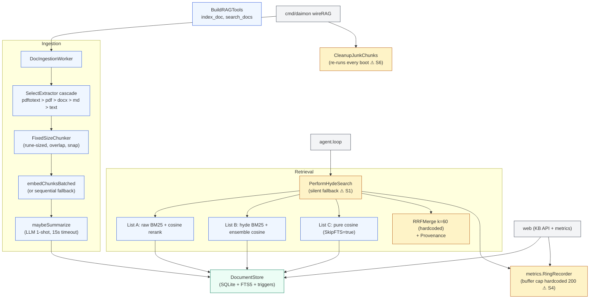
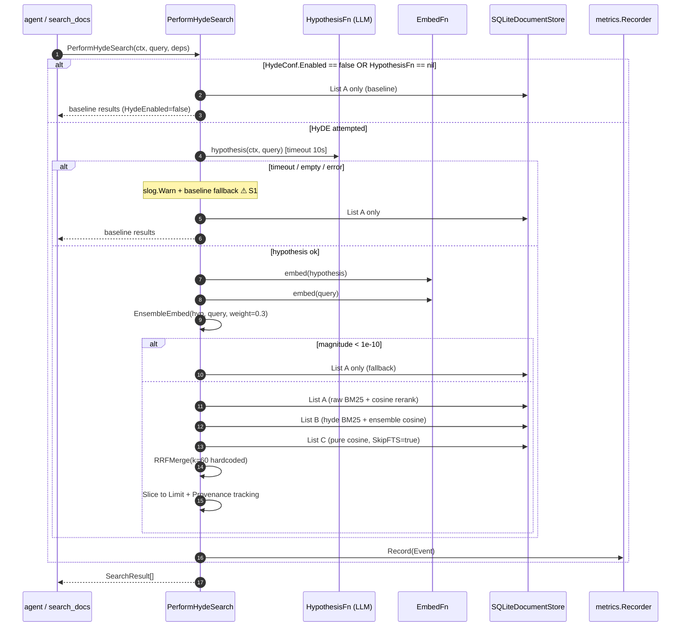
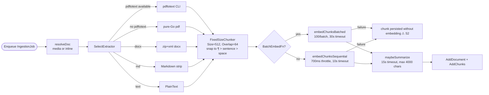

# `rag` — retrieval, ingestion, and HyDE pipeline

> **Status**: ⚠️ attention (silent fallbacks, dead metric fields, ignored config, duplicated provider call patterns)
> **Stability**: evolving (HyDE + summarizer + access counters are recent)
> **Last reviewed**: 2026-05-23
> **Code under**: `internal/rag/` + `internal/rag/metrics/`
> **Size**: 17 production files + 1 sub-package, ~2,933 LOC
> **Public surface**: 1 interface (`DocumentStore`), 3 sentinel errors, 13 free functions, ~10 exported structs

## 1. Purpose

The `rag` package owns Daimon's retrieval-augmented generation subsystem: ingest a document (PDF / DOCX / Markdown / text), chunk it, embed it, persist into SQLite + FTS5, and at query time run a 3-list HyDE retrieval (raw-BM25 / hyde-BM25 / pure-cosine) merged via RRF. The sub-package `internal/rag/metrics` records per-search events in a thread-safe ring buffer and exposes percentile aggregates. The package is consumed only by `agent` (search-time) and `web` (knowledge-base API + dashboard).

The retrieval architecture described in [`../ARCHITECTURE.md` §4.5](../ARCHITECTURE.md#45-rag-retrieval-hyde--rrf) is implemented here: three searches run in sequence (not parallel — `hyde_search.go:174-183`), results merged with `RRFMerge(k=60)`, neighbor expansion handled inside `SearchChunks` before merge.

## 2. Submodules & Key Files

### Core retrieval

| File              | LOC | Responsibility                                                                                     |
| ----------------- | --- | -------------------------------------------------------------------------------------------------- |
| `store.go`        | 41  | `DocumentStore` interface + sentinel errors                                                        |
| `sqlite_store.go` | 685 | `SQLiteDocumentStore`: `SearchChunks`, `pureVectorSearch`, `expandNeighbors`, `bumpAccessCounters` |
| `hyde_search.go`  | 288 | `PerformHydeSearch` — 3-list orchestrator + RRF + provenance                                       |
| `hyde.go`         | 87  | Pure functions: `RRFMerge`, `EnsembleEmbed`, `Provenance`                                          |
| `embed.go`        | 62  | `NormalizeEmbedding`, `SerializeEmbedding`, `CosineSimilarity`                                     |

### Ingestion pipeline

| File                     | LOC | Responsibility                                                     |
| ------------------------ | --- | ------------------------------------------------------------------ |
| `worker.go`              | 401 | `DocIngestionWorker` — resolve → chunk → embed → summarize → store |
| `chunker.go`             | 140 | `FixedSizeChunker` — rune-sized chunks with snap-to-boundary       |
| `extractor.go`           | 132 | `SelectExtractor` cascade; `PlainText`, `Markdown`                 |
| `pdftotext_extractor.go` | 87  | Poppler-utils CLI extractor (preferred for PDF)                    |
| `pdf_extractor.go`       | 75  | Pure-Go fallback via `ledongthuc/pdf`                              |
| `docx_extractor.go`      | 174 | Zip + XML reader for `.docx`                                       |

### Schema / cleanup / metrics / tools / config

| File                      | LOC | Responsibility                                                                       |
| ------------------------- | --- | ------------------------------------------------------------------------------------ |
| `migrate.go`              | 90  | `MigrateV9` — `documents` + `document_chunks` + FTS5 + triggers                      |
| `sqlite_store_cleanup.go` | 139 | `CleanupJunkChunks` — heals data from previous chunker bug (re-runs every boot — S6) |
| `tools.go`                | 242 | `BuildRAGTools` — `index_doc` + `search_docs` LLM tools                              |
| `config.go`               | 94  | `RAGConfig` family + `ApplyRAGDefaults`                                              |
| `doc.go`                  | 89  | `Document`, `DocumentChunk`, `SearchResult`, `SearchOptions`                         |
| `metrics/metrics.go`      | 202 | `Event`, `RingRecorder`, `Aggregates`                                                |

## 3. Public API

### Interface

```go
// store.go:17
type DocumentStore interface {
    AddDocument(ctx, doc Document) error
    AddChunks(ctx, docID string, chunks []DocumentChunk) error
    SearchChunks(ctx, query string, queryVec []float32, opts SearchOptions) ([]SearchResult, error)
    DeleteDocument(ctx, docID string) error
    ListDocuments(ctx, namespace string) ([]Document, error)
    GetDocument(ctx, id string) (Document, error)
}

var (
    ErrDocNotFound        = errors.New(...)
    ErrUnsupportedMIME    = errors.New(...)
    ErrStorageLimitReached = errors.New(...)
)
```

`*SQLiteDocumentStore` exposes one extra method that is **not** on the interface: `SumTokensByDoc(...)` (`sqlite_store.go:566`). Callers that need it must type-assert.

### Search types

```go
type SearchResult struct {
    Chunk       DocumentChunk
    DocTitle    string
    Score       float64
    CosineScore *float64    // only populated on the SkipFTS path — see S7
}
type SearchOptions struct {
    Limit, NeighborRadius        int
    MaxBM25Score, MinCosineScore float64
    SkipFTS                      bool
}
```

### HyDE entry point

```go
// hyde_search.go:54 — never returns error; silent baseline fallback
func PerformHydeSearch(ctx, query string, deps HydeSearchDeps) ([]SearchResult, error)

type HydeSearchDeps struct {
    Store           DocumentStore
    EmbedFn         func(ctx, text string) ([]float32, error)
    HypothesisFn    func(ctx, query string) (string, error)
    HydeConf        HydeSearchConfig         // Enabled, Model, Timeout, QueryWeight, MaxCandidates
    RetrievalConf   RetrievalSearchConfig    // Limit, NeighborRadius, MaxBM25Score, MinCosineScore
    MetricsRecorder metrics.Recorder
}
```

### Pure helpers

```go
func RRFMerge(lists [][]string, k int) map[string]float64                       // hyde.go:12
func EnsembleEmbed(hyp, raw []float32, queryWeight float64) ([]float32, error)  // hyde.go:33
func Provenance(finalIDs []string, lists [][]string) map[string]int             // hyde.go:67
```

### Config

```go
type RAGConfig struct {
    ChunkSize, ChunkOverlap int                  // 512, 64
    TopK, MaxDocuments       int                 // 5, 500
    MaxChunks, MaxContextTokens int              // 100000, 10000
    Embedding RAGEmbeddingConf
    Retrieval RAGRetrievalConf                   // NeighborRadius, MaxBM25Score, MinCosineScore
    Hyde      RAGHydeConf                        // Enabled, Model, HypothesisTimeout=10s, QueryWeight=0.3, MaxCandidates=20
    Metrics   RAGMetricsConf
}

func ApplyRAGDefaults(*RAGConfig)
```

### Metrics sub-package

```go
type Recorder interface{ Record(Event) }
type RingRecorder struct { /* … */ }
type NoopRecorder struct{}

type Event struct {
    Query string; HydeEnabled bool; LatencyMs int64
    BM25Hits, CosineHits int
    NeighborsExpanded     int   // ⚠ never populated — see S5
    ThresholdRejectedBM25 int   // ⚠ never populated — see S5
    ThresholdRejectedCosine int // ⚠ never populated — see S5
    ProvenanceBreakdown map[string]int
}
```

## 4. Dependencies

| Direction | Edge                                                                                                                                                                       |
| --------- | -------------------------------------------------------------------------------------------------------------------------------------------------------------------------- |
| Outbound  | `internal/rag/metrics`, `internal/tool` (only for `BuildRAGTools` to wrap `index_doc`/`search_docs`), stdlib + `ledongthuc/pdf`                                            |
| Inbound   | `internal/agent` (retrieval at query time), `internal/web` (knowledge-base API + metrics dashboard), `cmd/daimon` (`wireRAG` + reuse of `SelectExtractor` for attachments) |

### Layering position

Capability + Persistence hybrid. Allowed to import `tool`. Imported only by Core (`agent`), Transport (`web`), and Shell (`cmd`). Clean.

## 5. Component Diagram



## 6. Key Flows

### 6.1 HyDE retrieval (with silent fallback paths)



### 6.2 Ingestion pipeline



## 7. Verdict

**Overall health**: ⚠️ **Attention** — well-tested core (140+ tests), but several behavioural and config bugs make it harder to operate than to use.

| Dimension        | Rating     | Evidence                                                                                                                                                |
| ---------------- | ---------- | ------------------------------------------------------------------------------------------------------------------------------------------------------- |
| **Coupling**     | low        | Outbound: `metrics` sub-package + `tool`. Inbound: 3 packages.                                                                                          |
| **Size / bloat** | acceptable | 2,933 LOC across 17 files; biggest is `sqlite_store.go` (685).                                                                                          |
| **Cohesion**     | mixed      | One package handles ingestion + retrieval + cleanup + tools + config. A future split into `rag/ingest`, `rag/retrieve`, `rag/extract` would be natural. |
| **Testability**  | high       | 140+ test functions; SkipFTS path, chunker bugs, eval queries all covered.                                                                              |
| **Stability**    | evolving   | Recent additions: access counters, summaries, page counts, HyDE.                                                                                        |

### Smells & risks

**S1. `PerformHydeSearch` silent fallbacks** — `hyde_search.go:107-161`. Four explicit `slog.Warn + baseline` branches (hypothesis timeout / empty / embedding error / zero-magnitude ensemble). The caller cannot distinguish "HyDE ran" from "fell back to BM25-only" — `Event.HydeEnabled` defaults to false in the fallback paths but only operators reading logs see it. The user / agent gets results identical-looking but only half as good.

**S2. Embedding failures silently produce vector-less chunks** — `worker.go:357-360`. If the embedding provider returns an error, the chunk is still persisted (FTS5-indexed) but with no vector. The doc shows up as "indexed" in the UI even though it has no semantic capability. At scale, a degraded embedding provider can produce an entire corpus without vectors and nobody knows.

**S3. Hypothesis LLM call is an uncounted cost** — `cmd/daimon/rag_wiring.go:316` (`buildHypothesisFn`) makes a real provider call (MaxTokens=200) per RAG search when HyDE is on. No cache, no rate limit, no dedup. An agent in a tool-call loop with `search_docs` enabled multiplies cost silently.

**S4. `RAGMetricsConf.BufferSize` ignored** — `cmd/daimon/rag_wiring.go:98` calls `metrics.NewRingRecorder(200)` literally. The config field exists, has a default, and is documented, but the wiring discards it.

**S5. Three metric fields never populated** — `metrics/metrics.go:31-33`. `NeighborsExpanded`, `ThresholdRejectedBM25`, `ThresholdRejectedCosine` are defined on `Event`, summed in `Aggregates`, but no code in the package ever writes to them. Dashboard widgets bound to these will always read 0.

**S6. `CleanupJunkChunks` re-runs every boot** — `cmd/daimon/rag_wiring.go:69`. The function is idempotent but its `O(docs × chunks)` scan adds startup latency on large corpora. There is no `schema_version`-style marker to skip it once successful.

**S7. `SearchResult.CosineScore` inconsistent** — `sqlite_store.go:356` populates it only on the `SkipFTS` path; the much more common FTS+cosine-rerank path leaves it `nil`. Any consumer checking `CosineScore != nil` to detect "semantic reranking happened" gets false negatives.

**S8. `rrfK = 60` and `queryWeight = 0.3` magic numbers** — `hyde_search.go:203` (`rrfK`) and `:134` (queryWeight guard). The guard duplicates the default in `ApplyRAGDefaults` (`config.go:82`) — change the config default but forget the guard and you still get 0.3.

**S9. Four near-identical fallback blocks** — `hyde_search.go:107-161`. Each is `slog.Warn + baseline search + metrics record + return`. Extract a private `fallbackBaseline(...)` helper.

**S10. `processJob` is the kitchen-sink of ingestion** — `worker.go:205`, ~70 LOC. Extract + chunk + embed + summarize + persist in one method. Hard to test phases independently.

**S11. `SearchChunks` is a dispatcher hiding two flows** — `sqlite_store.go:138`. The `SkipFTS` branch and the FTS+rerank branch share little logic; splitting would improve readability.

**S12. `FTS5 ftsLimit = 50` hardcoded** — `sqlite_store.go:148`. With `topK=5` and `MaxCandidates=20`, asking for 50 candidates always is reasonable but rigid.

**S13. `RingRecorder` cap = 200 might be too small** — busy servers may overwrite history before the dashboard reads it.

**S14. Provider-call helpers in `wireRAG` duplicate construction** — `buildHypothesisFn` and `buildSummaryFn` in `rag_wiring.go` are 90% identical (same `provider.ChatRequest` skeleton, different prompts and `MaxTokens`).

### Suggested refactors (impact ÷ effort)

1. **Surface HyDE fallback to the caller** (S1) — add a `Fallback bool` to `SearchResult` set or include it in the returned event. Lets the agent log/expose to user. **Effort: S. Impact: high.**
2. **Reject ingestion when embed-fn is required but fails** (S2) — config flag `rag.embedding.required`, refuse to persist vector-less chunks when true. **Effort: S. Impact: high.**
3. **Cache hypothesis results by query hash** (S3) — short TTL (5–10 min) suffices for tool-loop spam. **Effort: M. Impact: high (cost).**
4. **Honour `RAGMetricsConf.BufferSize`** (S4) — one-line fix in `wireRAG`. **Effort: XS. Impact: low.**
5. **Wire the three dead metric fields or delete them** (S5) — `expandNeighbors` should increment `NeighborsExpanded`; thresholds should track rejections. **Effort: S. Impact: low-medium.**
6. **Mark `CleanupJunkChunks` as done in `schema_version` family** (S6) — add a one-shot marker so subsequent boots skip the scan. **Effort: S. Impact: low.**
7. **Always populate `CosineScore`** (S7) — set it in both branches. **Effort: XS. Impact: low.**
8. **Promote `rrfK` and `queryWeight` to `RAGHydeConf`** (S8) — already nearly there. **Effort: XS. Impact: low.**
9. **Extract `fallbackBaseline` helper** (S9). **Effort: XS. Impact: medium (clarity).**
10. **Split `processJob` into stages** (S10) — `extract`, `chunkAndEmbed`, `summarize`, `persist`. **Effort: M. Impact: medium.**

## 8. References

- High-level retrieval flow: [`../ARCHITECTURE.md` §4.5](../ARCHITECTURE.md#45-rag-retrieval-hyde--rrf).
- Wiring: `cmd/daimon/rag_wiring.go:46` (`wireRAG`), `:316` (`buildHypothesisFn`), `:69` (cleanup invocation).
- Related modules:
  - [[agent]] — calls `PerformHydeSearch` in `loop.go:950` (`ragSearchWithHyDE`).
  - [[provider]] — the embedding provider must implement `EmbeddingProvider` or `BatchEmbeddingProvider`.
  - [[store]] — RAG tables (`documents`, `document_chunks`, `document_chunks_fts`) are migrated in `store/migration.go:614` (V9) but read/written through `SQLiteDocumentStore` here.
  - [[tool]] — `BuildRAGTools` produces `index_doc` and `search_docs` consumed by the agent registry.
- Original RAG description in [`../DAIMON.md` §12c](../DAIMON.md) is **stale**: it describes the retrieval as a linear pipeline; the real implementation is the 3-list HyDE detailed above.
