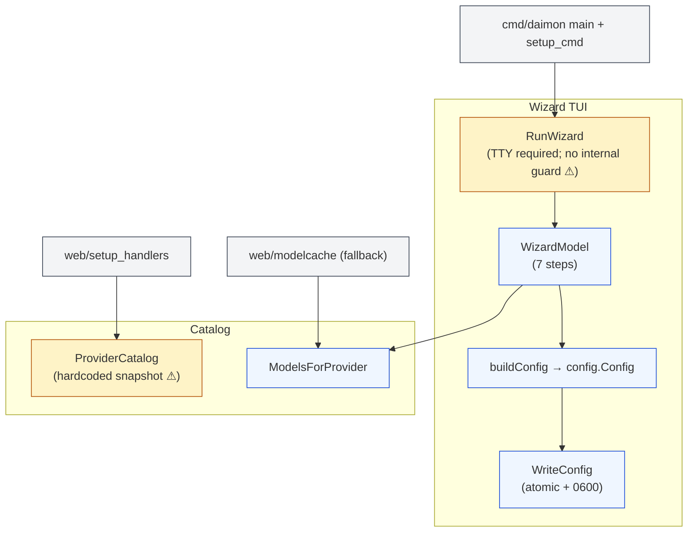
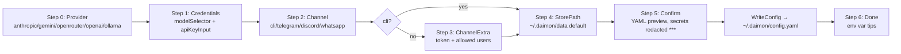
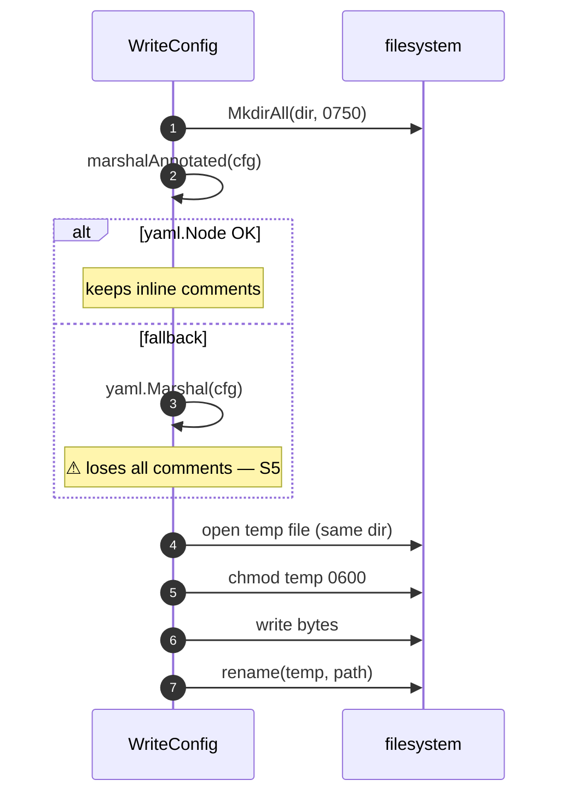
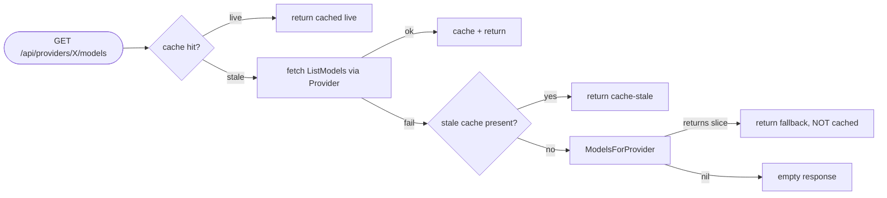

# `setup` — first-launch wizard + offline provider catalog

> **Status**: ⚠️ attention (TTY-only wizard with no guard inside `RunWizard`; hardcoded snapshot catalogue; store-type inconsistency between wizard and web)
> **Stability**: stable
> **Last reviewed**: 2026-05-23
> **Code under**: `internal/setup/`
> **Size**: 3 production files, ~270 LOC (wizard.go is the bulk: 991 LOC counting bubbletea boilerplate)
> **Public surface**: `RunWizard`, `ProviderCatalog`, `ModelsForProvider`, `ModelInfo`, `WriteConfig`, `DetectConfigPath`, `DefaultConfigPath`

## 1. Purpose

The `setup` package owns Daimon's **first-launch experience**: a Bubbletea TUI wizard that walks the user through provider + model + channel + store-path selection, validates inputs, and writes a YAML config to disk atomically. It also exposes a curated **offline provider catalog** — a hardcoded snapshot of model IDs / pricing / context windows — used both by the wizard and by `web/modelcache` as a last-resort fallback when live `ListModels` calls fail.

## 2. Submodules & Key Files

| File              | LOC  | Responsibility                                                                                                  |
| ----------------- | ---- | --------------------------------------------------------------------------------------------------------------- |
| `wizard.go`       | 991  | Bubbletea `WizardModel` + step state machine + `RunWizard` entry                                                |
| `providers.go`    | ~150 | `ProviderCatalog` map + `ModelInfo` struct + `ModelsForProvider` helper                                         |
| `configwriter.go` | ~135 | `WriteConfig` (atomic temp-and-rename, 0600 perms), `DetectConfigPath`, `DefaultConfigPath`, `marshalAnnotated` |

## 3. Public API

```go
// wizard.go:991 — TUI; assumes TTY; returns path written or error
func RunWizard() (string, error)

// providers.go:4
type ModelInfo struct {
    ID, DisplayName string
    CostIn, CostOut float64
    ContextK        int
    Description     string
}

// providers.go:27 — hardcoded snapshot
var ProviderCatalog map[string][]ModelInfo

// providers.go:114 — returns nil for "ollama" or unknown
func ModelsForProvider(provider string) []ModelInfo

// providers.go:17 — sentinel { ID: "" } that triggers free-text mode
var OtherModelSentinel ModelInfo

// configwriter.go:16, :28, :54
func DefaultConfigPath() string                         // ~/.daimon/config.yaml
func DetectConfigPath() (string, error)                 // cwd > XDG > home
func WriteConfig(path string, cfg *config.Config) error // atomic + chmod 0600
```

### Catalog snapshot (as of "early 2026")

| Provider     | Models                                                                |
| ------------ | --------------------------------------------------------------------- |
| `anthropic`  | `claude-sonnet-4-6`, `claude-opus-4-6`                                |
| `gemini`     | `gemini-3.1-flash-lite`, `gemini-3.1-pro`                             |
| `openai`     | `gpt-5.4`, `gpt-5.4-pro`                                              |
| `openrouter` | `openrouter/free`, `qwen/qwen3-coder:free`, `openrouter/healer-alpha` |
| `ollama`     | (intentionally empty — always free-text)                              |

## 4. Dependencies

| Direction | Edge                                                                                                                                                                |
| --------- | ------------------------------------------------------------------------------------------------------------------------------------------------------------------- |
| Outbound  | `internal/config`, `gopkg.in/yaml.v3`, `charmbracelet/{bubbles, bubbletea, lipgloss}`                                                                               |
| Inbound   | `cmd/daimon/main.go` + `setup_cmd.go` (`RunWizard`), `internal/web/setup_handlers.go` (`ProviderCatalog`), `internal/web/modelcache/cache.go` (`ModelsForProvider`) |

### Layering position

Subsystem. Allowed to import `config`. Clean.

## 5. Component Diagram



## 6. Key Flows

### 6.1 Wizard steps



### 6.2 Atomic config write



### 6.3 Fallback chain for offline catalog (web modelcache)



## 7. Verdict

**Overall health**: ⚠️ **Attention** — works as a first-launch experience; not safe outside TTY; carries a hand-maintained catalog that goes stale; inconsistent store-type defaults between this wizard and the web setup.

| Dimension        | Rating     | Evidence                                                        |
| ---------------- | ---------- | --------------------------------------------------------------- |
| **Coupling**     | very low   | Outbound: `config` + bubbletea + yaml. Inbound: 4 callers.      |
| **Size / bloat** | acceptable | `wizard.go` is large but mostly Bubbletea boilerplate.          |
| **Cohesion**     | focused    | Three small concerns: wizard, catalog, config writer.           |
| **Testability**  | mixed      | `WizardModel.Update` is unit-tested; `RunWizard` itself is not. |
| **Stability**    | stable     | Few recent edits to logic; catalog content drifts.              |

### Smells & risks

**S1. `RunWizard` requires TTY but does not validate** — `wizard.go:991`. Callers (`main.go:170, 219` and `setup_cmd.go:20`) check `isTTY` first. If `RunWizard` is invoked elsewhere without the guard, `tea.NewProgram` either fails or corrupts the terminal. Add an internal `isTTY` guard for safety.

**S2. `ProviderCatalog` is a hand-maintained snapshot** — `providers.go:27`, labelled "early 2026". Every model release ages it. The wizard view explicitly admits this (`wizard.go:848`: `"List current as of early 2026 — use Other... for newer models"`). There is no warning when the catalog has drifted past N months.

**S3. Store-type inconsistency between paths** — `wizard.go:763` hardcodes `Store.Type = "file"`; `web/setup_handlers.go:255` defaults to `"sqlite"`. Same user setting up via terminal vs dashboard ends with different storage backends. Given [`store.md` S3](store.md#smells--risks) (FileStore non-functional for half the features), the wizard default is the worse choice.

**S4. WhatsApp config is partial** — `wizard.go:756-760` writes WhatsApp config with `VerifyToken` empty and uses the "allowed users" input field for `PhoneNumberID`. Code carries a `// For Phase 1 quick fix` comment. The user must edit the YAML by hand to complete the channel setup.

**S5. `marshalAnnotated` fallback silently strips comments** — `configwriter.go:93-114`. If `yaml.Node` construction fails, the fallback to `yaml.Marshal` produces a comment-less YAML. Operators editing the file later have no inline guidance.

**S6. API key validation is non-blocking** — `wizard.go:546` (`advance` for `stepCredentials`). An empty API key shows a warning but lets the user advance. The resulting config writes successfully but the agent fails on first call. Move to a blocking check + optional "skip" path with explicit "I'll edit the YAML later" confirmation.

**S7. `ProviderCatalog` and live model discovery diverge silently** — `web/startup_check.go` warns when a configured model is missing from a live `ListModels`, but the wizard does not validate the model picked against any live source. A typo passes the wizard and reaches the user as an "invalid model" startup warning.

**S8. No tests for `RunWizard`** — `wizard_test.go` exercises individual `WizardModel.Update` transitions, but the end-to-end TUI is untested.

### Suggested refactors (impact ÷ effort)

1. **Internal `isTTY` guard in `RunWizard`** (S1). **Effort: XS. Impact: low (defensive).**
2. **Unify store-type default to `sqlite`** (S3) — change the wizard. **Effort: XS. Impact: high (correctness).**
3. **Complete WhatsApp config or refuse the path** (S4) — at least add a final "edit YAML to fill VerifyToken" warning panel. **Effort: S. Impact: medium.**
4. **Block API key empty + offer "skip and edit later"** (S6). **Effort: S. Impact: medium.**
5. **Validate selected model against any live source if reachable** (S7). **Effort: M. Impact: medium.**
6. **Date-stamp `ProviderCatalog` and warn after N months** (S2). **Effort: XS. Impact: low.**
7. **Always write annotated YAML or fail explicitly** (S5). **Effort: S. Impact: low.**

## 8. References

- Boot guard + caller: `cmd/daimon/main.go:170` (`isTTY` check + invoke), `:219` (auto-launch on `ErrNoConfig`), `cmd/daimon/setup_cmd.go:13` (`runWizardFunc` test seam).
- Web equivalents: `internal/web/setup_handlers.go:85` (`/api/setup/providers`), `:255` (`/api/setup/complete`).
- Modelcache fallback: `internal/web/modelcache/cache.go:149`.
- Related modules:
  - [[config]] — schema written by `WriteConfig`; see [`config.md`](config.md) (forthcoming).
  - [[provider]] — live model discovery contrasted with this offline catalog; see [`provider.md` §6.5](provider.md).
