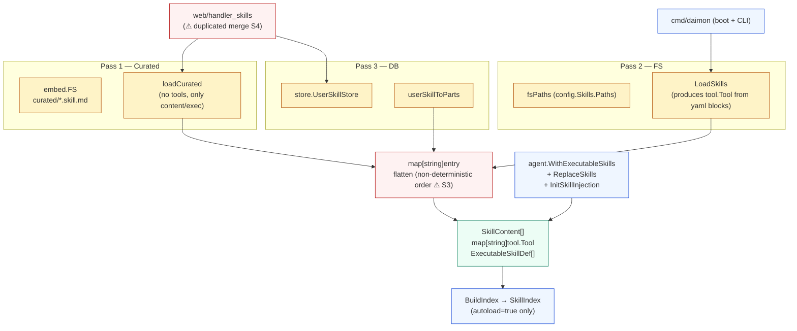
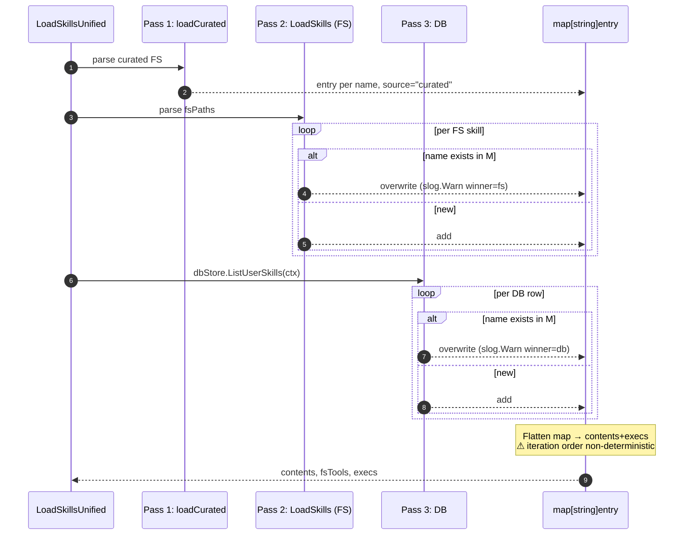
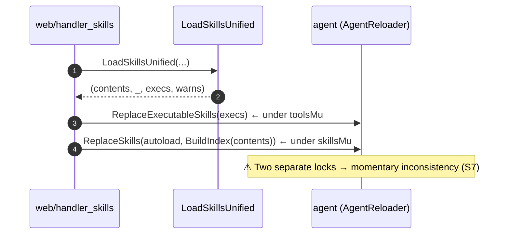

# `skill` — markdown skills + curated catalog + executable subagents

> **Status**: ⚠️ attention (3-pass merge non-deterministic order; duplicate merge logic in web; security gap on registry install)
> **Stability**: evolving (curated catalog + DB user-skills are recent)
> **Last reviewed**: 2026-05-23
> **Code under**: `internal/skill/`
> **Size**: 11 production files, ~1,840 LOC
> **Public surface**: 5 exported structs, 8 free functions, 3 sentinel errors, 1 embed.FS

## 1. Purpose

The `skill` package defines what a "skill" is in Daimon — a markdown file with YAML frontmatter that the agent can autoload (inline prose in the system prompt), index for on-demand loading, or expose as an **executable** subagent. It owns the parser, the FS loader, the unified 3-pass merge (curated → FS → DB), the embedded curated catalog (5 templates), the registry fetcher (remote YAML catalog) and the CLI-level service that installs and removes skills.

## 2. Submodules & Key Files

| File                                 | LOC     | Responsibility                                                                                      |
| ------------------------------------ | ------- | --------------------------------------------------------------------------------------------------- |
| `skill.go`                           | 99      | Runtime types: `SkillContent`, `BudgetFrontmatter`, `BudgetConfig`, `ExecutableSkillDef`, `ToolDef` |
| `parser.go`                          | 288     | Markdown + YAML frontmatter parser; `ParseSkillFile`                                                |
| `loader.go`                          | 128     | `LoadSkills` — load from FS paths, returns (contents, tools, execs, warns)                          |
| `loader_unified.go`                  | 216     | `LoadSkillsUnified` — the 3-pass merge curated→FS→DB                                                |
| `curated_embed.go`                   | 36      | `//go:embed curated/*.md` → `CuratedFS`; `CuratedCatalog` helper                                    |
| `curated/*.skill.md`                 | n/a     | 5 curated templates: code-reviewer, email-drafter, meeting-notes, researcher, summarizer            |
| `index.go`                           | 73      | `BuildIndex` + `SkillIndex.Render()` for the system-prompt skill index                              |
| `shelltool.go`                       | 86      | `tool.Tool` adapter for shell tools defined inside skills                                           |
| `registry.go`                        | 115     | `FetchRegistry` + remote registry resolution                                                        |
| `service.go`                         | 449     | CLI-level CRUD over the on-disk skills file (`Add/Remove/List/Info` + flock)                        |
| `service_lock_unix.go` + `_other.go` | 20 + 11 | flock(2) on Unix; no-ops elsewhere                                                                  |

## 3. Public API

### Core types

```go
// skill.go:7
type SkillContent struct {
    Name, Description string
    Prose, SystemAddendum string
    Autoload, Executable bool
    Version int
    Model, ProviderName string
    ProviderConfig map[string]any
    ToolsAllowlist []string    // nil = inherit all; [] = empty; non-empty = explicit subset
    Budget BudgetFrontmatter
}

// skill.go:78
type ExecutableSkillDef struct {
    Name, Description string
    Version int
    Model, ProviderName, SystemAddendum string
    ProviderConfig map[string]any
    ToolsAllowlist []string
    Budget BudgetConfig         // already resolved to time.Duration
}

// skill.go:66
type BudgetConfig struct {
    MaxCostUSD float64       // 0 = unlimited
    MaxTurns   int           // 0 = unlimited
    Timeout    time.Duration // 0 = no enforced timeout
}

// skill.go:92
type ToolDef struct {
    Name, Description, Command string
    Timeout time.Duration
    WorkingDir string
    Env map[string]string
}
```

### Loaders

```go
// loader.go:21
func LoadSkills(paths []string, shellCfg config.ShellToolConfig, limits config.LimitsConfig)
    ([]SkillContent, map[string]tool.Tool, []ExecutableSkillDef, []error)

// loader_unified.go:28
func LoadSkillsUnified(
    ctx context.Context,
    fsPaths []string,
    dbStore store.UserSkillStore,           // nil = skip DB pass
    curatedFS embed.FS,                     // pass skill.CuratedFS
    shellCfg config.ShellToolConfig,
    limits config.LimitsConfig,
) ([]SkillContent, map[string]tool.Tool, []ExecutableSkillDef, []error)

// parser.go:118
func ParseSkillFile(path string) (SkillContent, []ToolDef, []error)
```

### Catalog & index

```go
// curated_embed.go:17,27
var CuratedFS embed.FS
func CuratedCatalog(shellCfg, limits) ([]SkillContent, []ExecutableSkillDef, []error)

// index.go:24,65
func BuildIndex(skills []SkillContent) SkillIndex          // autoload=true only, alphabetic
func EstimateTokens(s string) int                          // heuristic: bytes/4

// index.go:16
type SkillIndex struct {
    Entries []IndexEntry
}
func (s SkillIndex) Render() string
func (s SkillIndex) TokenEstimate() int
```

### Shell tool adapter

```go
// shelltool.go:22
func NewSkillShellTool(def ToolDef) *skillShellTool
```

### Service (CLI-level CRUD)

```go
// service.go:56
func NewSkillService(skillsDir, configPath string, registryURL string) *SkillService

// methods:  Add(src), Remove(name), List(), Info(name), …
```

### Sentinel errors

```go
ErrSkillNotFound, ErrSkillExists, ErrNoRegistry  // service.go:22-24
```

## 4. Dependencies

| Direction | Edge                                                                                                                                             |
| --------- | ------------------------------------------------------------------------------------------------------------------------------------------------ |
| Outbound  | `config` (shell + limits + expand-env), `store` (UserSkillStore + UserSkill), `tool` (Tool, ToolResult), `gopkg.in/yaml.v3`, `embed`, `net/http` |
| Inbound   | `agent` (parser results + index + executable defs + hot-reload), `web` (skills handler + reload), `cmd/daimon` (boot wiring + CLI subcommand)    |

### Layering position

Capability layer. Allowed to import `config`, `store`, `tool`. Clean direction. The interface `web/server.go::AgentReloader` is the bridge that lets `web` push reloaded skills back into the agent.

## 5. Component Diagram



## 6. Key Flows

### 6.1 3-pass merge (precedence: DB > FS > Curated)



### 6.2 Executable skill → SubagentSpawnTool

```mermaid
flowchart LR
  Skill[ExecutableSkillDef] --> With[agent.WithExecutableSkills]
  With --> Reg[a.tools[Name] = &SubagentSpawnTool{def}]
  Reg --> Filt[filterKnownTools<br/>warn-and-drop unknown allowlist]
  Filt --> Ready[Tool available to LLM]
  Ready --> Exec[LLM tool_call → SubagentSpawnTool.Execute]
  Exec --> Mgr[SubagentManager.Spawn]
```

### 6.3 Hot reload after `/api/skills` write



## 7. Verdict

**Overall health**: ⚠️ **Attention** — well-tested loading layer, but several quality issues: non-deterministic merge order, duplicate logic, hot-reload lock split, and an unauthenticated registry install path.

| Dimension        | Rating     | Evidence                                                                      |
| ---------------- | ---------- | ----------------------------------------------------------------------------- |
| **Coupling**     | low        | Outbound: `config`, `store`, `tool`. Inbound: `agent`, `web`, `cmd`.          |
| **Size / bloat** | acceptable | 1,840 LOC; biggest is `service.go` (449).                                     |
| **Cohesion**     | mixed      | Loader + parser + index + remote registry + CLI service in one package.       |
| **Testability**  | high       | 2,743 LOC of test code, including 3-pass merge, executable parsing, registry. |
| **Stability**    | evolving   | Curated catalog + DB user-skills are recent additions.                        |

### Smells & risks

**S1. `stFrontmatter` declared but unused** — `parser.go:21`. Dead code in the state-machine enum; frontmatter is handled outside the main loop.

**S2. Unclosed `\`\`\`yaml tool` block fails silently** — `parser.go:209-213`. If a tool block has no closing fence, `toolBlockLines` accumulates and is discarded with no warning.

**S3. Non-deterministic flatten of the merge map** — `loader_unified.go:94-101`. Go's `range map[K]V` has no guaranteed order; `contents` and `execs` slice ordering varies between runs. The system prompt thus differs across reloads even with identical inputs. Tests can be flaky in edge cases.

**S4. Duplicate merge logic in `web/handler_skills.go:175-214`** — `handleListSkills` reimplements the curated→DB merge with its own `index` map + `order` slice, instead of calling `LoadSkillsUnified`. Two paths to diverge.

**S5. `userSkillToParts` writes Prose to `SystemAddendum`** — `loader_unified.go:130`. For DB-stored executable skills, `SystemAddendum` and `Prose` carry the same text; FS skills keep them distinct via the `system_prompt_addendum` field. Inconsistent semantics for the same field.

**S6. `web.mcp_skills::loadSkillsForReload` calls `LoadSkills`, not `LoadSkillsUnified`** — `mcp_skills.go:112`. After installing an MCP recipe skill, hot-reload skips the DB pass. User-DB skills temporarily disappear from the system prompt until the next boot or another `/api/skills` write.

**S7. Hot-reload uses two separate mutexes sequentially** — `web/handler_skills.go::reloadSkills` calls `ReplaceExecutableSkills` (toolsMu) then `ReplaceSkills` (skillsMu) as distinct operations. Between the two, a concurrent agent turn can see fresh executables but stale skill index, or vice-versa.

**S8. `service.go::Add` from a URL has no signature / hash check** — `service.go:162`. A registry-driven install is HTTP-then-parse; an active MITM can substitute the skill. Security warning is printed but ignorable.

**S9. `loadCurated` ignores `shellCfg` and `limits`** — `loader_unified.go:170-171` (`_ = shellCfg; _ = limits`). If curated templates ever add shell-tool blocks, they would be parsed and silently dropped (third return value `_` at `:194`).

**S10. Frontmatter field `name` accepts free text from FS** — `validateUserSkill` enforces `^[a-z][a-z0-9_-]*$` for REST inputs but `ParseSkillFile` does not. A file with `name: "My Skill 2024!"` parses without complaint.

**S11. Frontmatter `version` is parsed but unused for schema migration** — additions / renames to the YAML schema are not gated. Older files with missing fields parse as zero values without warning.

### Suggested refactors (impact ÷ effort)

1. **Sort merged entries deterministically** (S3) — sort by name after flatten. **Effort: XS. Impact: medium.**
2. **Have `handleListSkills` call `LoadSkillsUnified`** (S4) — remove the duplicate path. **Effort: S. Impact: medium.**
3. **Combine the two reload mutexes** (S7) — single `reloadMu` taken around both replacements. **Effort: S. Impact: medium.**
4. **Require checksum / signature on registry install** (S8). **Effort: M. Impact: high (security).**
5. **Switch `loadSkillsForReload` to `LoadSkillsUnified`** (S6). **Effort: XS. Impact: medium (correctness).**
6. **Enforce skill-name regex in `ParseSkillFile`** (S10). **Effort: XS. Impact: low.**
7. **Delete `stFrontmatter` dead-state and the unused `FilterFunc` exports** — covers S1. **Effort: XS. Impact: low.**
8. **Warn on unclosed yaml-tool fence** (S2). **Effort: XS. Impact: low.**

## 8. References

- Subagent spawn flow: [`../ARCHITECTURE.md` §4.6](../ARCHITECTURE.md#46-subagent-spawn-executable-skill).
- Related modules:
  - [[agent]] — consumes `SkillContent`, `SkillIndex`, `ExecutableSkillDef`; hot-reload entry points in `agent/hot_reload.go`. See [`agent.md` §6.4](agent.md).
  - [[tool]] — `SkillShellTool` implements `tool.Tool`; also `SubagentSpawnTool` lives in `agent` but consumes `ExecutableSkillDef`.
  - [[store]] — `UserSkillStore` + `user_skills` (v18 migration). FileStore non-functional for user skills (see [`store.md` §7 S3](store.md#smells--risks)).
  - [[web]] — `/api/skills` CRUD + hot-reload wiring (duplicate merge logic — S4 above).
