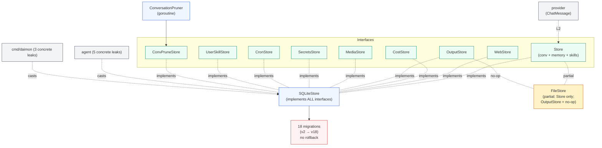
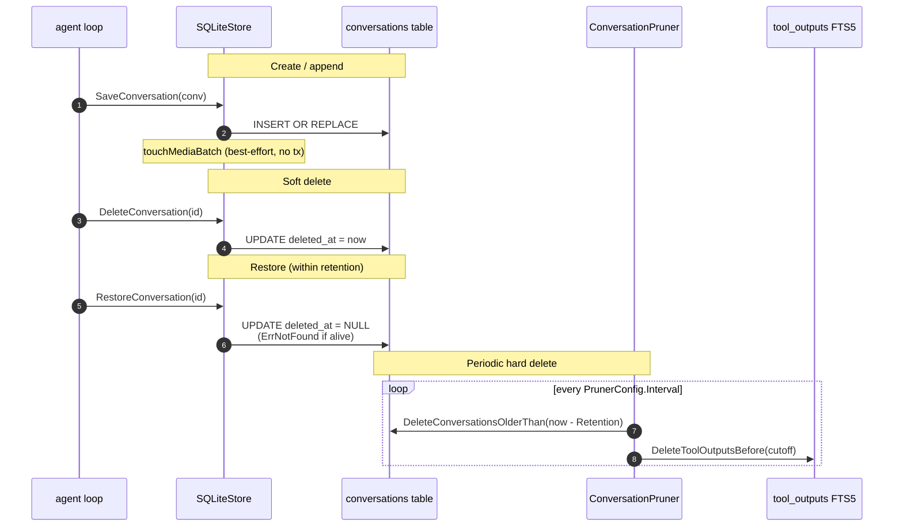
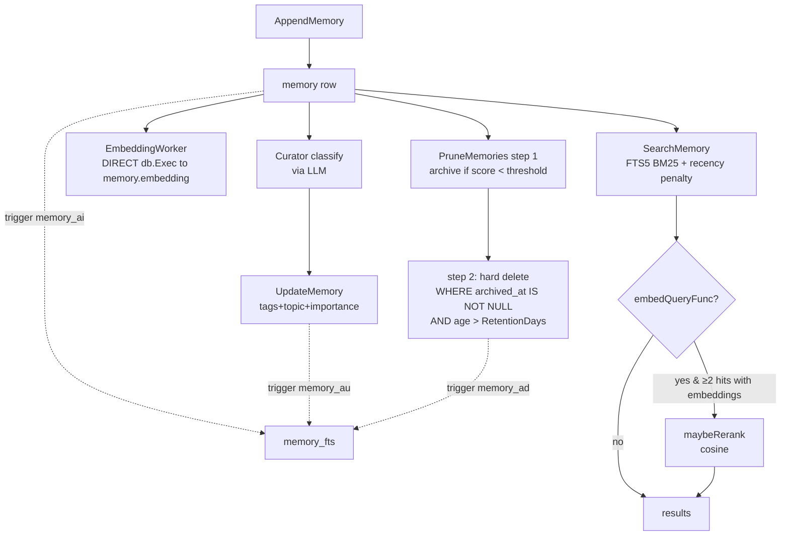
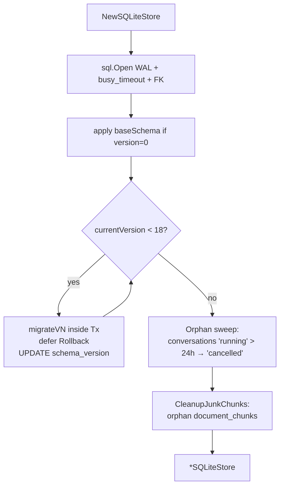

# `store` — persistence layer

> **Status**: 🔴 critical (FileStore is half-broken; 7 concrete-type assertions; L2 violation in 3 places; no backup story; no multi-process lock)
> **Stability**: stable but heavily migrated (18 versioned migrations)
> **Last reviewed**: 2026-05-23
> **Code under**: `internal/store/`
> **Size**: 19 production files, ~5,500 LOC (3,396 in `sqlitestore.go` + `cost_store.go` + media + userskills + migration)
> **Public surface**: 9 interfaces, 8 sentinel errors, 9 exported structs

## 1. Purpose

The `store` package is the persistence layer of Daimon. It defines the top-level `Store` interface (conversations + memory + user skills) and a family of sub-interfaces (`WebStore`, `CronStore`, `CostStore`, `OutputStore`, `MediaStore`, `SecretsStore`, `UserSkillStore`, `ConvPruneStore`) that production code type-asserts at runtime. Two implementations exist: `FileStore` (JSON files, intended for the MVP and tests) and `SQLiteStore` (the production target — implements every sub-interface). The package also owns 18 versioned schema migrations, a `ConversationPruner` background goroutine for soft-delete → physical-delete, a memory pruning algorithm (`PruneMemories`), and AES-256-GCM encryption for the `secrets` table.

## 2. Submodules & Key Files

### Contracts & types

| File        | LOC | Responsibility                                                   |
| ----------- | --- | ---------------------------------------------------------------- |
| `store.go`  | 448 | All exported interfaces, message/result structs, sentinel errors |
| `output.go` | 41  | `OutputStore` + `ToolOutput`                                     |
| `media.go`  | 69  | `MediaStore` + `MediaMeta`                                       |
| `clock.go`  | 31  | `Clock`, `SystemClock`, `FakeClock` (pruner testability)         |

### SQLite implementation

| File                        | LOC   | Responsibility                                                                               |
| --------------------------- | ----- | -------------------------------------------------------------------------------------------- |
| `sqlitestore.go`            | 1,591 | Main `SQLiteStore` — conversations, memory, tool outputs, secrets, subagent threads          |
| `sqlitestore_media.go`      | 266   | `MediaStore` impl over `media_blobs` table                                                   |
| `sqlitestore_userskills.go` | 266   | `UserSkillStore` impl (added in v18)                                                         |
| `cost_store.go`             | 265   | `CostStore` impl over `cost_records`                                                         |
| `migration.go`              | 1,182 | Base DDL + 17 versioned migrations (v2 → v18) + boot-time orphan sweep + `CleanupJunkChunks` |
| `crypto.go`                 | 89    | AES-256-GCM encrypt / decrypt for `SecretsStore`                                             |
| `pruning.go`                | 125   | `PruneMemories` (score-based archive + retention delete)                                     |
| `keywords.go`               | 112   | `ExtractKeywords`, `BuildFTSQuery`                                                           |
| `cosine.go`                 | ~100  | Cosine similarity for embedding rerank                                                       |

### FileStore + factory + pruner

| File           | LOC | Responsibility                                                                           |
| -------------- | --- | ---------------------------------------------------------------------------------------- |
| `filestore.go` | 392 | `FileStore` — JSON per conversation, JSON per memory scope, `atomicWrite` (tmp + rename) |
| `factory.go`   | 23  | `New(cfg)` — dispatches `"file"`/`""` → FileStore, `"sqlite"` → SQLiteStore              |
| `pruner.go`    | 122 | `ConversationPruner` — ticker, soft → hard delete after retention                        |

## 3. Public API

### Top-level interface

```go
// store.go:94
type Store interface {
    SaveConversation(ctx, conv Conversation) error
    LoadConversation(ctx, id string) (*Conversation, error)
    ListConversations(ctx, channelID string, limit int) ([]Conversation, error)
    AppendMemory(ctx, scopeID string, entry MemoryEntry) error
    SearchMemory(ctx, scopeID, query string, limit int) ([]MemoryEntry, error)
    UpdateMemory(ctx, scopeID string, entry MemoryEntry) error
    ListChildConversations(ctx, parentConvID string) ([]Conversation, error)
    SetConversationStatus(ctx, convID, status string) error
    ListUserSkills(ctx) ([]UserSkill, error)
    GetUserSkill(ctx, name string) (UserSkill, error)
    CreateUserSkill(ctx, skill UserSkill) (UserSkill, error)
    UpdateUserSkill(ctx, skill UserSkill) (UserSkill, error)
    DeleteUserSkill(ctx, name string) error
    Close() error
}
```

### Capability interfaces (type-asserted by callers)

| Interface        | Implemented by                | Used for                                                           |
| ---------------- | ----------------------------- | ------------------------------------------------------------------ |
| `WebStore`       | SQLite only                   | Pagination, soft delete, restore, message pagination, title rename |
| `CronStore`      | SQLite only                   | Cron jobs + results                                                |
| `CostStore`      | SQLite only                   | Per-call token & dollar accounting                                 |
| `OutputStore`    | both (FileStore is **no-op**) | Tool output FTS5 indexing                                          |
| `MediaStore`     | SQLite only                   | Content-addressed media blobs                                      |
| `SecretsStore`   | SQLite only                   | Encrypted KV                                                       |
| `UserSkillStore` | SQLite only                   | User-defined skills CRUD                                           |
| `ConvPruneStore` | SQLite only                   | Narrow surface used by `ConversationPruner`                        |

### Sentinel errors

```go
ErrNotFound, ErrNameConflict, ErrEncryptionKeyNotConfigured, ErrInvalidTitle  // store.go
ErrOutputMissingID, ErrOutputMissingToolName                                    // output.go
ErrMediaNotFound, ErrMediaNotSupported                                          // media.go
```

### Core structs (selected — full field list at `store.go`)

```go
type Conversation struct {
    ID, ChannelID    string
    Messages         []provider.ChatMessage   // ⚠ L2 layering violation
    Metadata         map[string]string
    CreatedAt, UpdatedAt time.Time
    CompactedAt      *time.Time
    CompactedSummary string                   // v15
    ParentConvID     string                   // v16
    Status           string                   // v16
}

type MemoryEntry struct {
    ID, ScopeID, Topic, Type, Title, Content, Source string
    Tags             []string
    CreatedAt        time.Time
    AccessCount      int                      // v2
    LastAccessedAt, ArchivedAt *time.Time     // v2
    Importance       int                      // v8 (default 5)
    Cluster          string                   // v11 (default "general")
    Embedding        []byte `json:"-"`        // v3 — written via SQLiteStore.DB() bypass
}

type CronJob, CronResult, ToolOutput, CostRecord, MediaMeta, UserSkill, BudgetJSON …
```

### Constructors

```go
// factory.go:14 — dispatches by cfg.Type
func New(cfg config.StoreConfig) (Store, error)

func NewFileStore(cfg config.StoreConfig) *FileStore
func NewSQLiteStore(cfg config.StoreConfig) (*SQLiteStore, error)

// pruner.go:48
func NewConversationPruner(store ConvPruneStore, clock Clock, cfg PrunerConfig) *ConversationPruner
```

### SQLiteStore-only exports (concrete-type access required)

```go
func (s *SQLiteStore) DB() *sql.DB                                        // sqlitestore.go:79
func (s *SQLiteStore) SetEmbedQueryFunc(fn func(ctx, text) ([]float32, error))
func (s *SQLiteStore) HasEmbedQueryFunc() bool
func (s *SQLiteStore) ListMemoryScopes(ctx) ([]string, error)
func (s *SQLiteStore) ListCompactableConversations(ctx, opts) ([]Conversation, error)
func (s *SQLiteStore) PruneMemories(ctx, cfg PruneConfig) (pruned, deleted int, err error)
```

Each of these is **required by callers** but not in any interface — see §7 S2.

## 4. Dependencies

### Outbound

| Package              | Why                                                                                                                             |
| -------------------- | ------------------------------------------------------------------------------------------------------------------------------- |
| `internal/provider`  | **L2 violation** — `Conversation.Messages []provider.ChatMessage` (3 locations: `store.go:33, 219`, `sqlitestore_media.go:108`) |
| `internal/config`    | `config.StoreConfig` (Type, Path, EncryptionKey)                                                                                |
| `modernc.org/sqlite` | Pure-Go SQLite driver (no CGO)                                                                                                  |

### Inbound

| Importer           | What it consumes                                                                                                                            |
| ------------------ | ------------------------------------------------------------------------------------------------------------------------------------------- |
| `internal/agent`   | `Store`, `OutputStore`, `MediaStore`, **`*SQLiteStore`** (5 type-assertion sites), `CronStore`, `MemoryEntry`, `Conversation`, `ToolOutput` |
| `internal/channel` | `MediaStore`                                                                                                                                |
| `internal/cron`    | `CronStore`, `CronJob`, `CronResult`                                                                                                        |
| `internal/skill`   | `UserSkillStore`, `UserSkill`                                                                                                               |
| `internal/tool`    | `OutputStore`, `CronStore`, `Store` (memory tools)                                                                                          |
| `internal/web`     | `WebStore`, `CostStore`, `MediaStore`, `SecretsStore`, `Store`, `UserSkillStore`                                                            |
| `cmd/daimon`       | `New`, `NewSQLiteStore`, **`*SQLiteStore`** (3 sites), `CostStore`, `CronStore`, `ConversationPruner`                                       |

### Layering position

Persistence layer. Allowed to import `config` and `content`. **Imports `provider` (L2 violation)**. See [`../ARCHITECTURE.md` §6](../ARCHITECTURE.md#6-layering-violations).

## 5. Component Diagram



## 6. Key Flows

### 6.1 Conversation lifecycle (SQLiteStore)



### 6.2 Memory lifecycle (write → enrich → embed → search → prune)



Score formula: `exp(-0.03 * age_days) + ln(1 + access_count) * 0.5`. Defaults: threshold 0.1 (~77 days untouched), retention 30 days for archived rows.

### 6.3 Schema migration on boot



## 7. Verdict

**Overall health**: 🔴 **Critical** — SQLiteStore is functional and well-migrated, but the FileStore parity gap means production deployments are silently dependent on `cfg.Store.Type == "sqlite"`; seven concrete-type assertions live outside this package; the L2 violation is structural; and there is no backup/restore strategy.

| Dimension        | Rating                   | Evidence                                                                                                                              |
| ---------------- | ------------------------ | ------------------------------------------------------------------------------------------------------------------------------------- |
| **Coupling**     | high (with L2 violation) | Fan-out 2 packages but one is `provider` (L2). Fan-in: 8 packages incl. 8 concrete-type assertions to `*SQLiteStore`.                 |
| **Size / bloat** | inflated                 | 5,500 LOC; `sqlitestore.go` alone is 1,591 LOC.                                                                                       |
| **Cohesion**     | mixed                    | One package owns 9 distinct interfaces; could split into `store/conv`, `store/memory`, `store/cost`, `store/media`.                   |
| **Testability**  | high for SQLite          | 1,244 LOC `sqlitestore_test.go`, 744 LOC `filestore_test.go`. Missing: `PruneUnreferencedMedia`, `GetDailyCostHistory` recursive CTE. |
| **Stability**    | high schema churn        | 18 versioned migrations, no downgrade path.                                                                                           |

### Smells & risks

**S1. L2 violation: `store → provider`** — `store.go:33` (`Conversation.Messages`), `:219` (`GetConversationMessages` signature), `sqlitestore_media.go:108,246` (`collectMediaSHAs`, `PruneUnreferencedMedia`). The persistence schema is wedded to the provider's message format. Fix: introduce `store.Message` (or use `content.ContentBlock` directly) and let `agent` do the conversion. **Impact: structural**.

**S2. Seven concrete `*SQLiteStore` type assertions outside this package** — `agent/agent.go:37,206`, `agent/curator.go:309`, `agent/consolidator.go:113`, `cmd/daimon/main.go:539`, `cmd/daimon/rag_wiring.go:57`, `cmd/daimon/web_cmd.go:357`. Each asserts to access `PruneMemories`, `DB()`, `SetEmbedQueryFunc`, `HasEmbedQueryFunc`, `ListMemoryScopes`. These should be lifted to interfaces (`PrunableStore`, `DBProvider`, `EmbedQueryStore`, `MemoryScoper`).

**S3. FileStore is **non-functional** for half the agent features**:

- `UpdateMemory` is a no-op (`filestore.go:190`). The Curator runs but never persists classifications.
- `IndexOutput` validates input but discards data (`filestore.go:315`). `search_output` tool always returns empty.
- `CreateUserSkill` returns the skill without persisting it (`filestore.go:343`). User skills disappear at next restart.
- No `MediaStore`, no `WebStore`, no `CronStore`, no `CostStore`, no `SecretsStore`.

The factory dispatches by `cfg.Type` with no warning when the user selects `"file"`. Either deprecate FileStore officially or extend it; the current half-implemented state is the worst of both worlds.

**S4. `migrateV16` is not idempotent** — `migration.go:1039`. Adds `parent_conv_id` and `status` columns via `ALTER TABLE` without a `PRAGMA table_info` guard. If `schema_version` is ever reset or rolled back (manual ops), the migration fails. Every other migration (v6, v7, v8, v11, v12, v13, v14, v15) does check. Inconsistency.

**S5. No multi-process file lock** — two Daimon instances pointing at the same `daimon.db` will both run migrations and clobber each other's writes (mitigated only by SQLite's WAL busy_timeout). No PID file, no `flock` on the DB file, no advisory lock. A misconfigured systemd unit can corrupt state.

**S6. No backup / restore story** — SQLite WAL mode requires copying `.db` + `.db-wal` + `.db-shm` together, or using `VACUUM INTO`. There is no helper, no documentation in [`../DEPLOY.md`](../DEPLOY.md), no `daimon backup` subcommand.

**S7. Selective encryption** — only `secrets` rows are AES-GCM encrypted (`crypto.go`). `conversations.messages`, `memory.content`, `media_blobs.data` are plain text/BLOBs. A stolen `daimon.db` exposes the entire chat history without needing the key. The encryption key itself is read from `cfg.EncryptionKey` or `DAIMON_SECRET_KEY` env var (no KMS, no KDF).

**S8. `updateAccessCounts` silently swallows errors** — `sqlitestore.go:787, 806`. `_ = fmt.Errorf(...)` constructs an error and discards it. Best-effort updates that fail are invisible. Either log or remove the dead error construction.

**S9. Migrations defined out of source order** — `migrateV5` lives between V7 and V8 in the file; `migrateV9` and `migrateV10` are in reversed code order. Execution order is correct (driven by `if version < N`), but readers see a confusing layout.

**S10. No FTS5 cleanup for `memory_fts`** — `document_chunks_fts` got an explicit cleanup (`CleanupJunkChunks`) after the chunker bug. There is no analogous cleanup for `memory_fts` in case a future trigger error leaves phantom entries.

**S11. `tool_outputs` is FTS5-only (no base table)** — efficient for the search-output tool, but `SELECT COUNT(*) FROM tool_outputs` and arbitrary filters by non-FTS columns are slow. If audit / pruning ever need more than the present `DeleteToolOutputsBefore`, the schema will hurt.

**S12. Missing composite indexes for the cost dashboard** — `cost_records` has single-column indexes on `session_id`, `channel_id`, `model`, `created_at`, `conv_id`, `parent_conv_id`. The dashboard query groups by `substr(created_at,1,10)` over a date range — no composite index supports it.

**S13. `GetDailyCostHistory` depends on timestamp format** — `cost_store.go:156` uses `substr(created_at,1,10)` assuming `"YYYY-MM-DD …"`. Go's `time.UTC().String()` produces that format, but any future change to how timestamps are stored will silently corrupt the daily aggregation.

**S14. No tests for `PruneUnreferencedMedia`, `GetDailyCostHistory`, `CostSummaryForTree` recursive CTE** — the most complex queries in the package are uncovered.

### Suggested refactors (impact ÷ effort)

1. **Introduce `store.Message` (or use `content.ContentBlock` directly) and break the L2 edge** (S1) — **Effort: L. Impact: high (architectural).**
2. **Lift the 6 concrete-type accessors to interfaces** (S2) — `PrunableStore`, `DBProvider`, `EmbedQueryStore`, `MemoryScoper`. Removes every `*SQLiteStore` cast. **Effort: M. Impact: high.**
3. **Decide FileStore's fate** (S3) — either fill the gaps (huge effort) or deprecate and refuse `cfg.Type == "file"` with a config error. **Effort: S (deprecation) or L (parity). Impact: high (correctness).**
4. **Make `migrateV16` idempotent** (S4) — copy the `PRAGMA table_info` pattern from siblings. **Effort: XS. Impact: low.**
5. **PID file + advisory lock on the DB** (S5) — `flock` the `.db` file at boot; refuse start if held. **Effort: S. Impact: high (data integrity).**
6. **Backup helper + doc** (S6) — `daimon backup` subcommand using `VACUUM INTO`. **Effort: S. Impact: medium.**
7. **Encrypt conversations + memory at rest** (S7) — optional config flag, application-level encryption of the `content` columns. **Effort: M. Impact: high (privacy).**
8. **Replace silent `_ = fmt.Errorf` with `slog.Warn`** (S8). **Effort: XS. Impact: low.**
9. **Reorder migrations in source** (S9) — purely cosmetic. **Effort: XS. Impact: low.**
10. **Composite index on `cost_records (substr-able date, model)`** (S12) — actually requires storing the day separately. **Effort: M. Impact: low-medium.**
11. **Add tests for the 3 uncovered queries** (S14). **Effort: S. Impact: medium.**

## 8. References

- Persistence flows: [`../ARCHITECTURE.md` §4.1](../ARCHITECTURE.md#41-happy-path-user-message--response) (save), §4.5 (RAG retrieval which doubles into `documents` + `document_chunks`).
- Related modules:
  - [[provider]] — origin of `ChatMessage` (L2 violation source).
  - [[agent]] — 5 `*SQLiteStore` concrete leaks; see [`agent.md` §7 S4](agent.md#smells--risks).
  - [[content]] — block primitives embedded in stored messages.
  - [[rag]] — uses `documents` + `document_chunks` tables (defined here, owned there).
  - [[cron]] — `CronStore` + `cron_jobs` / `cron_results`.
  - [[skill]] — `UserSkillStore` + `user_skills` (v18).
- Migration framework: `internal/store/migration.go:84` (`initSchemaVersioned`).
- Pruner wiring: `internal/web/server.go` (production wiring of `ConversationPruner`).
