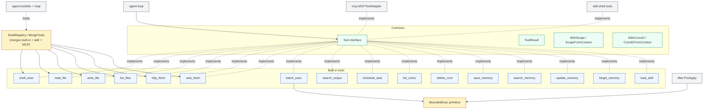
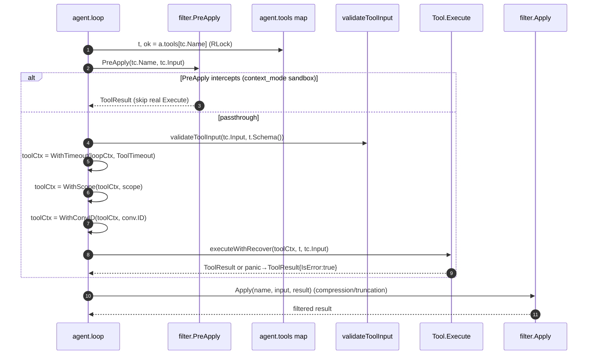
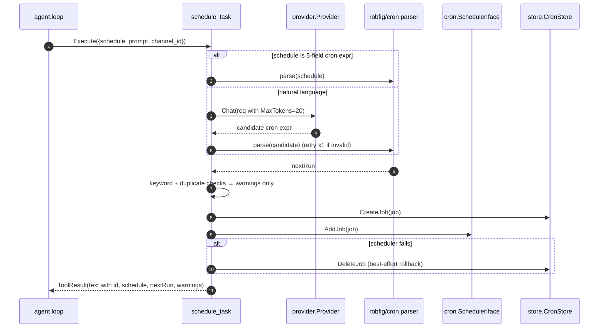

# `tool` — capabilities catalog and tool contract

> **Status**: ⚠️ attention (no `Registry` struct; layering violations; several security/coupling smells)
> **Stability**: stable
> **Last reviewed**: 2026-05-23
> **Code under**: `internal/tool/`
> **Size**: 14 production files, ~2,900 LOC
> **Public surface**: 1 contract interface, 16 built-in tools, 2 ctx scopers, 3 factories

## 1. Purpose

The `tool` package defines what the agent can _do_. It owns the `Tool` interface (`Name / Description / Schema / Execute`), the bag of built-in tools that ship with Daimon (shell, file ops, HTTP / web fetch, batch exec, memory tools, cron tools, output search, skill loader), and the helpers that let other layers wrap their capabilities as tools (MCP and executable skills). It also owns the **context scope** convention: every tool invocation reads `tool.ScopeFromContext(ctx)` and `tool.ConvIDFromContext(ctx)` to isolate per-user and per-conversation data.

The "registry" is just a `map[string]Tool` — there is no struct. The mutex that protects it lives in `*agent.Agent.toolsMu`, not here. The agent loop validates input against `Schema()`, injects `Scope` + `ConvID` into ctx, then calls `Execute()`.

## 2. Submodules & Key Files

### Contracts & helpers

| File              | LOC | Responsibility                                                                                              |
| ----------------- | --- | ----------------------------------------------------------------------------------------------------------- |
| `tool.go`         | 19  | `Tool` interface, `ToolResult` struct                                                                       |
| `registry.go`     | 58  | `BuildRegistry`, `BuildRegistrySimple` (alias), `MergeTools`                                                |
| `memory.go`       | 434 | Ctx scope/convID + 4 memory tools (`save_memory`, `search_memory`, `update_memory`, `forget_memory`)        |
| `bounded_exec.go` | 393 | `BoundedExec` primitive (byte-limit + timeout, head+tail buffer) used by `batch_exec` and `filter.PreApply` |

### Tool implementations

| File                                                         | LOC           | Tools provided                                                                              |
| ------------------------------------------------------------ | ------------- | ------------------------------------------------------------------------------------------- |
| `shell.go` (+ `shell_proc_unix.go`, `shell_proc_windows.go`) | 210 + 34 + 20 | `shell_exec` — whitelist + metachar scan + process-group kill                               |
| `fileops.go`                                                 | 237           | `read_file`, `write_file`, `list_files` — path traversal guard via `resolvePath`            |
| `httpfetch.go`                                               | 143           | `http_fetch` — raw HTTP GET/POST                                                            |
| `webfetch.go`                                                | 261           | `web_fetch` — readability + Jina fallback                                                   |
| `batch.go`                                                   | 228           | `batch_exec` — sequential `sh -c` commands with indexed outputs                             |
| `search_output.go`                                           | 106           | `search_output` — FTS5 over indexed tool outputs                                            |
| `cron.go`                                                    | 432           | `schedule_task`, `list_crons`, `delete_cron` (also imports `provider` for NL→cron LLM call) |
| `skill_loader.go`                                            | 84            | `load_skill` — on-demand prose loading                                                      |

## 3. Public API

### Interfaces & types

```go
// tool.go:14
type Tool interface {
    Name() string
    Description() string
    Schema() json.RawMessage
    Execute(ctx context.Context, params json.RawMessage) (ToolResult, error)
}

// tool.go:8
type ToolResult struct {
    Content string             // text returned to the LLM
    IsError bool               // if true, Content is an error message
    Meta    map[string]string  // optional audit metadata (url, status_code, command, exit_code, …)
}
```

### Context scope helpers

```go
// memory.go — opaque key types so external packages cannot collide
func WithScope(ctx context.Context, scope string) context.Context           // :20
func ScopeFromContext(ctx context.Context) string                            // :26 — empty string if absent
func WithConvID(ctx context.Context, convID string) context.Context          // :41
func ConvIDFromContext(ctx context.Context) string                           // :47
```

The agent loop injects both keys at `agent/loop.go:661-662` before every `tool.Execute`. Scope value: `channelID:senderID` (derived from the resolved `conv.ID`). ConvID value: full `conv.ID` (e.g. `"conv_telegram:123:456"`).

### Factories

```go
BuildRegistry(cfg config.ToolsConfig) map[string]Tool                        // registry.go:12
BuildRegistrySimple(cfg config.ToolsConfig) map[string]Tool                  // registry.go:44 (alias)
MergeTools(registry, extras map[string]Tool, source string)                  // registry.go:52 (first-writer-wins)
BuildMemoryTools(deps MemoryToolDeps) map[string]Tool                        // memory.go:64
BuildCronTools(sched cron.SchedulerIface, st store.CronStore,
               existing map[string]Tool, prov provider.Provider) map[string]Tool // cron.go:76
```

### Individual constructors

```go
NewShellTool(cfg config.ShellToolConfig) *ShellTool
NewReadFileTool(cfg config.FileToolConfig) *ReadFileTool
NewWriteFileTool(cfg config.FileToolConfig) *WriteFileTool
NewListFilesTool(cfg config.FileToolConfig) *ListFilesTool
NewHTTPFetchTool(cfg config.HTTPToolConfig) *HTTPFetchTool
NewWebFetchTool(cfg config.WebFetchConfig) *WebFetchTool
NewBatchExecTool(cfg BatchExecToolConfig) *BatchExecTool
NewSearchOutputTool(s store.OutputStore) *SearchOutputTool
NewSkillLoaderTool(skills map[string]SkillContent) *SkillLoaderTool
```

### `MemoryToolDeps`

```go
type MemoryToolDeps struct {
    Store         store.Store
    EnqueueEnrich func(entry store.MemoryEntry)   // nil if enricher disabled
    EnqueueEmbed  func(id, scope, content string) // nil if embedding disabled
}
```

## 4. Dependencies

### Outbound

| Package             | Why                                                                                                                                                                                      |
| ------------------- | ---------------------------------------------------------------------------------------------------------------------------------------------------------------------------------------- |
| `internal/config`   | `ToolsConfig`, `ShellToolConfig`, `FileToolConfig`, `HTTPToolConfig`, `WebFetchConfig`, `BoolVal`                                                                                        |
| `internal/store`    | `OutputStore.IndexOutput/SearchOutputs`, `Store.AppendMemory/SearchMemory/UpdateMemory`, `CronStore.CreateJob/ListJobs/DeleteJob`, `MemoryEntry`, `ToolOutput`, `CronJob`, `ErrNotFound` |
| `internal/cron`     | **L3/L4 violation** — `cronpkg.SchedulerIface`, `cronpkg.ErrJobNotFound`                                                                                                                 |
| `internal/content`  | **boundary-blurring** — only for `content.TextBlock` in `cron.go`                                                                                                                        |
| `internal/provider` | **L3/L4 violation** — sub-LLM call inside `schedule_task` for natural-language → cron expr                                                                                               |

### Inbound

| Importer          | What it consumes                                                                                     |
| ----------------- | ---------------------------------------------------------------------------------------------------- |
| `internal/agent`  | `Tool`, `ToolResult`, `WithScope`, `WithConvID`, `ConvIDFromContext` (loop, hot*reload, subagent*\*) |
| `internal/mcp`    | `Tool`, `ToolResult` (adapter wraps remote MCP tools as `tool.Tool`)                                 |
| `internal/filter` | `ToolResult`, `BoundedExec`, `ExecErrorNone`                                                         |
| `internal/rag`    | `Tool`, `ToolResult` (type aliases)                                                                  |
| `internal/skill`  | `Tool` — `SkillContent` carries shell-tool entries that implement `Tool`                             |
| `internal/web`    | `Tool` for `/api/tools` handler                                                                      |
| `cmd/daimon`      | All factories + `Tool` + `SkillContent`                                                              |

### Layering position

Capability layer. Allowed to import Persistence and Cross-cutting. **Imports Transport (`channel` — historical leak through helpers) and Subsystem (`cron`, `provider`)** — see [`../ARCHITECTURE.md` §6 L3/L4](../ARCHITECTURE.md#6-layering-violations). The `provider` edge is the most invasive: a tool that triggers a sub-LLM call introduces a new cost axis the agent loop doesn't account for.

## 5. Component Diagram



## 6. Key Flows

### 6.1 Tool execution from the agent loop



### 6.2 `shell_exec` whitelist + metachar scan

```mermaid
flowchart TB
  S[Execute params.command] --> P[parts = strings.Fields]
  P --> E{empty?}
  E -- yes --> ERR1[IsError: empty command]
  E -- no --> A{AllowAll?}
  A -- yes --> EXEC1[sh -c command<br/>setProcessGroup]
  A -- no --> WL{parts[0] in whitelist?}
  WL -- no --> ERR2[IsError: not allowed]
  WL -- yes --> MC[firstShellMetachar?<br/>; & | < > $ ` ( ) { } CR LF]
  MC -- found --> ERR3[IsError: metachar detected]
  MC -- none --> EXEC2[exec.Command parts[0] parts[1:]<br/>setProcessGroup]
  EXEC1 --> WD[waitWithDeadline<br/>ctx cancel → kill process group + 500ms grace]
  EXEC2 --> WD
  WD --> T[truncate to 64KB<br/>capture stdout+stderr]
  T --> R[ToolResult Meta: command, exit_code]
```

### 6.3 `schedule_task` (sub-LLM call)

The only built-in tool that itself calls the LLM:



## 7. Verdict

**Overall health**: ⚠️ **Attention** — the contract is small and clean, the tools are well-tested (the test files are 2-5× the production size for shell/cron/web_fetch), but five smells erode the boundary: layering leaks through `cron`/`provider`, no `Registry` struct (state lives in `agent`), several security gaps in fetchers, hardcoded constants scattered everywhere, and `schedule_task` makes uncounted sub-LLM calls.

| Dimension        | Rating     | Evidence                                                                                                                 |
| ---------------- | ---------- | ------------------------------------------------------------------------------------------------------------------------ |
| **Coupling**     | medium     | Fan-out 5 (config, content, cron, provider, store); fan-in 8 (agent, mcp, filter, rag, skill, web, +2 cmd files).        |
| **Size / bloat** | acceptable | 2,900 LOC across 14 files; biggest is `memory.go` (434 LOC, holds 4 tools).                                              |
| **Cohesion**     | mixed      | tools share `Tool` interface but have nothing else in common; `cron.go` is the outlier (imports provider).               |
| **Testability**  | high       | Test LOC ≈ production LOC; `bounded_exec_test.go` and `cron_test.go` are exemplary.                                      |
| **Stability**    | stable     | most tools are pre-MVP; recent additions: `web_fetch` (Jina), `batch_exec`/`search_output` (context_mode), memory tools. |

### Smells & risks

**S1. `tool → cron` (L3/L4 violation)** — `cron.go:15-16`. Imports `cronpkg.SchedulerIface` (could be a local interface) and `cronpkg.ErrJobNotFound` (the hard tie). Fix: define a local `Scheduler` interface, compare error via `errors.Is` against a sentinel created in `tool`.

**S2. `tool → provider` — sub-LLM call inside `schedule_task`** — `cron.go:290-305`. `schedule_task.Execute` calls `t.prov.Chat(ctx, req)` to translate NL → cron expr. Consequences: (a) cost not visible from the conversation; (b) provider is captured by value at `BuildCronTools` time — if the agent hot-swaps providers, the cron tool keeps the stale one; (c) no rate limiting against an LLM hallucinating endless `schedule_task` calls.

**S3. `tool → content` for a single helper** — `cron.go:16` imports `content` only for `content.TextBlock`. Boundary noise.

**S4. No `Registry` struct** — the package defines a contract but no owner of the live map. State and mutex live in `*agent.Agent` (`agent.go:115` `toolsMu`, `:113` `tools`). Two collision-resolution strategies exist (boot-time first-writer-wins via manual merge in `main.go`; hot-reload first-writer-wins in `agent/hot_reload.go`) but the rules are not codified in `tool`. Refactor: extract a `tool.Registry` struct with `Register`, `Unregister`, `Get`, `List` and an explicit collision policy; let `agent` embed it.

**S5. `http_fetch` accepts any URL scheme** — `httpfetch.go:79` calls `url.Parse` without scheme validation. `file://`, `gopher://`, `ftp://` all pass. SSRF risk to cloud-metadata endpoints (169.254.169.254) is mitigated only by the optional hostname blocklist. `web_fetch` (`webfetch.go:80`) gets this right (HTTP/HTTPS only).

**S6. Domain blocklist is hostname-based, not IP-based** — `httpfetch.go:99-113`. DNS rebinding or a hostname pointing at an internal IP bypasses the blocklist. Add an IP-resolve step before connecting.

**S7. `resolvePath` does not follow symlinks** — `fileops.go:33`. `strings.HasPrefix(target, base)` is a prefix string check; a symlink inside `BasePath` pointing outside is not caught. Use `filepath.EvalSymlinks` after `filepath.Abs`.

**S8. `batch_exec` is unrestricted** — runs `sh -c` for any command (`batch.go:120`). Intentional in context_mode, but `Description()` does not mention this asymmetry vs `shell_exec`.

**S9. Memory tools `update_memory` and `forget_memory` do an O(n) scan** — `memory.go:329, 408`. They call `SearchMemory(scope, "", 0)` to fetch every memory in scope, then iterate. For users with many memories this scales badly; also `limit=0` semantics are not specified in the store interface (could mean "no results" or "all results" depending on implementation).

**S10. `WithScope` not enforced** — if any future caller invokes `Execute` without `WithScope(ctx, …)`, the memory tools silently persist under scope `""` and mix users. Add a sentinel + log warn (or hard-error) when scope is empty in memory tools.

**S11. `save_memory.Importance` is hardcoded to 7** — `memory.go:163`. The LLM cannot indicate that something is more or less important.

**S12. Scattered hardcoded constants** — `shell_exec` max output 64 KB, `http_fetch` timeout 15 s & max 2 MB, `web_fetch` 20 s & 1 MB & Jina threshold 200 chars, `batch_exec` 1 MB & 30 s & head/tail 20/10, `schedule_task` MaxTokens=20, `search_memory` max limit 20 & preview 200 runes. Most have no config field. Centralise in `config.ToolsConfig` and document defaults.

**S13. Inconsistent error semantics** — some tools return Go `error` on parameter-parse failure (`ReadFileTool`), others return `ToolResult{IsError:true}` (`BatchExecTool`). The LLM only sees `ToolResult`; Go errors bubble up as infrastructure failures. Standardise.

**S14. `MergeTools` is unused** — `registry.go:52` exists but no production code calls it. `main.go` does manual `for name, t := range mcpTools { if _, ok := toolsRegistry[name]; !ok { toolsRegistry[name] = t } }`. Either delete `MergeTools` or have `main.go` use it.

**S15. No re-discovery of dynamic tools** — once the registry is built, removing a tool requires `UnregisterMCPServer` / `ReplaceExecutableSkills`. There is no in-process "rebuild registry" path that re-reads config + re-loads skills + re-connects MCP. Skill/MCP edits require restart unless dispatched through the dashboard hot-paths.

### Suggested refactors (impact ÷ effort)

1. **Introduce `tool.Registry` struct** (S4) — owns the map, mutex, and collision policy; agent embeds it. Eliminates the cross-package state split. **Effort: M. Impact: high.**
2. **Define `tool.Scheduler` interface + sentinel `ErrJobNotFound` locally** (S1) — removes the `tool → cron` edge. **Effort: S. Impact: medium.**
3. **Move the NL → cron LLM call out of `schedule_task`** (S2) — let the agent loop handle that hop, or pre-parse in a separate "parse_schedule" tool. **Effort: M. Impact: high (cost visibility + decoupling).**
4. **Add scheme allowlist to `http_fetch`** (S5) — `if u.Scheme != "http" && u.Scheme != "https" { IsError }`. **Effort: XS. Impact: high (security).**
5. **Resolve domain → IP and reject private/loopback** (S6) — `net.LookupIP` + range check. **Effort: S. Impact: high (security).**
6. **Use `filepath.EvalSymlinks` in `resolvePath`** (S7). **Effort: XS. Impact: medium.**
7. **Centralise tool constants under `config.ToolsConfig`** (S12) — single source for sizes, timeouts, truncation limits. **Effort: M. Impact: medium.**
8. **Add `LookupMemory(scope, id)` to `store.Store`** (S9) — eliminate the O(n) memory scan. **Effort: S (cross-package). Impact: medium.**
9. **Standardise on `ToolResult{IsError:true}` for parameter-parse failures** (S13) — Go errors only for infrastructure crashes. **Effort: S. Impact: low.**
10. **Hard-error or warn when `ScopeFromContext == ""` in memory tools** (S10). **Effort: XS. Impact: medium (correctness).**
11. **Delete or use `MergeTools`** (S14). **Effort: XS. Impact: low.**

## 8. References

- Tool execution path: [`../ARCHITECTURE.md` §4.2](../ARCHITECTURE.md#42-tool-use-iteration-loop).
- Related modules:
  - [[agent]] — owns `toolsMu`, the live map, and the `executeWithRecover` wrapper; details on `processMessage` tool loop in [`agent.md`](agent.md).
  - [[mcp]] — `MCPToolAdapter` implements `Tool` ([`mcp.md`](mcp.md)).
  - [[skill]] — executable skills become `SubagentSpawnTool` (in `agent`) and shell-skill tools (in `skill`).
  - [[filter]] — `filter.PreApply` and `filter.Apply` wrap every tool call.
  - [[cron]] — scheduler interface depended on by `cron.go`.
  - [[store]] — `OutputStore` (batch indexing), `Store` (memory tools), `CronStore` (cron tools).
  - [[provider]] — invoked by `schedule_task` (anti-pattern, see S2).
- Built-in tool specs: [`../DAIMON.md` §9](../DAIMON.md) (note: out of date for `web_fetch`, `batch_exec`, `search_output`, memory tools, cron tools, `load_skill`).
- Wiring: `cmd/daimon/main.go:244-490`, `cmd/daimon/memory_wiring.go:67`.
