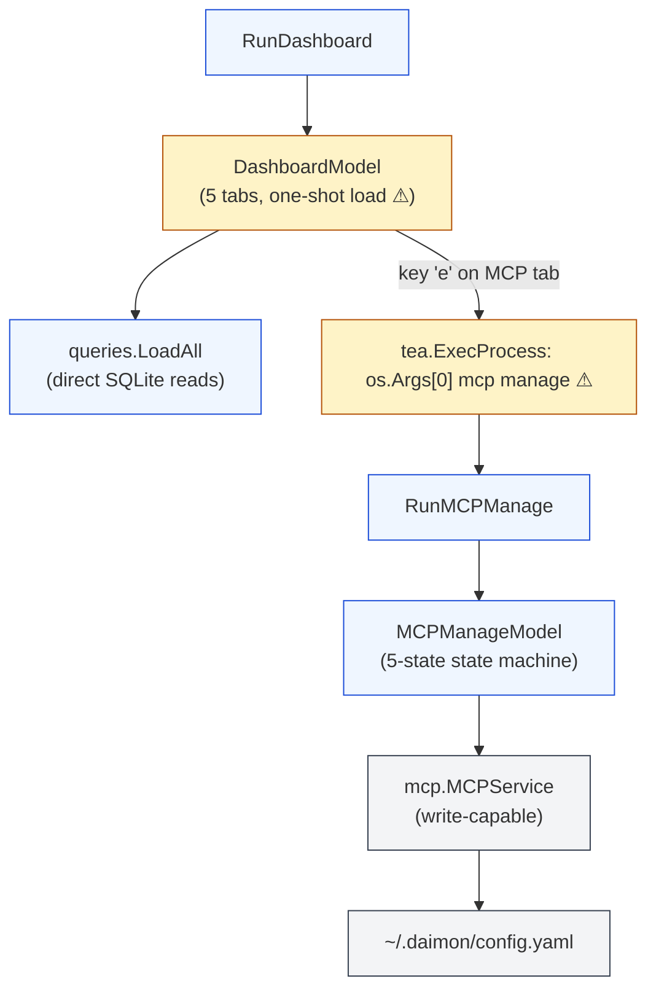
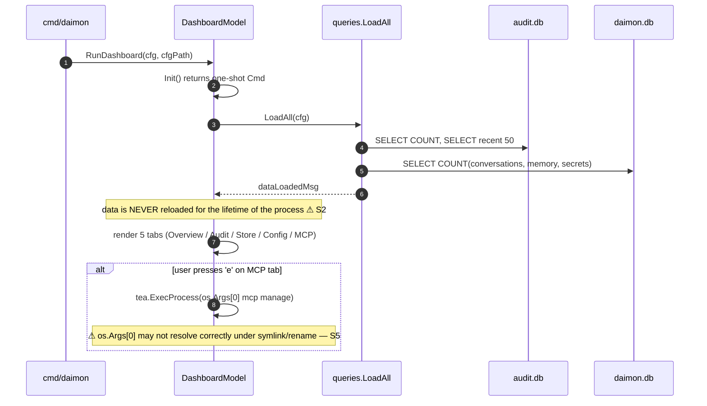
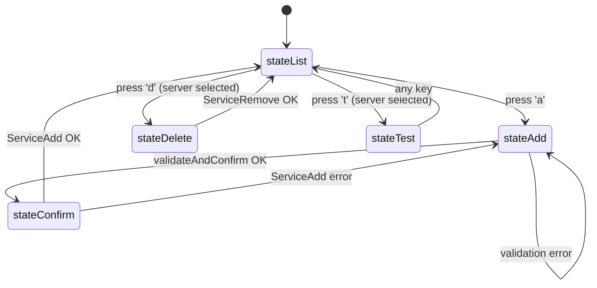

# `tui` — terminal dashboard + MCP management UI

> **Status**: ⚠️ attention (one-shot load with no refresh; `mcp_manage.go` is 810 LOC; subprocess relaunch via `os.Args[0]`)
> **Stability**: stable
> **Last reviewed**: 2026-05-23
> **Code under**: `internal/tui/`
> **Size**: 4 production files, ~1,417 LOC
> **Public surface**: `RunDashboard`, `RunMCPManage`, `DashboardModel`, `MCPManageModel`, `LoadAll` (+ data structs)

## 1. Purpose

The `tui` package is a Bubbletea terminal dashboard for Daimon — a read-only view of audit events, store counts, config, and MCP server configuration, plus a separate **write-capable** MCP management TUI invoked from the dashboard via subprocess. It is intentionally minimal: only `config` and `mcp` are imported (no agent, no provider, no live channel). All data is loaded by direct SQLite reads on the audit and store DBs at startup; there is no polling, no refresh tick.

## 2. Submodules & Key Files

| File            | LOC | Responsibility                                                                                                                       |
| --------------- | --- | ------------------------------------------------------------------------------------------------------------------------------------ |
| `dashboard.go`  | 381 | `DashboardModel` (5-tab read-only); navigation; subprocess launcher for `mcp manage`                                                 |
| `mcp_manage.go` | 810 | `MCPManageModel` — 5-state state machine (list / add / confirm / test / delete); write-capable                                       |
| `mcp_data.go`   | 64  | `MCPTabData`, `MCPServerRow`; reads `cfg.Tools.MCP` (no live state)                                                                  |
| `queries.go`    | 151 | Direct SQLite reads from `audit.db` + `daimon.db`; `OverviewData`, `AuditEventRow`, `StoreStats`; blank-imports `modernc.org/sqlite` |

## 3. Public API

```go
// dashboard.go:374 — assumes TTY; uses tea.WithAltScreen()
func RunDashboard(cfg *config.Config, cfgPath string) error

// mcp_manage.go:792 — explicit isatty check; constructs *mcp.MCPService
func RunMCPManage(cfgPath string) error

// dashboard.go:65 — top-level Bubbletea model
type DashboardModel struct { /* … */ }

// mcp_manage.go:157 — 5-state state machine
type MCPManageModel struct { /* state, addForm, service *mcp.MCPService, servers []mcp.ServerStatus */ }

// queries.go:51 — one-shot loader
func LoadAll(cfg *config.Config) (OverviewData, []AuditEventRow, StoreStats, MCPTabData, error)
```

## 4. Dependencies

| Direction | Edge                                                                                                                 |
| --------- | -------------------------------------------------------------------------------------------------------------------- |
| Outbound  | `internal/config`, `internal/mcp`, `github.com/charmbracelet/*`, `modernc.org/sqlite` (blank import in `queries.go`) |
| Inbound   | `cmd/daimon` only (dashboard subcommand + `daimon mcp manage` subcommand)                                            |

### Layering position

Transport. Allowed to import `config` + `mcp`. Importantly, **does not import `agent`** — the TUI cannot influence the live agent; it reads files / DBs only.

## 5. Component Diagram



## 6. Key Flows

### 6.1 Dashboard one-shot lifecycle



### 6.2 MCP manage state machine



## 7. Verdict

**Overall health**: ⚠️ **Attention** — works, but the one-shot load model leads to stale data and the 810-LOC MCP manage file mixes view + update + form state.

| Dimension        | Rating     | Evidence                                                                              |
| ---------------- | ---------- | ------------------------------------------------------------------------------------- |
| **Coupling**     | very low   | Outbound: `config` + `mcp` + Bubbletea + SQLite driver. Inbound: `cmd` only.          |
| **Size / bloat** | acceptable | 1,417 LOC; `mcp_manage.go` is 810.                                                    |
| **Cohesion**     | focused    | Two scopes (dashboard read, MCP write) cleanly separated by entry point.              |
| **Testability**  | partial    | `WizardModel.Update` style transitions tested directly; `RunDashboard` itself is not. |
| **Stability**    | stable     | Few recent edits.                                                                     |

### Smells & risks

**S1. `mcp_manage.go` is 810 LOC** — styles, `addForm`, 5 state handlers, 5 view renderers, validation, and entry point all together. Split into `mcp_manage_view.go` + `mcp_manage_update.go` + `mcp_manage_form.go`.

**S2. Dashboard data is loaded **once** at boot, never refreshed** — `dashboard.go:98`. A user leaving the dashboard open sees increasingly stale stats with no visual indication. Add a refresh tick (e.g. 5s for stats, 2s for audit events) or at minimum a `r` keybinding.

**S3. No keyboard shortcuts to jump tabs** — only `Tab`/`Shift+Tab`/`←`/`→`. Number keys `1-5` would speed up navigation to tab 5 (MCP).

**S4. `addForm.envPairs` is append-only** — `mcp_manage.go:82`. The user cannot delete an env var after typing it; the workaround is "cancel the whole form and restart".

**S5. `launchMCPManage` re-execs via `os.Args[0]`** — `dashboard.go:319`. Under symlink, `mv`, or PATH-shadowing scenarios the path is wrong. Resolve via `os.Executable()` (resolves symlink target reliably).

**S6. `queries.go` opens + closes SQL connections per call** — `queries.go`. For a one-shot load this is fine; would be a problem if S2 is fixed by polling.

**S7. Blank-imports `modernc.org/sqlite` in `queries.go`** — pulls the full SQLite driver into the `daimon` binary regardless of whether the user configures the SQLite store. The driver is already in the binary via `store/sqlitestore.go`, so this is duplicate code rather than new bloat, but the dependency from a presentation layer is awkward.

**S8. No unit tests for `RunDashboard` end-to-end** — `MCPManageModel.Update` transitions are testable via Bubbletea's update model; the dashboard itself is untested at integration level.

**S9. MCP manage TUI bypasses any in-process state validation** — it writes config directly via `mcp.MCPService` while the live agent (if running in a different process) keeps using the stale registry until restart. The TUI cannot tell whether anyone is running against the same config.

### Suggested refactors (impact ÷ effort)

1. **Add a refresh tick to `DashboardModel`** (S2) — `tea.Tick(5*time.Second, ...)` returns a `tickMsg` that re-runs `LoadAll`. Show "Last refreshed: …" in the header. **Effort: S. Impact: medium.**
2. **Split `mcp_manage.go`** (S1) — three files of ~250 LOC each. **Effort: S. Impact: medium (review surface).**
3. **`os.Executable()` instead of `os.Args[0]`** (S5). **Effort: XS. Impact: low-medium.**
4. **Number-key shortcuts for tab navigation** (S3). **Effort: XS. Impact: low.**
5. **Delete-env-var on the add form** (S4). **Effort: S. Impact: low.**
6. **Lift `queries.LoadAll` into a small interface** — would let a future test substitute a fake DB. **Effort: S. Impact: low.**

## 8. References

- Dashboard entry: `internal/tui/dashboard.go:374` (`RunDashboard`).
- MCP manage entry: `internal/tui/mcp_manage.go:792` (`RunMCPManage`).
- Data loader: `internal/tui/queries.go:51` (`LoadAll`).
- Related modules:
  - [[config]] — read-only consumer of the config struct.
  - [[mcp]] — `MCPManageModel.service` is `*mcp.MCPService` (concrete); same write surface as `web/handler_mcp.go`.
