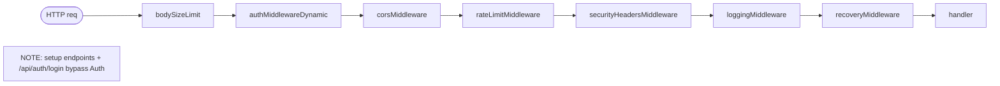
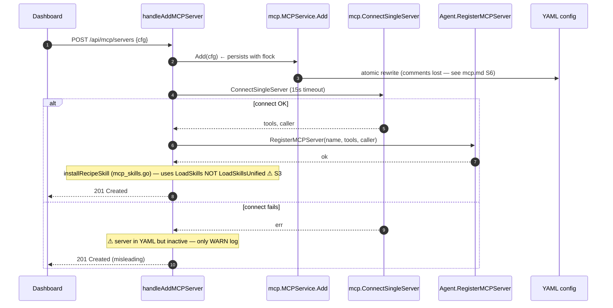
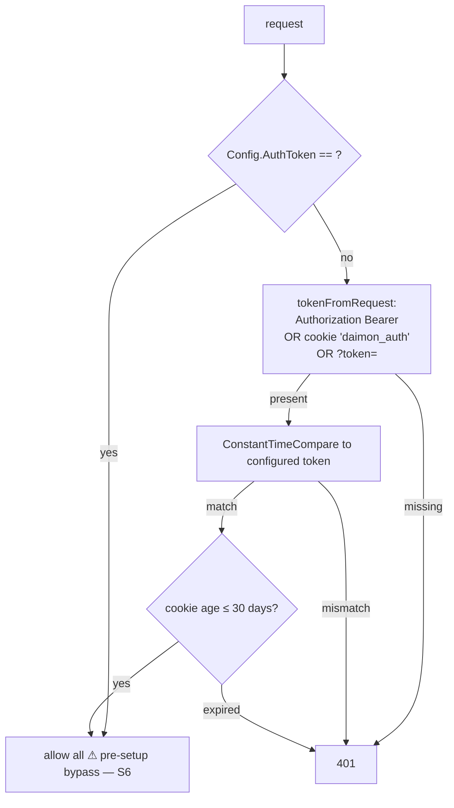
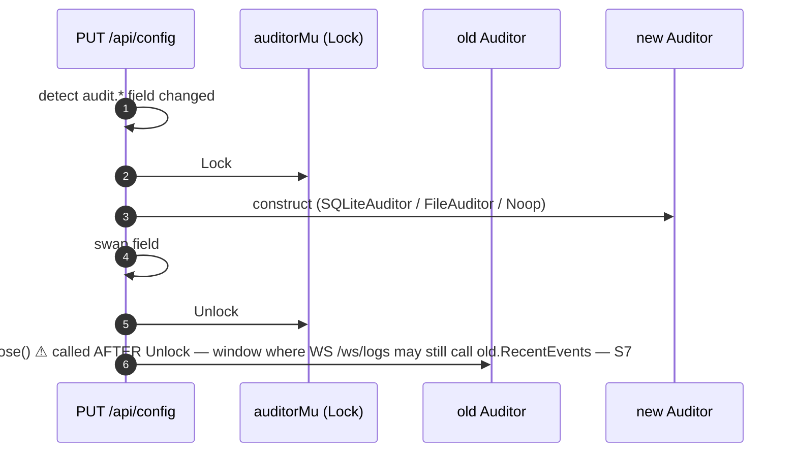

# `web` — HTTP server, REST API, WebSockets, dashboard

> **Status**: 🔴 critical (god-module: 30 files, ~4,730 LOC, 14 fan-out; multiple type-assertion leaks; 30-day token TTL; divergent hot-reload paths)
> **Stability**: actively evolving (auth, RAG, subagents, setup wizard all touched recently)
> **Last reviewed**: 2026-05-23
> **Code under**: `internal/web/` + sub-package `internal/web/modelcache/`
> **Size**: 30 production files in root, 1 in modelcache, ~4,892 LOC total
> **Public surface**: `Server`, `ServerDeps`, 4 local interfaces (`MCPManager`, `AgentReloader`, `SubagentProvider`, `providerRegistry`), `ValidateConfiguredModel`, `modelcache.Cache`

## 1. Purpose

The `web` package is everything HTTP: the REST API, the chat WebSocket (`/ws/chat`), the logs and metrics WebSockets, the static asset server (embedded SPA), the auth pipeline (Bearer / cookie / query param), the model-discovery cache, the startup model validation, the setup wizard handlers, and the audit hot-swap. It also defines the interfaces (`AgentReloader`, `SubagentProvider`, `MCPManager`) that the live `*agent.Agent` and `*mcp.MCPService` satisfy by duck typing — which is the layering escape hatch (L1 in [`../ARCHITECTURE.md` §6](../ARCHITECTURE.md#6-layering-violations)) used to avoid an explicit `web → agent` import even though it exists.

The package has **14 outbound dependencies** — the highest fan-out in the codebase. It is the de-facto god module and a prime candidate for sub-packaging into `web/auth`, `web/ws`, `web/handlers`, `web/middleware`.

## 2. Submodules & Key Files

Grouped by responsibility (30 files in root):

### Server core

| File            | LOC | Responsibility                                                                                                                                                 |
| --------------- | --- | -------------------------------------------------------------------------------------------------------------------------------------------------------------- |
| `server.go`     | 389 | `Server`, `ServerDeps`, local interfaces (`MCPManager`, `AgentReloader`, `SubagentProvider`, `providerRegistry`), `routes()`, `NewServer`, `Start`, `Shutdown` |
| `middleware.go` | 296 | Pipeline: logging, recovery, CORS, body-size limit, IP rate limiter, security headers                                                                          |
| `static.go`     | 91  | Embedded SPA + SPA fallback                                                                                                                                    |
| `helpers.go`    | 20  | `writeJSON`, `writeError`, `pathParam`                                                                                                                         |

### Auth (~499 LOC across 5 files — extraction candidate)

| File                 | LOC | Responsibility                                                           |
| -------------------- | --- | ------------------------------------------------------------------------ |
| `auth.go`            | 212 | `authMiddlewareDynamic` + token extraction (Bearer / cookie / `?token=`) |
| `auth_cookie.go`     | 84  | HttpOnly cookie, SameSite, 30-day TTL constant                           |
| `auth_login.go`      | 52  | `POST /api/auth/login`                                                   |
| `auth_logout.go`     | 86  | `POST /api/auth/logout` + token rotation                                 |
| `origin_validate.go` | 69  | Origin/Referer check for mutating requests                               |

### REST handlers (~2,630 LOC across 13 files)

| File                        | LOC | Surface                                                                        |
| --------------------------- | --- | ------------------------------------------------------------------------------ |
| `handler_config.go`         | 474 | `GET/PUT /api/config` — biggest handler; ~200-LOC merge closure (S2)           |
| `handler_skills.go`         | 495 | CRUD `/api/skills` + `reloadSkills` (uses `LoadSkillsUnified`)                 |
| `setup_handlers.go`         | 382 | First-launch flow: `/api/setup/{status,providers,validate-key,complete,reset}` |
| `handler_conversations.go`  | 301 | List / get / messages / patch (rename) / restore / delete                      |
| `handler_knowledge.go`      | 274 | RAG docs CRUD + multipart upload + ingest enqueue                              |
| `handler_subagents.go`      | 206 | `/api/subagents/active`, `/cancel`, `/api/ws/subagents`                        |
| `handler_upload.go`         | 193 | Media upload + `/api/media/*`                                                  |
| `handler_mcp.go`            | 180 | MCP CRUD + hot-add / hot-remove                                                |
| `handler_memory.go`         | 177 | Memory list / post / delete                                                    |
| `handler_metrics.go`        | 163 | `/api/metrics` + `/api/metrics/history`                                        |
| `handler_system_metrics.go` | 181 | `/api/system-metrics` (gopsutil)                                               |
| `handler_providers.go`      | 104 | `/api/providers/{p}/models` via `modelcache`                                   |
| `handler_status.go`         | 37  | `/api/status`                                                                  |
| `handler_tools.go`          | 24  | `/api/tools` (static list)                                                     |

### WebSockets (~462 LOC across 3 files — extraction candidate)

| File                                | LOC | Channel                                           |
| ----------------------------------- | --- | ------------------------------------------------- |
| `handler_ws_logs.go`                | 189 | `/ws/logs` — polls `audit.LogStreamer` every 2s   |
| `handler_ws_metrics.go`             | 67  | `/ws/metrics` — pushes `MetricsSnapshot` every 5s |
| `handler_subagents.go` (WS portion) | 206 | `/api/ws/subagents` — subscribes to `notify.Bus`  |

(`/ws/chat` is hosted by `channel.WebChannel.HandleWebSocket` — see [`channel.md`](channel.md).)

### Cross-cutting

| File                  | LOC | Responsibility                                                                                                    |
| --------------------- | --- | ----------------------------------------------------------------------------------------------------------------- |
| `audit_swap.go`       | 65  | Hot-swap audit backend under `auditorMu` (RWMutex)                                                                |
| `mcp_skills.go`       | 132 | Auto-install bundled "recipe" skill when an MCP server is added; uses `LoadSkills` (not `LoadSkillsUnified` — S3) |
| `startup_check.go`    | 79  | `ValidateConfiguredModel` — warn-only on `ListModels` mismatch                                                    |
| `modelcache/cache.go` | 162 | TTL cache with `setup.ProviderCatalog` fallback                                                                   |

## 3. Public API

```go
// server.go:123
type Server struct { /* deps, srv, mux, upgrader, rateLimiter, configMu, auditorMu, convPruner */ }

// server.go:81 — 20+ fields; many optional, mixed obligatory / optional semantics
type ServerDeps struct {
    Store              store.Store
    Auditor            audit.Auditor
    Config             *config.Config
    ConfigPath         string
    MCPService         MCPManager           // local interface (S5)
    Agent              AgentReloader        // local interface (S5)
    ProviderRegistry   providerRegistry
    ModelCache         *modelcache.Cache
    Tools              map[string]tool.Tool
    StartedAt          time.Time
    Version            string
    WebChannel         *channel.WebChannel
    MediaStore         store.MediaStore
    ProviderFactory    func(cfg config.ProviderConfig) (provider.Provider, error)
    DocStore           rag.DocumentStore
    IngestWorker       *rag.DocIngestionWorker
    RAGMetrics         metrics.Recorder
    SubagentProvider   SubagentProvider     // local interface
    UserSkillStore     store.UserSkillStore
    CuratedSkills      []skill.SkillContent
}

func NewServer(deps ServerDeps) *Server
func (s *Server) Start() error
func (s *Server) Shutdown(ctx context.Context) error

// server.go:30, :55, :69, :43 — interfaces satisfied by duck typing
type MCPManager        interface{ List(ctx) ([]mcp.ServerStatus, error); Add(...); Remove(...); Test(...) }
type AgentReloader     interface{ RegisterMCPServer(...); UnregisterMCPServer(...); ReplaceSkills(...); ReplaceExecutableSkills(...) }
type SubagentProvider  interface{ ActiveSubagents() []agent.SubagentStatus; SubagentBus() notify.Bus; CancelSubagent(id string) error }
type providerRegistry  interface{ Lister(name string) (provider.ModelLister, bool); RegisterTransient(name string, p provider.Provider) }

// startup_check.go:32 — warn-only on /api/providers/.../models mismatch
func ValidateConfiguredModel(ctx, registry, providerName, modelName string) error

// modelcache/cache.go:43, :66, :101 — per-provider TTL cache; falls back to setup.ProviderCatalog
type Cache struct { /* … */ }
func New(opts Options) *Cache
func (c *Cache) GetOrFetch(ctx, providerName string, fetch FetchFunc, refresh bool) (Entry, error)
```

## 4. Dependencies

### Outbound (14)

```
agent  audit  channel  config  content  mcp  notify  provider
rag    rag/metrics  setup  skill  store  tool
```

For each: see the deep-dive table — every package in `internal/` (except `cron`, `cost`, `filter`, `tui`) is imported. `web` is the god module.

### Inbound

Only `cmd/daimon` — `web` does not export to any other `internal/*`.

### Layering position

Transport. **Imports Core (`agent`)** — layering violation L1, mitigated by the local interfaces `AgentReloader` / `SubagentProvider` that the agent satisfies via duck typing. The web package therefore avoids importing the `*agent.Agent` struct directly except for `agent.SubagentStatus` (a value type).

## 5. Component Diagram

```mermaid
flowchart TB
  classDef hot fill:#fee2e2,stroke:#b91c1c
  classDef impl fill:#eff6ff,stroke:#1d4ed8
  classDef sub fill:#ecfdf5,stroke:#047857
  classDef ext fill:#f3f4f6,stroke:#374151

  Srv["Server<br/>(deps + 4 interfaces + configMu + auditorMu)"]:::hot

  subgraph MW[Middleware pipeline]
    direction LR
    Body["bodySizeLimit"]:::impl
    Auth["authMiddlewareDynamic"]:::impl
    CORS["cors"]:::impl
    RL["rateLimit"]:::impl
    SEC["securityHeaders"]:::impl
    LOG["logging + recovery"]:::impl
  end

  subgraph HND[REST handlers (13 files, ~2630 LOC)]
    H1["/api/config (474 LOC)"]:::impl
    H2["/api/skills (495 LOC)"]:::impl
    H3["/api/conversations + memory + knowledge + mcp + …"]:::impl
  end

  subgraph WS[WebSocket handlers]
    WL["/ws/logs (poll 2s)"]:::impl
    WM["/ws/metrics (push 5s)"]:::impl
    WSa["/api/ws/subagents (bus subscribe)"]:::impl
    WC["/ws/chat → channel.WebChannel"]:::ext
  end

  MC["modelcache<br/>(TTL + ProviderCatalog fallback)"]:::sub
  AUD["audit_swap.go<br/>(auditorMu hot-swap)"]:::impl
  STAT["startup_check.go<br/>(warn-only model validation)"]:::impl

  Srv --> MW --> HND
  Srv --> WS
  HND --> MC
  Srv --> AUD
  Srv --> STAT
  HND -. duck-typed via AgentReloader .-> EXT_AG["agent.Agent"]:::ext
  HND -. duck-typed via SubagentProvider .-> EXT_AG
```

## 6. Key Flows

### 6.1 Middleware pipeline (request order)



### 6.2 Hot-add MCP server end-to-end



### 6.3 Auth pipeline



### 6.4 Audit hot-swap (under `auditorMu`)



## 7. Verdict

**Overall health**: 🔴 **Critical** — the most fan-out in the codebase, with structural smells (god module), runtime smells (4+ type assertions inside `ServerDeps`-consuming handlers), security smells (30-day token TTL, no per-session revocation, query-param token in WS), and at least one divergent hot-reload path.

| Dimension        | Rating            | Evidence                                                                                                                       |
| ---------------- | ----------------- | ------------------------------------------------------------------------------------------------------------------------------ |
| **Coupling**     | very high         | Fan-out 14, the highest in `internal/`. Imports `agent` despite the L1 violation.                                              |
| **Size / bloat** | inflated          | 4,892 LOC across 30 files. `handler_config.go` (474), `handler_skills.go` (495), `server.go` (389), `setup_handlers.go` (382). |
| **Cohesion**     | low               | 6 distinct concerns in one package: auth, middleware, REST handlers, WebSockets, audit hot-swap, model cache.                  |
| **Testability**  | moderate          | Most handlers covered. `handler_system_metrics.go` and `mcp_skills.go` lack tests.                                             |
| **Stability**    | actively evolving | Recent: auth flow, RAG handler, subagents endpoints, setup wizard.                                                             |

### Smells & risks

**S1. Sub-packaging is overdue** — 30 files in one package. Natural extractions: `web/auth` (5 files, ~499 LOC), `web/ws` (3 files, ~462 LOC), `web/middleware` (1 file, 296 LOC), `web/handlers` (13 files, ~2,630 LOC). Today every file is a sibling.

**S2. `handler_config.go::handlePutConfig` 474 LOC** — `:158`. Contains a ~200-LOC closure that merges every config sub-tree inline. Extract `mergeProviders`, `mergeRAG`, `mergeAudit`, `mergeChannel`, `mergeStore`, …

**S3. Two divergent hot-reload paths** — `handler_skills.go:476` (`reloadSkills`) uses `skill.LoadSkillsUnified` (curated + FS + DB merge); `mcp_skills.go:112` (`loadSkillsForReload`, called from `installRecipeSkill`) uses `skill.LoadSkills` (FS only). After installing an MCP recipe, the user-DB skills temporarily disappear from the agent prompt until something else triggers `reloadSkills`. See [`skill.md` S6](skill.md#smells--risks).

**S4. Hardcoded type assertions to concrete types**:

- `handler_knowledge.go:98` — `deps.DocStore.(*rag.SQLiteDocumentStore)` to call `SumTokensByDoc` (not on the interface).
- `handler_metrics_rag.go:22` — `deps.RAGMetrics.(*metrics.RingRecorder)` because `metrics.Recorder` does not expose `Snapshot/Aggregates`. Any future `Recorder` impl breaks the endpoint silently (501).
- `server.go:253` — `deps.Store.(store.ConvPruneStore)` to start the pruner; ok because the interface exists.
- `handler_conversations.go:56`, `handler_memory.go:152` — `deps.Store.(store.WebStore)`.
- `handler_metrics.go:68` — `deps.Store.(store.CostStore)`.

All except the first two have valid interfaces — they should be on `ServerDeps` directly, not type-asserted at runtime.

**S5. `ServerDeps` mixes obligatory and optional fields without a constructor** — fields documented in comments as "obligatory" or "optional" but constructed by `cmd/daimon` populating them ad-hoc. No `Validate()` to surface a missing required dep at boot — handlers fail individually with `500`/`501`.

**S6. Pre-setup auth bypass** — `auth.go:99`. When `Config.Web.AuthToken == ""`, every request is allowed. If the binary boots without setup-complete being called (e.g., crash between setup and config save), a window exists where the API is open. Mitigation: emit a startup `slog.Warn` and refuse to serve any non-setup endpoint until the token exists.

**S7. Audit hot-swap window** — `audit_swap.go:60`. The `old.Close()` call happens after releasing `auditorMu`. WS connections that captured `old` at the start of a tick can race with `Close`. The doc comment on `handler_ws_logs.go:170` acknowledges that the design relies on each tick re-fetching via `CurrentAuditor`, but a mid-tick swap can still hit the window.

**S8. Auth token has no per-session revocation** — single global string. Logout rotates the global token, invalidating everyone. No refresh token, no short-lived JWT. 30-day cookie TTL.

**S9. Query-param token in WebSocket** — `auth.go:197` accepts `?token=`. URLs leak into proxy logs, reverse-proxy access logs, browser history. Use cookie or a short-lived ticket exchanged via POST.

**S10. Inconsistent error responses** — `writeError` (`{"error": "..."}`), `writeSkillError` (same shape, separate function), `writeSkillValidation` (`{"errors": [...]}`), and raw `http.Error` in some handlers (`handleSubagentCancel`). Unify or callers can't write one client.

**S11. Duplicate WS boilerplate** — three independent files implement the same `ping/pong + done-chan + write-mutex` pattern (`handler_ws_logs.go`, `handler_ws_metrics.go`, `handler_subagents.go`). Extract `runWSLoop(conn, onTick)`.

**S12. `handleAddMCPServer` bypasses `MCPManager`** — `handler_mcp.go:81` calls `mcp.ConnectSingleServer` directly **and** `MCPService.Add`. Persistence (MCPManager.Add) and live activation (ConnectSingleServer) run in parallel; one can succeed while the other fails. The 15-s connect timeout is hardcoded (also flagged in [`mcp.md` S1](mcp.md#smells--risks)).

**S13. WS subagents drops on full channel** — `handler_subagents.go:81`. Capacity 8 with default `drop+slog.Warn`. Slow consumers silently lose subagent lifecycle events.

**S14. `mcp_skills.go` carries 12 bundled `.md` recipes** — auto-installed on MCP server add. The user has no way to opt out, no way to know what was installed, and uninstalling the MCP server does not uninstall the recipe.

### Suggested refactors (impact ÷ effort)

1. **Split into sub-packages** (S1) — `web/auth`, `web/middleware`, `web/ws`, `web/handlers`. **Effort: L. Impact: high (review surface).**
2. **Extract `handlePutConfig` merge closures** (S2). **Effort: M. Impact: high.**
3. **Unify hot-reload to `LoadSkillsUnified`** (S3) — eliminate the FS-only path in `mcp_skills.go`. **Effort: S. Impact: medium (correctness).**
4. **Lift `SumTokensByDoc` to `DocumentStore` interface** (S4) — and add a `Snapshotter` interface for RAG metrics. **Effort: M. Impact: medium.**
5. **Refuse to serve protected endpoints until `AuthToken != ""`** (S6). **Effort: XS. Impact: high (security).**
6. **Per-session tokens with refresh + revocation list** (S8). **Effort: L. Impact: high.**
7. **Remove query-param token; use short-lived ticket exchange** (S9). **Effort: M. Impact: high (security).**
8. **Extract `runWSLoop` helper** (S11). **Effort: S. Impact: medium.**
9. **`Validate()` method on `ServerDeps`** (S5) — surface missing deps at boot. **Effort: XS. Impact: medium.**
10. **Move the `Close()` of the old Auditor inside the lock (or block new WS frames until swap finishes)** (S7). **Effort: S. Impact: medium.**
11. **Unify error response shape** (S10). **Effort: S. Impact: low-medium.**

## 8. References

- System map: [`../ARCHITECTURE.md` §2](../ARCHITECTURE.md#2-module-dependency-map-real-edges), [§7 R4](../ARCHITECTURE.md#7-architectural-risks-worth-tracking).
- Layering violation L1: [`../ARCHITECTURE.md` §6](../ARCHITECTURE.md#6-layering-violations).
- Auth pipeline: `auth.go:54` (`authMiddlewareDynamic`), `:187` (`tokenFromRequest`), `auth_cookie.go:17` (`authCookieTTL` constant).
- Hot-swap audit: `audit_swap.go:29` (`rebuildAuditor`).
- Modelcache: `modelcache/cache.go:101` (`GetOrFetch`).
- Related modules:
  - [[agent]] — satisfied by duck typing through `AgentReloader` + `SubagentProvider`. See [`agent.md` §4](agent.md).
  - [[mcp]] — `handleAddMCPServer` bypass + ConnectSingleServer; see [`mcp.md` §6.2](mcp.md).
  - [[skill]] — divergent hot-reload paths; see [`skill.md` S6](skill.md).
  - [[setup]] — `/api/setup/*` and the `ProviderCatalog` fallback.
  - [[channel]] — `/ws/chat` is hosted by `channel.WebChannel.HandleWebSocket`, registered here.
